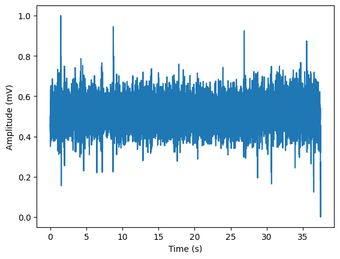
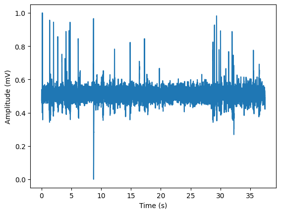
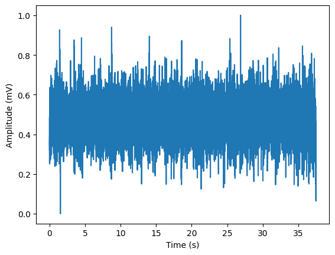
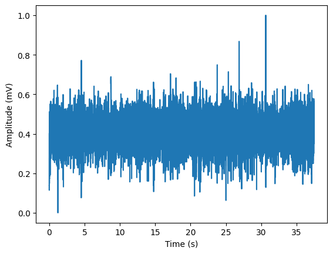

# Lab 10 - Procesamiento EEG

## Tabla de contenidos
- [Objetivos](#objetivos)
- [Materiales](#materiales)
- [Introducción](#introducción)
- [Metolodogía](#metodología)
- [Resultados](#resultados)
- [Discusión de resultados](#Discusión-de-resultados)
- [Referencias](#referencias)

##  Objetivos
- Aplicar el filtro más adecuado para la señal EEG
- Realizar la normalización de la señal de EEG
- Discutir las características extraídas de la señal EEG 

## Materiales
| Material | Cantidad |
|:--------------:|:--------------:|
| Lenguaje de programación *Python* | N.A | 
| Interfaz *Jypiter Notebook* | N.A | 

## Introducción

En la práctica, las señales EEG suelen estar contaminadas por artefactos biológicos y ambientales [1]. Los artefactos biológicos provienen de fuentes no cerebrales dentro del cuerpo humano, como el corazón, los ojos o los músculos [1]. Dichas fuentes originan variables como los latidos del corazón, movimientos oculares y parpadeos, la respiración, entre otros [2]. En contraste, los artefactos ambientales se originan fuera del cuerpo humano debido al movimiento de los electrodos o a la interferencia de dispositivos externos como motores eléctricos o la corriente alterna [1]. Ambos tipos de artefactos deterioran las señales EEG, complicando el diagnóstico clínico y las aplicaciones de BCI al distorsionar el espectro de potencia [1]. Esto se debe a que los artefactos pueden imitar actividad cognitiva o patológica y, por lo tanto, sesgar la interpretación de la señal. Por ende, se requiere un procesamiento de datos de ingeniería del EEG [2]. 

La práctica clínica común es cortar todo el segmento de datos afectado por los artefactos, lo cual también lleva a una pérdida de información importante [2]. Asimismo, descartar segmentos de datos no es viable si el objetivo es procesar los datos en tiempo real: en este caso, la extracción manual de artefactos no se puede realizar y una limitante está en automatizar el procedimiento de separación de artefactos [2]. Otros métodos tradicionales para eliminar artefactos de las señales EEG utilizan filtros lineales o regresiones basadas en el momento de aparición o en el rango de frecuencia de los artefactos [1]. Sin embargo, filtrar en los dominios de tiempo o frecuencia puede resultar en una pérdida significativa de la actividad cerebral debido a la superposición espectral entre la actividad neurológica y los artefactos [1]. Se ha encontrado que el análisis multirresolución con transformada wavelet discreta (DWT) es más efectivo para eliminar artefactos específicos, preservando mejor la señal EEG en los dominios de tiempo y frecuencia [1]. 

Por otro lado, el análisis de componentes independientes (ICA) es útil para separar artefactos específicos en un componente independiente mediante la separación ciega de fuentes estadísticas subyacentes [1,3]. Esta herramienta descompone las grabaciones multicanal del EEG y facilita la detección de fuentes de señales que no pueden identificarse a nivel de datos brutos utilizando otras técnicas más convencionales [3]. La combinación de métodos wavelet e ICA ha mostrado resultados favorables en aplicaciones prácticas [1].La aplicación del método combinado wavelet-ICA para eliminar artefactos puede requerir la aplicación de un umbral definido manualmente o arbitrariamente para identificar y separar los componentes artefactuales [1]. Cabe resaltar que este umbral puede no capturar artefactos cercanos a los límites arbitrarios definidos para las señales EEG lo que puede incrementar la tasa de falsos positivos [1]. 

Para la práctica se utilizó la interfaz Jupyter Notebook con el lenguaje de programación Python para aplicar el filtro seleccionado, graficar la señal, aplicar el análisis de componentes independientes (ICA) y extraer sus características.

## Metodología

El procesamiento de una señal de EEG seguirá tres pasos fundamentales: el filtrado de la señal en base a un filtro butterworth y notch, un preprocesamiento de la señal basado en su normalización y alineamiento, y finalmente la extracción de características. 
En experiencias previas de laboratorio, solo se logró obtener la señal de EEG utilizando BiTalino (solo un canal), por lo que se utilizará una señal extraída de Physionet.

La base de datos a emplear es "Auditory evoked potential EEG-Biometric dataset" [4], la cual es una base de datos abierta que consta de más de 240 registros EEG de dos minutos obtenidos de 20 voluntarios. Los datos incluyen experimentos en estado de reposo con ojos abiertos y ojos cerrados, y 6 estímulos auditivos (3 con estímulos auditivos intraoculares y 3 con estímulos auditivos de conducción ósea). Para la recolección de estos datos se utilizó una placa OpenBCI Ganglion, con una frecuencia de muestreo de 200 Hz y cuatro canales: T7, F8, Cz y P4.

A continuación, se decribe el proceso seguido en cada paso del procesamiento de la señal: 

### Diseño del Filtro EEG

### Preprocesamiento (normalización)

Para normalizar una señal de EEG se pueden aplicar métodos como la normalización con mínimos y máximos (min-máx) o la técnica de puntuación Z (Z-score). Para la elección del tipo de normalización, esta se basará en el artículo de "EEG-Based Automatic Sleep Staging Using Ontology and Weighting Feature Analysis" [5], cuyo procesamiento de EEG en estado de sueño o reposo se basa en el uso de mínimos y máximos. Asimismo, debido a que las señales obtenidas de la base de datos provienen de pacientes en estado de reposo, este fue un punto clave para optar por este tipo de normalización. La fórmula a emplear se muestra a continuación: 

Fig 1. Normalización min-máx

### Extracción de características

Para la extracción de características de una señal de EEG se recurre a la aplicación de transformadas wavelets continuas o discretas. El artículo "Feature extraction and classification for EEG signals using wavelet transform and machine learning techniques" [6], describe el uso de una transformada wavelet discreta para la extracción de características de EEG tomados en sujetos en reposo y actividad cognitiva, y obtener la energía wavelet relativa con el cálculo de los términos de coeficientes detallados y coeficientes de aproximación del último nivel de descomposición. Este artículo utiliza una wavelet madre Daubechies con cuatro niveles de descomposición (db4). Las energías totales y relativas de las subbandas se calcularon a partir de los coeficientes wavelet extraídos (D1-D4 y A4).

Fig. 2 DWT descomposición

## Resultados

| Paciente 1 : Canal 1 | Canal 2 | Canal 3 | Canal 4 |
| --- | --- | --- | --- | 
|     |  |  |  |

| Paciente 2 : Canal 1 | Canal 2 | Canal 3 | Canal 4 |
| --- | --- | --- | --- | 
|     |  |  |  |

***NOTA**: El ploteo de las señales se realizó en intervalos distintos, para una mejor apreciación de las señales. Asimismo, la frecuencia de muestreo fue de 1000 Hz.*

## Código en Python

***NOTA**: El código utilizado se encuentra en el archivo .ipynb de la carpeta*

## Discusión de resultados

En los resultados se observan las señales EEG de dos pacientes, cada uno con registros de cuatro canales diferentes (T7, F8, Cz y P4) tomados de la base de datos "Auditory evoked potential EEG-Biometric dataset". Respecto al filtrado, se puede notar que los filtros butterworth y notch lograron eliminar gran parte del ruido manteniendo la estructura de las señales claramente visible. Luego, normalización de las señales basada en mínimos y máximos fue empleada correctamente, por lo que ahora las señales se encuentran en el rango de 0 a 1 haciendo posible su comparación.  Las señales procesadas mostraron variaciones consistentes con la actividad cerebral en estado de reposo, con diferencias individuales entre los dos pacientes en términos de amplitud y frecuencia de los picos.

La extracción de características empleando una transformada wavelet discreta (DWT) con una wavelet madre Daubechies (db4) y cuatro niveles de descomposición permitió obtener energías totales y relativas de los coeficientes, los cuales son fundamentales para el análisis y clasificación de las señales EEG. Los resultados de la energía relativa muestran que la mayor parte de la energía de las señales EEG se concentra en los coeficientes de aproximación, con valores superiores al 97% en todos los casos, mientras que los coeficientes de detalle contienen una fracción mucho menor de la energía total. Esto evidencia que el estado cerebral de ambos pacientes es en reposo, ya que hay predominancia de la energía en los coeficiencies de aproximación, lo cuales representan la versión de baja frecuencia de la señal EEG.

## Referencias
1. Sai CY, Mokhtar N, Arof H, Cumming P, Iwahashi M. Automated Classification and Removal of EEG Artifacts With SVM and Wavelet-ICA. IEEE J Biomed Health Inform [Internet]. Mayo de 2018 [consultado el 19 de junio de 2024];22(3):664-70. Disponible en: https://doi.org/10.1109/jbhi.2017.2723420.
2. Mammone N, La Foresta F, Morabito FC. Automatic Artifact Rejection From Multichannel Scalp EEG by Wavelet ICA. IEEE Sens J [Internet]. Marzo de 2012 [consultado el 19 de junio de 2024];12(3):533-42. Disponible en: https://doi.org/10.1109/jsen.2011.2115236
3. Ullsperger M. Simultaneous EEG and fMRI: Recording, analysis, and application. New York: Oxford University Press; 2010. 315 p.
4. PhysioNet [Internet]. Auditory evoked potential EEG-Biometric dataset; 1 de diciembre de 2021 [consultado el 21 de junio de 2024]. Disponible en: https://physionet.org/content/auditory-eeg/1.0.0/.
5. Zhang B, Lei T, Liu H, Cai H. EEG-Based Automatic Sleep Staging Using Ontology and Weighting Feature Analysis. Comput Math Methods Med [Internet]. 4 de septiembre de 2018 [consultado el 21 de junio de 2024];2018:1-16. Disponible en: https://doi.org/10.1155/2018/6534041
6. Amin HU, Malik AS, Ahmad RF, Badruddin N, Kamel N, Hussain M, Chooi WT. Feature extraction and classification for EEG signals using wavelet transform and machine learning techniques. Australas Phys Amp Eng Sci Med [Internet]. 4 de febrero de 2015 [consultado el 21 de junio de 2024];38(1):139-49. Disponible en: https://doi.org/10.1007/s13246-015-0333-x
