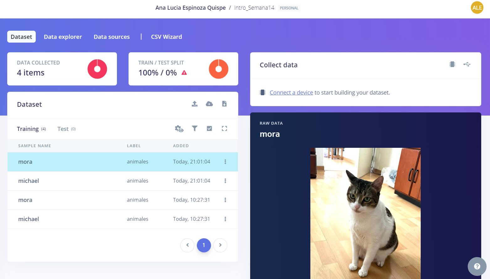
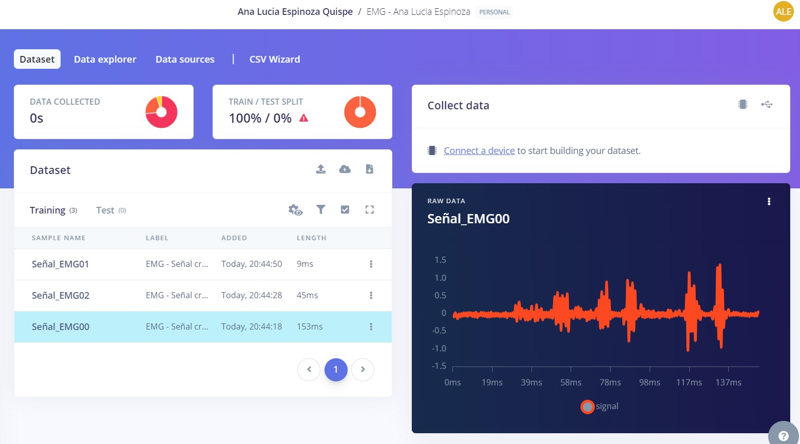
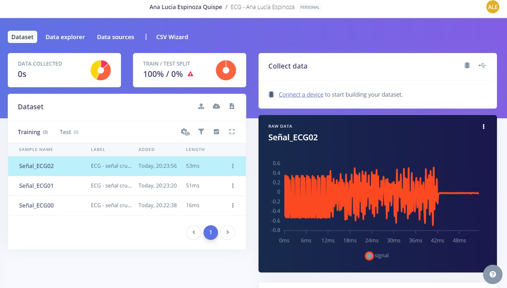
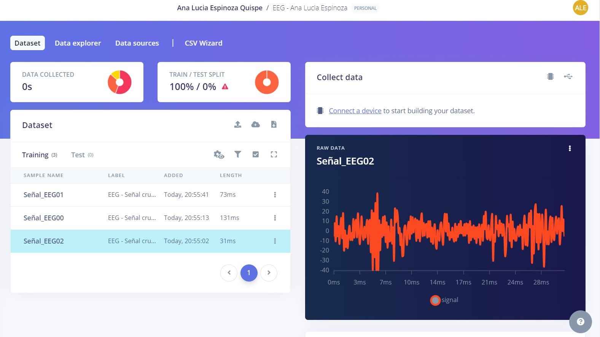

# Lab 11 - Edge Impulse -  Ana Lucía Espinoza

## Tabla de contenidos
- [Objetivos](#objetivos)
- [Materiales](#materiales)
- [Resultados](#resultados)


##  Objetivos
- Crear tres proyectos correspondientes a EMG, ECG y EEG en Edge Impulse y subir las señales trabajadas en clase con sus correspondientes etiquetas

## Materiales
| Material | Cantidad |
|:--------------:|:--------------:|
| Lenguaje de programación *Python* | N.A | 
| Plataforma *Edge Impulse* | N.A | 

## Resultados
Las señales utilizadas no fueron tratadas previamente y fueron subidas en formato CVS según los requerimientos de la plataforma Edge Impulse.

# Ejemplo

Link del proyecto: https://studio.edgeimpulse.com/public/431094/live

# EMG

Link del proyecto: https://studio.edgeimpulse.com/public/431109/live

# ECG

Link del proyecto: https://studio.edgeimpulse.com/public/431110/live

# EEG

Link del proyecto: https://studio.edgeimpulse.com/public/431109/live


## Código en Python

# Ejemplo
``` python
# Install requests via: `pip3 install requests`
import requests
import os
import json

api_key = 'ei_2d86439d7e71d76954952aac22e195bdf51de5e0f0cc3f35'

#ei_d14efbd616ba6fb50ef27c88225d63e95d47982a6c097b5a'
# Add the files you want to upload to Edge Impulse

files = [
    'michael.jpg',
    'mora.jpeg',
]
# # Replace the label with your own.
label = 'animales'
# Upload the file to Edge Impulse using the API, and print the response.
res = requests.post(url='https://ingestion.edgeimpulse.com/api/training/files',
                    headers={
                        'x-label': label,
                        'x-api-key': api_key,
                    },
                    # Creating the data payload for the request.
                    files=(('data', (os.path.basename(i), open(
                        i, 'rb'), 'image/png')) for i in files)
                    )

if (res.status_code == 200):
    print('Uploaded file(s) to Edge Impulse\n', res.status_code, res.content)
else:
    print('Failed to upload file(s) to Edge Impulse\n',
          res.status_code, res.content)
```

# EMG
``` python
# Install requests via: pip3 install requests
import requests
import os
import json
import csv

api_key = 'ei_e97d864fe69593259d589a777933bb9c2c9940444c4ab293'

# Add the files you want to upload to Edge Impulse

files = [
    'Señal_EMG01.csv'
]
# # Replace the label with your own.
label = 'EMG - Señal cruda reposo'

# Upload the file to Edge Impulse using the API, and print the response.
res = requests.post(url='https://ingestion.edgeimpulse.com/api/training/files',
                    headers={
                        'x-label': label,
                        'x-api-key': api_key,
                    },
                    # Creating the data payload for the request.
                    files=(('data', (os.path.basename(i), open(
                        i, 'rb'), 'image/png')) for i in files)
                    )

if (res.status_code == 200):
    print('Uploaded file(s) to Edge Impulse\n', res.status_code, res.content)
else:
    print('Failed to upload file(s) to Edge Impulse\n',
          res.status_code, res.content)
```

# ECG
``` python
# Install requests via: pip3 install requests
import requests
import os
import json
import csv

api_key = 'ei_fd64f0381709ef292f6078925c67324cc2d95a8e9fb4c065'

# Add the files you want to upload to Edge Impulse

files = [
    'Señal_ECG02.csv'
]
# # Replace the label with your own.
label = 'ECG - señal cruda fibrilación ventricular severa'

# Upload the file to Edge Impulse using the API, and print the response.
res = requests.post(url='https://ingestion.edgeimpulse.com/api/training/files',
                    headers={
                        'x-label': label,
                        'x-api-key': api_key,
                    },
                    # Creating the data payload for the request.
                    files=(('data', (os.path.basename(i), open(
                        i, 'rb'), 'image/png')) for i in files)
                    )

if (res.status_code == 200):
    print('Uploaded file(s) to Edge Impulse\n', res.status_code, res.content)
else:
    print('Failed to upload file(s) to Edge Impulse\n',
          res.status_code, res.content)
```

# EEG
``` python
# Install requests via: pip3 install requests
import requests
import os
import json
import csv

api_key = 'ei_99bb4a09eb1dbf8e72051855a2155f3f2294e24b3232525c'

# Add the files you want to upload to Edge Impulse

files = [
    'Señal_EEG02.csv'
]
# # Replace the label with your own.
label = 'EEG - Señal cruda ejercicios mentales simples'

# Upload the file to Edge Impulse using the API, and print the response.
res = requests.post(url='https://ingestion.edgeimpulse.com/api/training/files',
                    headers={
                        'x-label': label,
                        'x-api-key': api_key,
                    },
                    # Creating the data payload for the request.
                    files=(('data', (os.path.basename(i), open(
                        i, 'rb'), 'image/png')) for i in files)
                    )

if (res.status_code == 200):
    print('Uploaded file(s) to Edge Impulse\n', res.status_code, res.content)
else:
    print('Failed to upload file(s) to Edge Impulse\n',
          res.status_code, res.content)
```


