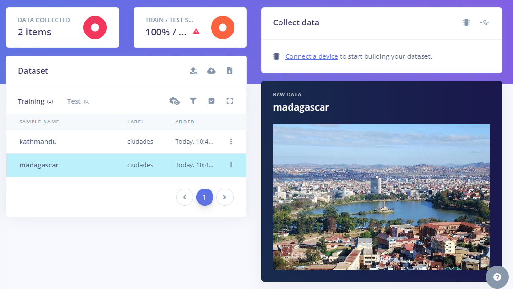
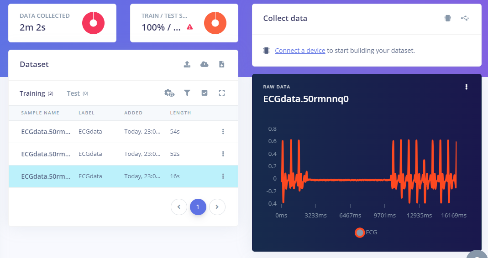
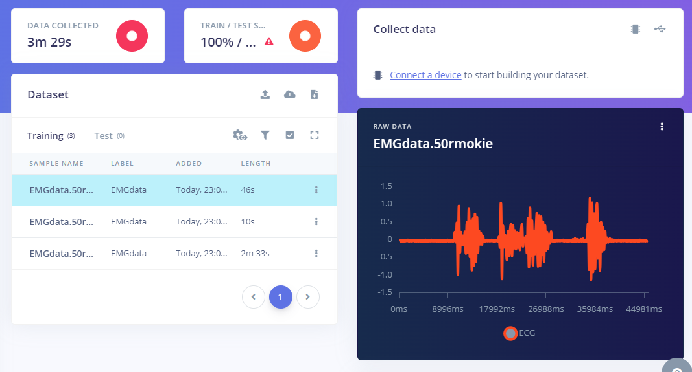
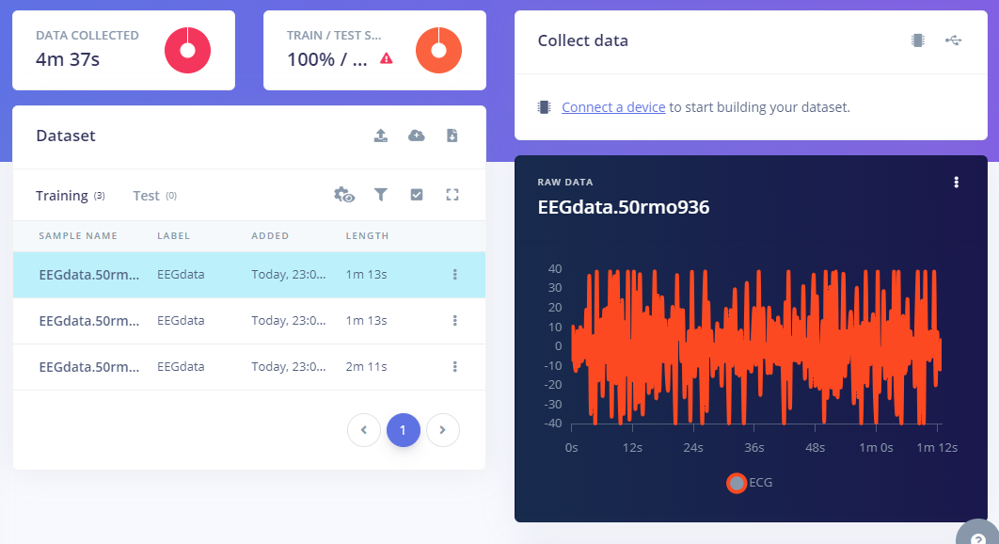

# Laboratorio 11 - Edge Impulse - TinyML

## Tabla de contenidos
- [Objetivos](#objetivos)
- [Materiales](#materiales)
- [Resultados](#resultados)
- [Código de Python](#código-de-python)

##  Objetivos
- Subir data de señales de EEG, ECG y EMG a Edge Impulse 

## Materiales
| Material | Cantidad |
|:--------------:|:--------------:|
| Lenguaje de programación *Python* | N.A | 
| Plataforma *Edge Impulse* | N.A | 

## Resultados 

| Proyecto de prueba | Proyecto ECG |
|:--------------:|:--------------:|
| || 
| https://studio.edgeimpulse.com/studio/431100|https://studio.edgeimpulse.com/studio/431120| 

| Proyecto EMG | Proyecto EEG |
|:--------------:|:--------------:|
|  || 
| https://studio.edgeimpulse.com/studio/431122 |https://studio.edgeimpulse.com/studio/431118| 

## Código de Python 

Para subir las señales recoletadas, se empleó el siguiente código: 

### EMG

```python

# Install requests via: pip3 install requests
import requests
import os

api_key = 'ei_6b9797ff0be9a2460f49aa7622672ab2f6f93406d35db257ebc7dad7e8942fb2'

# Add the files you want to upload to Edge Impulse
# Especifica la ruta completa a los archivos
files_EMG = [
    "C:/Users/marsh/Downloads/EMG_BRAZO.csv", 
    "C:/Users/marsh/Downloads/EMG_DEDOS.csv", 
    "C:/Users/marsh/Downloads/EMG_PIERNAS.csv"
]

# Replace the label with your own
label = EMGdata

def upload_files(files, label, api_key):

    # Crear el payload de los archivos
    file_payload = (('data', (os.path.basename(i), open(i, 'rb'), 'image/png')) for i in files)
    
    # Realizar la solicitud POST
    res = requests.post(url='https://ingestion.edgeimpulse.com/api/training/files',
                        headers={
                            'x-label': label,
                            'x-api-key': api_key,
                        },
                        files=file_payload)

    # Manejar la respuesta
    if res.status_code == 200:
        print('Uploaded file(s) to Edge Impulse\n', res.status_code, res.content)
    else:
        print('Failed to upload file(s) to Edge Impulse\n', res.status_code, res.content)
upload_files(files_EMG, label, api_key)
```

### ECG

```python

# Install requests via: pip3 install requests
import requests
import os

api_key = 'ei_30edb286d75b1c501e7a400a2a934808142acfe9954f6954de95324e89e84552'

# Add the files you want to upload to Edge Impulse
# Especifica la ruta completa a los archivos
files_ECG = [
    "C:/Users/marsh/Downloads/SeñalesECG0.csv", 
    "C:/Users/marsh/Downloads/SeñalesECG1.csv", 
    "C:/Users/marsh/Downloads/SeñalesECG2.csv"
]

# Replace the label with your own
label = 'ECGdata'

def upload_files(files, label, api_key):

    # Crear el payload de los archivos
    file_payload = (('data', (os.path.basename(i), open(i, 'rb'), 'image/png')) for i in files)
    
    # Realizar la solicitud POST
    res = requests.post(url='https://ingestion.edgeimpulse.com/api/training/files',
                        headers={
                            'x-label': label,
                            'x-api-key': api_key,
                        },
                        files=file_payload)

    # Manejar la respuesta
    if res.status_code == 200:
        print('Uploaded file(s) to Edge Impulse\n', res.status_code, res.content)
    else:
        print('Failed to upload file(s) to Edge Impulse\n', res.status_code, res.content)

upload_files(files_ECG, label, api_key)
```

### EEG

```python

# Install requests via: pip3 install requests
import requests
import os

api_key = 'ei_588905804f8d30434c3fa4d9981c1534e218840253393d819e695faf21bc2a4d'

# Add the files you want to upload to Edge Impulse
# Especifica la ruta completa a los archivos
files_EEG = [
    "C:/Users/marsh/Downloads/SeñalesEEG0.csv", 
    "C:/Users/marsh/Downloads/SeñalesEEG1.csv", 
    "C:/Users/marsh/Downloads/SeñalesEEG2.csv"
]

# Replace the label with your own
label = 'EEGdata'

def upload_files(files, label, api_key):

    # Crear el payload de los archivos
    file_payload = (('data', (os.path.basename(i), open(i, 'rb'), 'image/png')) for i in files)
    
    # Realizar la solicitud POST
    res = requests.post(url='https://ingestion.edgeimpulse.com/api/training/files',
                        headers={
                            'x-label': label,
                            'x-api-key': api_key,
                        },
                        files=file_payload)

    # Manejar la respuesta
    if res.status_code == 200:
        print('Uploaded file(s) to Edge Impulse\n', res.status_code, res.content)
    else:
        print('Failed to upload file(s) to Edge Impulse\n', res.status_code, res.content)

upload_files(files_EEG, label, api_key)
```
