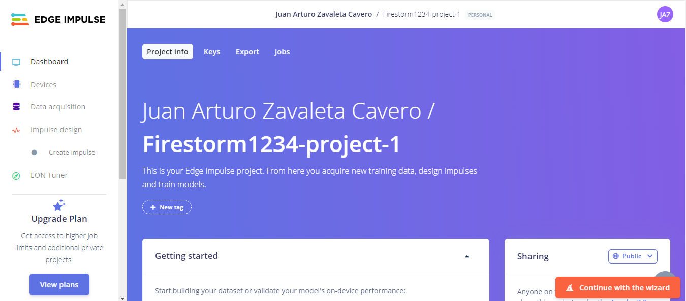
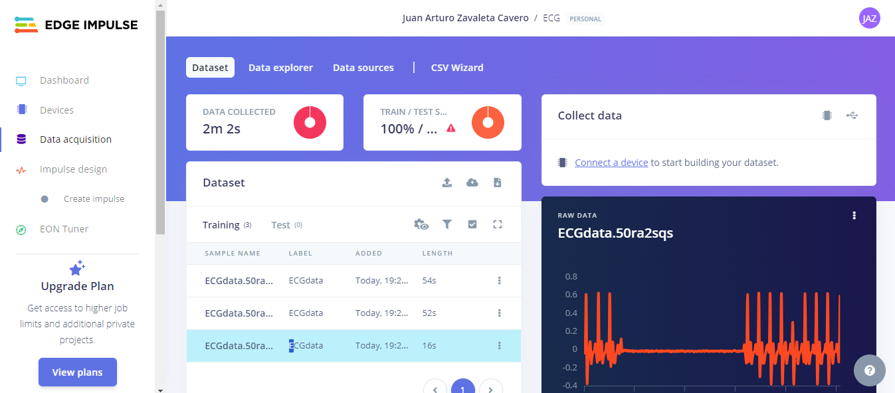

# Laboratorio 11 - Edge Impulse - TinyML

#### Almuno: Juan Arturo Zavaleta Cavero
#### Curso: Introducción a Señales Biomédicas

## Tabla de contenidos
- [Objetivos](#objetivos)
- [Materiales](#materiales)
- [Enlaces de Proyecto](#enlaces-de-proyecto)
- [Resultados](#resultados)
- [Creeación de Archivos](#creación-de-archivos-csv)
- [Código de Python](#código-de-python)

##  Objetivos
- Subir data de señales de EEG, ECG y EMG a Edge Impulse 

## Materiales
| Material | Cantidad |
|:--------------:|:--------------:|
| Lenguaje de programación *Python* | N.A | 
| Plataforma *Edge Impulse* | N.A | 

## Enlaces de Proyecto

#### EMG

https://studio.edgeimpulse.com/studio/431492

#### ECG

https://studio.edgeimpulse.com/studio/431491

#### EEG

https://studio.edgeimpulse.com/studio/431103

## Resultados 

| Proyecto de prueba | Proyecto ECG |
|:--------------:|:--------------:|
| || 

| Proyecto EMG | Proyecto EEG |
|:--------------:|:--------------:|
|  || 

## Creación de archivos .csv

```python

import pandas as pd
import matplotlib.pyplot as plt
import numpy as np
import glob
import requests
from scipy.io import loadmat
import re
import json
import time, hmac, hashlib
import requests
import scipy.io
import pandas as pd
import os


def get_values_and_save_to_csv(path, output_csv):
    df = pd.read_csv(path, sep='\t', skiprows=3)  # Skip the first three rows (header)
    novena_columna = df.iloc[:, 6].values  # Get the values from the sixth column (index 5)
    
    # Generate the n values
    n = [i/1000 for i in range(len(novena_columna))]
    
    # Calculate the signal values
    signal = [(float(valor)/(2**10)-1/2)*3.3/1009*1000 for valor in novena_columna]
    
    # Create a DataFrame from the n and signal values
    output_df = pd.DataFrame({'n': n, 'signal': signal})
    
    # Save the DataFrame to a CSV file
    output_df.to_csv(output_csv, index=False)
    print(f"Saved signal data to {output_csv}")


output_csv_path = "C:/Users/Eva/Desktop/University/7mo ciclo/ISB-2024_1/Códigos/Lab 11 - Edge Impulse/Señales"
path = "C:/Users/Eva/Desktop/University/7mo ciclo/ISB-2024_1/Códigos/Lab 11 - Edge Impulse/Señales/ECG"
k = 0
for i in os.listdir(path):
    print(i)
    newPath = os.path.join(path, i)
    get_values_and_save_to_csv(newPath, output_csv_path+"ECG"+str(k)+".csv")
    k+=1

```


## Código de Python 

Para subir las señales recoletadas, se empleó el siguiente código: 

```python

import time
import hmac
import hashlib
import json
import requests
import csv

def upload_ei(_name_label, _values, hmac_key, api_key):
    HMAC_KEY = hmac_key
    API_KEY = api_key
    emptySignature = ''.join(['0'] * 64)

    data = {
        "protected": {
            "ver": "v1",
            "alg": "HS256",
            "iat": time.time()  # epoch time, seconds since 1970
        },
        "signature": emptySignature,
        "payload": {
            "device_name": "ac:87:a3:0a:2d:1b",
            "device_type": "BiTalino",
            "interval_ms": 1,  # Intervalo en milisegundos (1 ms para 1000 Hz)
            "sensors": [
                { "name": "ECG", "units": "mV" }  # Asumiendo que la señal ECG está en milivoltios
            ],
            "values": _values
        }
    }

    # encode in JSON
    encoded = json.dumps(data)

    # sign message
    signature = hmac.new(bytes(HMAC_KEY, 'utf-8'), msg=encoded.encode('utf-8'), digestmod=hashlib.sha256).hexdigest()

    # set the signature again in the message, and encode again
    data['signature'] = signature
    encoded = json.dumps(data)

    # and upload the file
    res = requests.post(url='https://ingestion.edgeimpulse.com/api/training/data',
                        data=encoded,
                        headers={
                            'Content-Type': 'application/json',
                            'x-file-name': _name_label,
                            'x-api-key': API_KEY
                        })
    if (res.status_code == 200):
        print('Uploaded file to Edge Impulse', res.status_code, res.content)
    else:
        print('Failed to upload file to Edge Impulse', res.status_code, res.content)

def read_csv(file_path):
    values = []
    with open(file_path, newline='', encoding='utf-8') as csvfile:
        csvreader = csv.reader(csvfile)
        next(csvreader)  # Skip header row
        for row in csvreader:
            # Convert the second column to float and store it
            try:
                ecg_value = float(row[1])  # Obtener el valor de ECG, EMG o EEG
                values.append([ecg_value])  # Solo la amplitud
            except ValueError as e:
                print(f"Skipping row due to error: {e}")
    return values

# Paths for ECG, EEG and EMG
pathsECG = ['ECG_data/SeñalesECG0.csv','ECG_data/SeñalesECG1.csv','ECG_data/SeñalesECG2.csv']
pathsEEG = ['EEG_data/SeñalesEEG0.csv','EEG_data/SeñalesEEG1.csv','EEG_data/SeñalesEEG1.csv']
pathsEMG = ['EMG_data/EMG1.csv','EMG_data/EMG2.csv','EMG_data/EMG3.csv']

# Define labels and keys
name_label_ECG= 'ECGdata'
hmac_key_ECG = 'c6d7d06ad79ad0076fcc779e552aace2'  # HMAC key ECG
api_key_ECG = 'ei_d696e62d34a51c185519c739215e649bb6314a357e44e90338be9f614a105fb8'  # API key ECG

name_label_EEG= 'EEGdata'
hmac_key_EEG = '903121853291d44f92b24788c7af44a9'  # HMAC key EEG
api_key_EEG = 'ei_e248d1dac25600710bcacb098469524a1c8d3fab3c0788abe29e9846edaa66b4	'  # API key EEG

name_label_EMG= 'EMGdata'
hmac_key_EMG = '34cbaaa947c7a65f11b1927dd724e3cd'  # HMAC key EMG
api_key_EMG = 'ei_54126a9d945cbb1cfc1891e45ff172ad8ae71a2b2c5cdce8174fdb576e1704d3'  # API key EMG


for file_path in pathsECG:
    values = read_csv(file_path)
    # Upload data
    upload_ei(name_label_ECG, values, hmac_key_ECG, api_key_ECG)

for file_path in pathsEEG:
    # Read CSV file
    values = read_csv(file_path)
    # Upload data
    upload_ei(name_label_EEG, values, hmac_key_EEG, api_key_EEG)

for file_path in pathsEMG:
    # Read CSV file
    values = read_csv(file_path)
    # Upload data
    upload_ei(name_label_EMG, values, hmac_key_EMG, api_key_EMG)

```