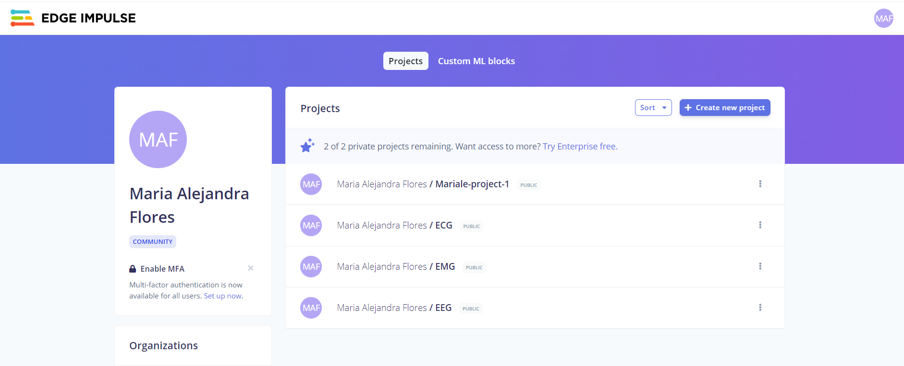

# Lab 11 - Edge Impulse - María Alejandra Flores

## Tabla de contenidos
- [Objetivos](#objetivos)
- [Materiales](#materiales)
- [Resultados](#resultados)


##  Objetivos
- Subir data de señales de EEG, ECG y EMG a Edge Impulse 

## Materiales
| Material | Cantidad |
|:--------------:|:--------------:|
| Lenguaje de programación *Python* | N.A | 
| Plataforma *Edge Impulse* | N.A | 


## Resultados


Fig 1. Creación de proyectos


| Proyecto de prueba | Proyecto ECG |
|:--------------:|:--------------:|
|  || 

| Proyecto EMG | Proyecto EEG |
|:--------------:|:--------------:|
|  || 


### Links para visualización
- [Proyecto de prueba](https://studio.edgeimpulse.com/studio/429736/acquisition/training?page=1)
- [Proyecto EMG](https://studio.edgeimpulse.com/studio/431127/acquisition/training?page=1)
- [Proyecto ECG](https://studio.edgeimpulse.com/studio/431124/acquisition/training?page=1)
- [Proyecto EEG](https://studio.edgeimpulse.com/studio/431129/acquisition/training?page=1)

## Código en Python

### Para subir las imágenes de prueba
```python
# Install requests via: `pip3 install requests`
import requests
import os

api_key = 'ei_2ce926d0e1b2782bff5dc8c7698d3330f511b99bae3d55550a8a5913e629abf5'
# Add the files you want to upload to Edge Impulse


files = [
    "23456789_0.png",
    "71996960_0.png",
]
# # Replace the label with your own.
label = 'ECGdata2'
# Upload the file to Edge Impulse using the API, and print the response.
res = requests.post(url='https://ingestion.edgeimpulse.com/api/training/files',
                    headers={
                        'x-label': label,
                        'x-api-key': api_key,
                    },
                    # Creating the data payload for the request.
                    files=(('data', (os.path.basename(i), open(
                        i, 'rb'), 'application/csv')) for i in files)
                    )

if (res.status_code == 200):
    print('Uploaded file(s) to Edge Impulse\n', res.status_code, res.content)
else:
    print('Failed to upload file(s) to Edge Impulse\n',
          res.status_code, res.content)
```

### Para subir las señales de EMG, ECG y EEG
```python
import time
import hmac
import hashlib
import json
import requests
import csv

def upload_ei(_name_label, _values, hmac_key, api_key):
    HMAC_KEY = hmac_key
    API_KEY = api_key
    emptySignature = ''.join(['0'] * 64)

    data = {
        "protected": {
            "ver": "v1",
            "alg": "HS256",
            "iat": time.time()  # epoch time, seconds since 1970
        },
        "signature": emptySignature,
        "payload": {
            "device_name": "ac:87:a3:0a:2d:1b",
            "device_type": "BiTalino",
            "interval_ms": 1,  # Intervalo en milisegundos (1 ms para 1000 Hz)
            "sensors": [
                { "name": "ECG", "units": "mV" }  # Asumiendo que la señal ECG está en milivoltios
            ],
            "values": _values
        }
    }

    # encode in JSON
    encoded = json.dumps(data)

    # sign message
    signature = hmac.new(bytes(HMAC_KEY, 'utf-8'), msg=encoded.encode('utf-8'), digestmod=hashlib.sha256).hexdigest()

    # set the signature again in the message, and encode again
    data['signature'] = signature
    encoded = json.dumps(data)

    # and upload the file
    res = requests.post(url='https://ingestion.edgeimpulse.com/api/training/data',
                        data=encoded,
                        headers={
                            'Content-Type': 'application/json',
                            'x-file-name': _name_label,
                            'x-api-key': API_KEY
                        })
    if (res.status_code == 200):
        print('Uploaded file to Edge Impulse', res.status_code, res.content)
    else:
        print('Failed to upload file to Edge Impulse', res.status_code, res.content)

def read_csv(file_path):
    values = []
    with open(file_path, newline='', encoding='utf-8') as csvfile:
        csvreader = csv.reader(csvfile)
        next(csvreader)  # Skip header row
        for row in csvreader:
            # Convert the second column to float and store it
            try:
                ecg_value = float(row[1])  # Obtener el valor de ECG, EMG o EEG
                values.append([ecg_value])  # Solo la amplitud
            except ValueError as e:
                print(f"Skipping row due to error: {e}")
    return values

# Paths for ECG, EEG and EMG
pathsECG = ['ECGdata/SeñalesECG0.csv','ECGdata/SeñalesECG1.csv','ECGdata/SeñalesECG2.csv']
pathsEEG = ['EEGdata/SeñalesEEG0.csv','EEGdata/SeñalesEEG1.csv','EEGdata/SeñalesEEG1.csv']
pathsEMG = ['EMGdata/SeñalesEMG0.csv','EMGdata/SeñalesEMG1.csv','EMGdata/SeñalesEMG1.csv']

# Define labels and keys
name_label_ECG= 'ECGdata'
hmac_key_ECG = 'c6d7d06ad79ad0076fcc779e552aace2'  # HMAC key ECG
api_key_ECG = 'ei_c80666a331c20882ec2a46056ca8e5d57a7d537469505de7596d439ceea54ac2'  # API key ECG

name_label_EEG= 'EEGdata'
hmac_key_EEG = '903121853291d44f92b24788c7af44a9'  # HMAC key EEG
api_key_EEG = 'ei_394cca4fbf731fb1762d85863732c95bd47495a3682d2e456741b04cb18f8926'  # API key EEG

name_label_EMG= 'EMGdata'
hmac_key_EMG = '34cbaaa947c7a65f11b1927dd724e3cd'  # HMAC key EMG
api_key_EMG = 'ei_dcfbaee43928e2f035fc3e464a80c64465d6528a00d0125c7d8b0f7a5f4e76d7'  # API key EMG


for file_path in pathsECG:
    values = read_csv(file_path)
    # Upload data
    upload_ei(name_label_ECG, values, hmac_key_ECG, api_key_ECG)

for file_path in pathsEEG:
    # Read CSV file
    values = read_csv(file_path)
    # Upload data
    upload_ei(name_label_EEG, values, hmac_key_EEG, api_key_EEG)

for file_path in pathsEMG:
    # Read CSV file
    values = read_csv(file_path)
    # Upload data
    upload_ei(name_label_EMG, values, hmac_key_EMG, api_key_EMG)
```
