# Lab 3 - EMG con BiTalino

## Tabla de contenidos
- [Objetivos](#objetivos)
- [Materiales](#materiales)
- [Introducción](#introducción)
- [Conexión utilizada](#Conexión-utilizada)
- [Procedimiento](#Procedimiento)
- [Prueba 1](#Prueba-1)
- [Prueba 2](#Prueba-2)
- [Prueba 3](#Prueba-3)
- [Referencias](#referencias)
  
##  Objetivos
- Adquirir señales biomédicas de EMG.
- Hacer una correcta configuración de BiTalino.
- Extraer la información de las señales EMG de software OpenSignals (r)evolution.

## Materiales
| Material | Cantidad |
|--------------|--------------|
| Kit BiTalino    | 1    |
| Laptop    | 1    |
| Electrodos    | 3    |

## Introducción

El electromiograma (EMG) es un procedimiento utilizado para la evaluación de la salud muscular y las células nerviosas que intervienen (neuronas motoras). En la electromiografía se utilizan electrodos para traducir las señales eléctricas producidas por las neuronas motoras que generan la contracción muscular. Los electrodos son usados para la medición de la velocidad e intensidad de las señales que se desplazan entre 2 o más puntos [1].

Para la práctica se utilizó 1 kit BiTalino para la realización de EMG. El dispositivo de BITalino EMG posee una configuración bipolar, ideal para la adquisición de señales con bajo ruido [2]. Además, se utilizó el software OpenSignals (r)evolution para la adquisición de la señal y los datos para un posterior análisis.

## Conexión utilizada

Para la adquisición de señales electromiográficas se utilizó la siguiente conexión en BITalino con 3 electrodos

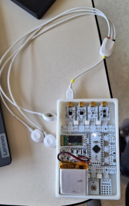

Figura 1. Conexiones de BITalino para EMG

## Procedimiento

Se realizaron 3 mediciones de EMG en diferentes partes del cuerpo. Para la colocación de los electrodos se tomó de referencia los ejemplos de la “Guía De Procedimiento de Electromiografía y velocidad de conducción de nervios periféricos del INSN”, el “Manual de procedimientos en electromiografía” y “BITalino (r)evolution Lab Guide”.  

La colocación de los electrodos será la siguiente: Los electrodos positivo y negativo será colocados en el músculo de interés, mientras que el electrodo de referencia será colocado en una zona neutra (por ejemplo un hueso).

### Prueba 1

En la primera prueba se obtuvo el EMG del bíceps. Los electrodos fueron colocados como se observa en la figura 2. Se tomó registro de la señal en estado de reposo o silencio eléctrico (figura 3) y realizando la contracción muscular (figura 4).

| Posicionamiento de los electrodos para la prueba 1|
|:--------------:|
|  |
|Figura 2  |

| Brazo en estado de reposo| Brazo en estado de tensión |
|:--------------:|:--------------:|
| 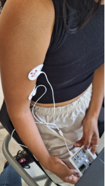   | 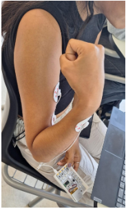   |
| Figura 3    | Figura 4   |

| Brazo en reposo | Brazo en estado de tensión |
|:--------------:|:--------------:|
| VIDEO    | VIDEO    |

### Prueba 2

En la segunda prueba se obtuvo el EMG del pulgar (Abductor pollicis brevis). Los electrodos fueron colocados como se observa en la figura 5, con una separación aproximada de 2 cm entre electrodo positivo y negativo. Se tomó registro de la señal en estado de reposo o silencio eléctrico (figura 6) y realizando la contracción muscular (figura 7).

| Posicionamiento de los electrodos para la prueba 2|
|:--------------:|
|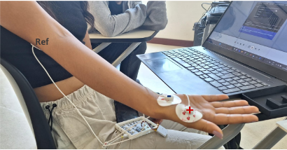  |
|Figura 5  |

| Estado de reposo| Contracción muscular |
|:--------------:|:--------------:|
| 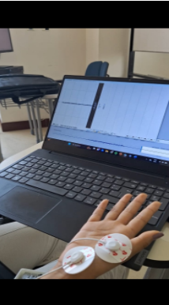    | 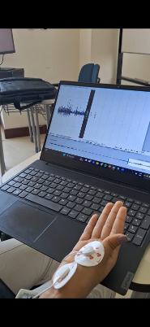    |
| Figura 6    | Figura 7   |

| Dedo en reposo | Dedo en estado de tensión |
|:--------------:|:--------------:|
| VIDEO    | VIDEO    |

### Prueba 3

En la segunda prueba se obtuvo el EMG del sóleo. Los electrodos fueron colocados como se observa en la figura 8. Se tomó registro de la señal en estado de reposo o silencio eléctrico (figura 9) y realizando la contracción muscular (figura 10).

| Posicionamiento de los electrodos para la prueba 3|
|:--------------:|
|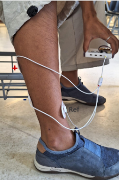  |
|Figura 8  |

| Estado de reposo| Contracción muscular |
|:--------------:|:--------------:|
| 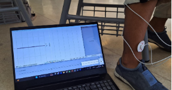    | 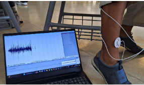    |
| Figura 9    | Figura 10   |

| Pierna en reposo | Pierna en estado de tensión |
|:--------------:|:--------------:|
| VIDEO    | VIDEO    |

##  Ploteo de Python

- Para el ploteo de la primera señal adquirida, que refiere al EMG del paquete muscular **biceps braquial**, se tiene el siguiente código: 
(Archivo: Ploteo_s1.py)

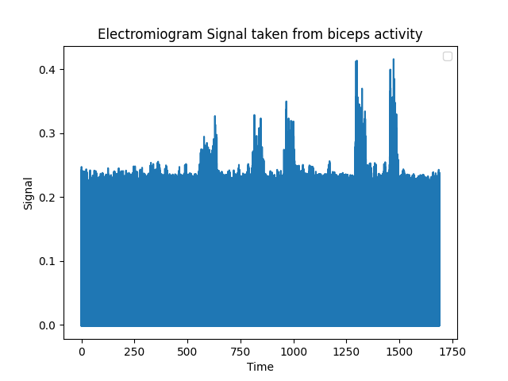

```python
import re
with open('emg1.txt', 'r') as file:
    texto = file.read()


columna_sexta = re.findall(r'\b\d+\b', texto.split("# EndOfHeader")[1])
Signal = []
k = 10
for valor in columna_sexta:
    Signal.append((float(valor)/(2^k)-1/2)*3.3/1009)

n = [i for i in range(0,len(Signal))]
Ts = 1/1000
time = [i*Ts for i in n]

import matplotlib.pyplot as plt

plt.plot(time, Signal)
plt.xlabel('Time')
plt.ylabel('Signal')
plt.title('Electromiogram Signal taken from biceps activity')

plt.legend()
plt.savefig('scatter_plot1.png')
plt.show()
```
- Para el ploteo de la segunda señal adquirida, que refiere al EMG del músculo __abductor pollicis brevis__, se tiene el siguiente código: 
(Archivo: Ploteo_s2.py)

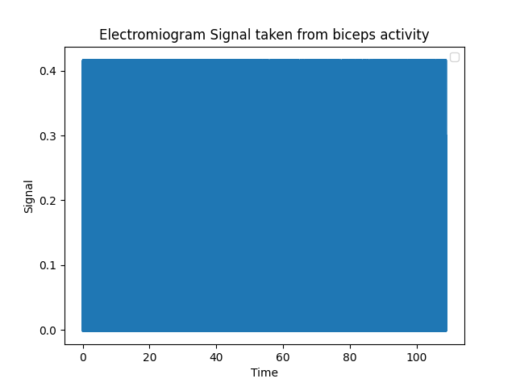

```python 
import re
with open('emg2.txt', 'r') as file:
    texto = file.read()


columna_sexta = re.findall(r'\b\d+\b', texto.split("# EndOfHeader")[1])
Signal2 = []

k = 10
for valor in columna_sexta:
    Signal2.append((float(valor)/(2^k)-1/2)*3.3/1009)
n = [i for i in range(0,len(Signal2))]
Ts = 1/1000
time2 = [i*Ts for i in n]
print(len(time2))
print(len(Signal2))
import matplotlib.pyplot as plt

plt.plot(time2, Signal2)
plt.xlabel('Time')
plt.ylabel('Signal')
plt.title('Electromiogram Signal taken from "Pollicis brevis abductor" activity')
plt.legend()
plt.savefig('scatter_plot2.png')
plt.show()

```
- Para el ploteo de la tercera señal adquirida, que refiere al EMG del músculo __sóleo__ y __gemelos__, se tiene el siguiente código: 
(Archivo: Ploteo_s3.py)

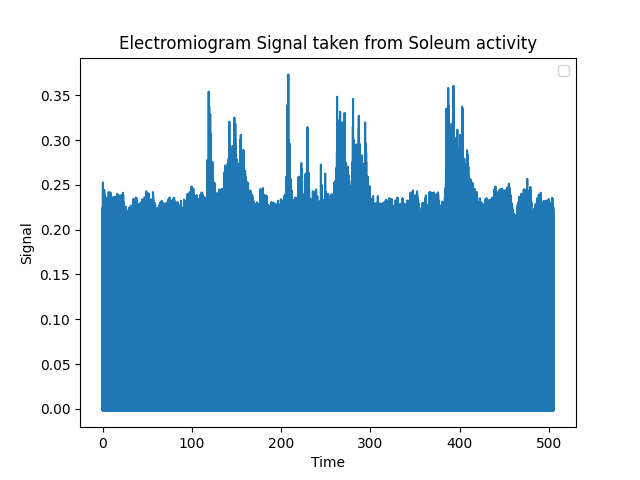

```python
import re
with open('emg3.txt', 'r') as file:
    texto = file.read()


columna_sexta = re.findall(r'\b\d+\b', texto.split("# EndOfHeader")[1])
Signal3 = []

k = 10
for valor in columna_sexta:
    Signal3.append((float(valor)/(2^k)-1/2)*3.3/1009)
n = [i for i in range(0,len(Signal3))]
Ts = 1/1000
time3 = [i*Ts for i in n]
print(len(time3))
print(len(Signal3))
import matplotlib.pyplot as plt

plt.plot(time3, Signal3)
plt.xlabel('Time')
plt.ylabel('Signal')
plt.title('Electromiogram Signal taken from Soleum activity')
plt.legend()
plt.savefig('scatter_plot3.png')
plt.show()
```

## Referencias

[1]  “Electromiografía”, Mayoclinic.org, 21-may-2019. [En línea]. Disponible en: https://www.mayoclinic.org/es/tests-procedures/emg/about/pac-20393913. [Consultado: 13-abr-2024].

[2] “Electromyography (EMG) Sensor User Manual”, Bitalino.com. [En línea]. Disponible en: https://www.bitalino.com/storage/uploads/media/electromyography-emg-user-manual.pdf. [Consultado: 13-abr-2024].
