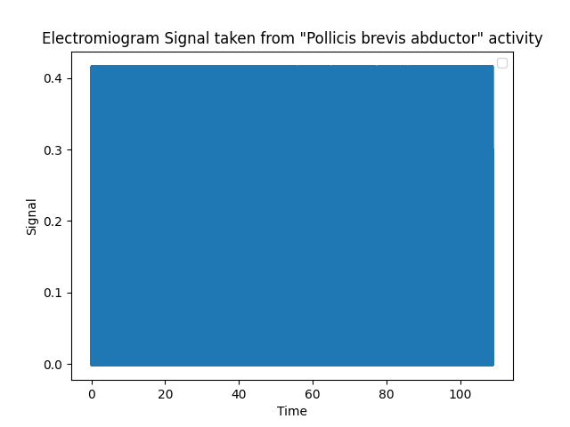

# Lab 3 - EMG con BiTalino

##  Objetivos de la práctica
Adquirir señales biomédicas de EMG.
Hacer una correcta configuración de BiTalino.
Extraer la información de las señales EMG de software OpenSignals (r)evolution

## Materiales
- Kit BiTalino
- Laptop
- Electrodos

## Introducción


##  Ploteo de Python

- Para el ploteo de la primera señal adquirida, que refiere al EMG del paquete muscular **biceps braquial**, se tiene el siguiente código: 
(Archivo: Ploteo_s1.py)


```python
import re
with open('emg1.txt', 'r') as file:
    texto = file.read()


columna_sexta = re.findall(r'\b\d+\b', texto.split("# EndOfHeader")[1])
Signal = []
k = 10
for valor in columna_sexta:
    Signal.append((float(valor)/(2^k)-1/2)*3.3/1009)

n = [i for i in range(0,len(Signal))]
Ts = 1/1000
time = [i*Ts for i in n]

import matplotlib.pyplot as plt

plt.plot(time, Signal)
plt.xlabel('Time')
plt.ylabel('Signal')
plt.title('Electromiogram Signal taken from biceps activity')

plt.legend()
plt.savefig('scatter_plot1.png')
plt.show()
```
- Para el ploteo de la segunda señal adquirida, que refiere al EMG del músculo __abductor pollicis brevis__, se tiene el siguiente código: 
(Archivo: Ploteo_s2.py)



```python 
import re
with open('emg2.txt', 'r') as file:
    texto = file.read()


columna_sexta = re.findall(r'\b\d+\b', texto.split("# EndOfHeader")[1])
Signal2 = []

k = 10
for valor in columna_sexta:
    Signal2.append((float(valor)/(2^k)-1/2)*3.3/1009)
n = [i for i in range(0,len(Signal2))]
Ts = 1/1000
time2 = [i*Ts for i in n]
print(len(time2))
print(len(Signal2))
import matplotlib.pyplot as plt

plt.plot(time2, Signal2)
plt.xlabel('Time')
plt.ylabel('Signal')
plt.title('Electromiogram Signal taken from "Pollicis brevis abductor" activity')
plt.legend()
plt.savefig('scatter_plot2.png')
plt.show()

```
- Para el ploteo de la tercera señal adquirida, que refiere al EMG del músculo __sóleo__ y __gemelos__, se tiene el siguiente código: 
(Archivo: Ploteo_s3.py)


```python
import re
with open('emg3.txt', 'r') as file:
    texto = file.read()


columna_sexta = re.findall(r'\b\d+\b', texto.split("# EndOfHeader")[1])
Signal3 = []

k = 10
for valor in columna_sexta:
    Signal3.append((float(valor)/(2^k)-1/2)*3.3/1009)
n = [i for i in range(0,len(Signal3))]
Ts = 1/1000
time3 = [i*Ts for i in n]
print(len(time3))
print(len(Signal3))
import matplotlib.pyplot as plt

plt.plot(time3, Signal3)
plt.xlabel('Time')
plt.ylabel('Signal')
plt.title('Electromiogram Signal taken from Soleum activity')
plt.legend()
plt.savefig('scatter_plot3.png')
plt.show()
```