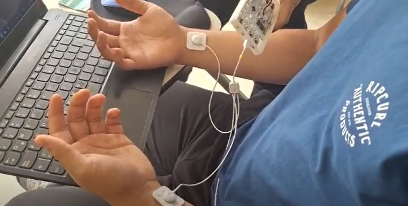

# Lab 4 - ECG con BiTalino

## Tabla de contenidos
- [Objetivos](#objetivos)
- [Materiales](#materiales)
- [Introducción](#introducción)
- [Conexión utilizada](#Conexión-utilizada)
- [Procedimiento](#Procedimiento)
- [Prueba 1](#Prueba-1)
- [Prueba 2](#Prueba-2)
- [Referencias](#referencias)
  
##  Objetivos
- Adquirir señales biomédicas de ECG.
- Hacer una correcta configuración de BiTalino.
- Extraer la información de las señales ECG de software OpenSignals (r)evolution.

## Materiales
| Material | Cantidad |
|--------------|--------------|
| Kit BiTalino    | 1    |
| ProSim 4 Vital Signs Simulator | 1    |
| Laptop    | 1    |
| Electrodos    | 3    |

## Marco Teórico

El electrocardiograma(ECG) es un procedimiento utilizado para evaluar la actividad eléctrica del corazón ya que nos permite diagnosticar anomalías en él como por ejemplo las arritmias [1]. Dichas anomalias pueden desencadenar eventos mortales como el infarto al miocardio por lo que una interpretación adecuada es de suma importancia para la prevención de enfermedades cardiacas [1]. 
Esta prueba muestra la variación en el tiempo de potenciales bioeléctricos que se dan en el corazón cuando este late [1]. Usualmente se utilizan las 12 derivaciones cuya interpretación es mas compleja. Sin embargo, en el presente laboratorio utilizamos unicamente derivaciones bipolares estándares por lo que utilizamos dos electrodos para detectar el potencial bioeléctrico
así como un electrodo de referencia a diferencia de un ECG con 12 derivaciones en el cual se utilizan 12 electrodos y su utilidad esta mas enfocada al diagnóstico de infartos e isquemias miocárdicas [3].

Respecto a las derivaciones bipolares, son derivaciones periféricas clásicas que nos permiten evaluar diferentes orientaciones de la actividad eléctrica del corazón. De esta manera, las derivaciones tienen un eje de derivación que junta a los polos de esta. Entre ellas existe una relación dada por la ley de Einthoven la cual nos indica que la suma de los voltajes de las derivaciones bipolares I y III nos dará el voltaje en la derivación II [3].

Diversas propuestas se estan desarrollando para permitir una interpretación automátizada del ECG para así aumentar la accesibilidad y precisión a los diagnósticos y por ende tratamientos de enfermedades cardiacas con riesgo de muerte [1]. Entre las propuestas para el procesamiento de estas señales se encuentran métodos de automático como inteligencia artificial (IA) o Machine Learning [1]. 

Para la práctica se utilizó 1 kit BiTalino para la realización de ECG así como unProSim 4 VItal Signs Simulator para simular un ECG según la derivación elegida. El dispositivo de BITalino ECG posee una configuración bipolar, ideal para la adquisición de señales con bajo ruido [2]. Además, se utilizó el software OpenSignals (r)evolution para la adquisición de la señal y los datos para un posterior análisis.

## Conexión utilizada

Para la adquisición de señales electrocardiográficas se utilizó la siguiente conexión en BITalino con 3 electrodos


Figura 1. Conexiones de BITalino para ECG

## Procedimiento

Se realizaron 2 mediciones de ECG en diferentes partes del cuerpo. Para la colocación de los electrodos se tomó de referencia los ejemplos de la “Guía De Procedimiento de Electromiografía y velocidad de conducción de nervios periféricos del INSN”, el “Manual de procedimientos en electromiografía” y “BITalino (r)evolution Lab Guide”.  

La colocación de los electrodos será la siguiente: Los electrodos positivo y negativo será colocados en el músculo de interés, mientras que el electrodo de referencia será colocado en una zona neutra (por ejemplo un hueso).

### Prueba 1

En la primera prueba se obtuvo el ECG del bíceps. Los electrodos fueron colocados como se observa en la figura 2. Se tomó registro de la señal en estado de reposo o silencio eléctrico (figura 3) y realizando la contracción muscular (figura 4).

| Posicionamiento de los electrodos para la prueba 1|
|:--------------:|
|  |
|Figura 2  |

| xxx | xxxx |
|:--------------:|:--------------:|
|    |    |
| Figura 3    | Figura 4   |

#### Ploteo en OpenSignals

| xxx| xxx |
|:--------------:|:--------------:|
|     |    |
| Figura 5    | Figura 6   |

| Video: xxx |
|:----------------------------:|
| [](xxx)    |


### Prueba 2

En la segunda prueba se 

| Posicionamiento de los electrodos para la prueba 2|
|:--------------:|
|  |
|Figura 7  |

| Estado de reposo| xxx |
|:--------------:|:--------------:|
|     |     |
| Figura 8    | Figura 9   |

#### Ploteo en OpenSignals

| Estado de reposo| xx |
|:--------------:|:--------------:|
|     |     |
| Figura 10   | Figura 11   |

| Video: xxx - xxxx |
|:----------------------------:|
| [](xxxx)    |


### Prueba 3

En la segunda prueba xxx

| Posicionamiento de los electrodos para la prueba 3|
|:--------------:|
|  |
|Figura 12  |

| Estado de reposo| xxx|
|:--------------:|:--------------:|
|     |     |
| Figura 13    | Figura 14   |

#### Ploteo en OpenSignals

| Estado de reposo| xxx|
|:--------------:|:--------------:|
|   |    |
| Figura 15    | Figura 16  |

| Video : xxxx  |
|:----------------------------:|
| [](xxx)    |


### Explicación


##  Ploteo de Python

- Para el ploteo de la primera señal adquirida, se tiene el siguiente código: 
(Archivo: Ploteo_s1.py)


- Para el ploteo de la segunda señal adquirida, se tiene el siguiente código: 
(Archivo: Ploteo_s2.py)


- Para el ploteo de la tercera señal adquirida, se tiene el siguiente código: 
(Archivo: Ploteo_s3.py)

```

## Referencias

1. Kundu M, Nasipuri M, Kumar Basu D. Knowledge-based ECG interpretation: a critical review. Pattern Recognit [Internet]. Marzo de 2000 [consultado el 19 de abril de 2024];33(3):351-73. Disponible en: https://doi.org/10.1016/s0031-3203(99)00065-5

2. Breen CJ, Kelly GP, Kernohan WG. ECG interpretation skill acquisition: A review of learning, teaching and assessment. J Electrocardiol [Internet]. Abril de 2019 [consultado el 19 de abril de 2024]. Disponible en: https://doi.org/10.1016/j.jelectrocard.2019.03.010

3. www.elsevier.com [Internet]. Interpretación del ECG: Guí­a Esencial para Profesionales Médicos; 12 de junio de 2023 [consultado el 19 de abril de 2024]. Disponible en: https://www.elsevier.com/es-es/connect/electrocardiograma-de-12-derivaciones-derivaciones-y-ejes

