# Lab 4 - ECG con BiTalino

## Tabla de contenidos
- [Objetivos](#objetivos)
- [Materiales](#materiales)
- [Introducción](#introducción)
- [Conexión utilizada](#Conexión-utilizada)
- [Procedimiento](#Procedimiento)
- [Prueba 1](#Prueba-1)
- [Prueba 2](#Prueba-2)
- [Referencias](#referencias)
  
##  Objetivos

- Adquirir señales biomédicas de ECG.
- Hacer una correcta configuración de BiTalino.
- Extraer la información de las señales ECG del software OpenSignals (r)evolution.

## Materiales
| Material | Cantidad |
|--------------|--------------|
| Kit BiTalino    | 1    |
| Dispositivo *ProSim 4 Vital Signs Simulator* | 1    |
| Laptop    | 1    |
| Electrodos    | 3    |
| Programa *Open Signal (r)evolution* | N.A |
| Programa *Python* | N.A | 

## Marco Teórico

El electrocardiograma(ECG) es un procedimiento utilizado para evaluar la actividad eléctrica del corazón ya que nos permite diagnosticar anomalías en él como por ejemplo las arritmias [1]. Dichas anomalias pueden desencadenar eventos mortales como el infarto al miocardio por lo que una interpretación adecuada es de suma importancia para la prevención de enfermedades cardiacas [1]. 
Esta prueba muestra la variación en el tiempo de potenciales bioeléctricos que se dan en el corazón cuando este late [1]. Usualmente se utilizan las 12 derivaciones cuya interpretación es mas compleja. Sin embargo, en el presente laboratorio utilizamos unicamente derivaciones bipolares estándares por lo que utilizamos dos electrodos para detectar el potencial bioeléctrico
así como un electrodo de referencia a diferencia de un ECG con 12 derivaciones en el cual se utilizan 12 electrodos y su utilidad esta mas enfocada al diagnóstico de infartos e isquemias miocárdicas [3].

Respecto a las derivaciones bipolares, son derivaciones periféricas clásicas que nos permiten evaluar diferentes orientaciones de la actividad eléctrica del corazón. De esta manera, las derivaciones tienen un eje de derivación que junta a los polos de esta. Entre ellas existe una relación dada por la ley de Einthoven la cual nos indica que la suma de los voltajes de las derivaciones bipolares I y III nos dará el voltaje en la derivación II [3].

Diversas propuestas se estan desarrollando para permitir una interpretación automátizada del ECG para así aumentar la accesibilidad y precisión a los diagnósticos y por ende tratamientos de enfermedades cardiacas con riesgo de muerte [1]. Entre las propuestas para el procesamiento de estas señales se encuentran métodos de automático como inteligencia artificial (IA) o Machine Learning [1]. 

Para la práctica se utilizó 1 kit BiTalino para la realización de ECG así como unProSim 4 VItal Signs Simulator para simular un ECG según la derivación elegida. El dispositivo de BITalino ECG posee una configuración bipolar, ideal para la adquisición de señales con bajo ruido [2]. Además, se utilizó el software OpenSignals (r)evolution para la adquisición de la señal y los datos para un posterior análisis.

## Conexión utilizada

Primero se utilizó el dispositivo ProSim 4 Vital Signs Simulator, cuya conexión se realizó de tal manera para simular un ECG de tipo derivación III. Para ello, en el punto LL se colocó el electrodo positivo, en el punto LA se colocó el electrodo negativo y en el punto RA se colocó el de referecia (Figura 1 y 2)

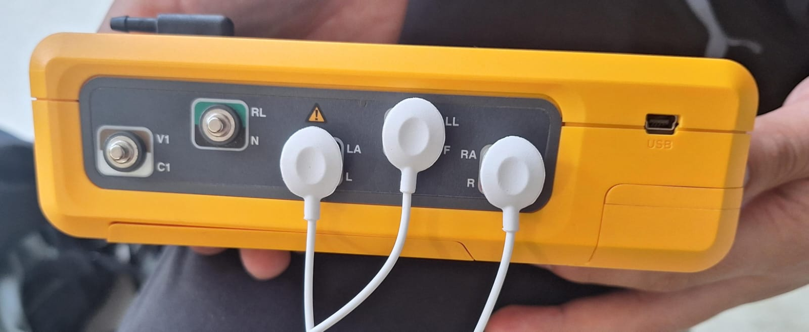
Figura 1. Conexiones en ProSim 4 Vital Signs Simulator
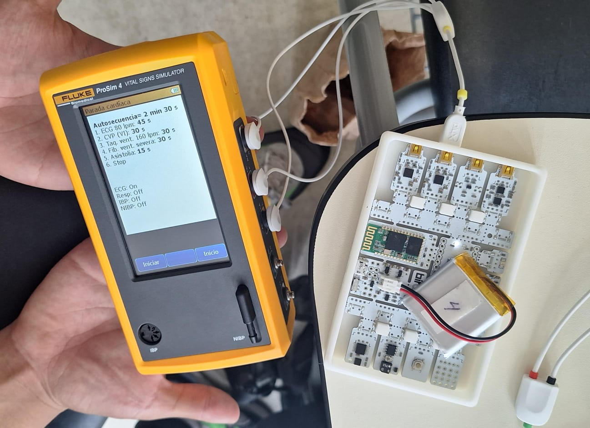
Figura 2. Conexiones en ProSim 4 Vital Signs Simulator y BiTalino

Para la obtención de ECG se utilizó la guía de "BITalino (r)evolution Lab Guide: EXPERIMENTAL GUIDES TO MEET & LEARN YOUR BIOSIGNALS". Se utilizó la conexión en el puerto A2 en el BiTalino y se realizó la colocación de los electrodos de acuerdo a la derivación I de Einthoven:

* Forma 1 : Colocación del electrodo positivo en la clavícula izquierda, electrodo negativo en la clavícula derecha y electrodo de referencia en la cresta iliaca. Observar figura 3.
* Forma 2: Colocación del electrodo positivo en la muñeca izquierda, electrodo negativo en la muñeca derecha y electrodo de referencia en la cresta iliaca. Observar figura 4.

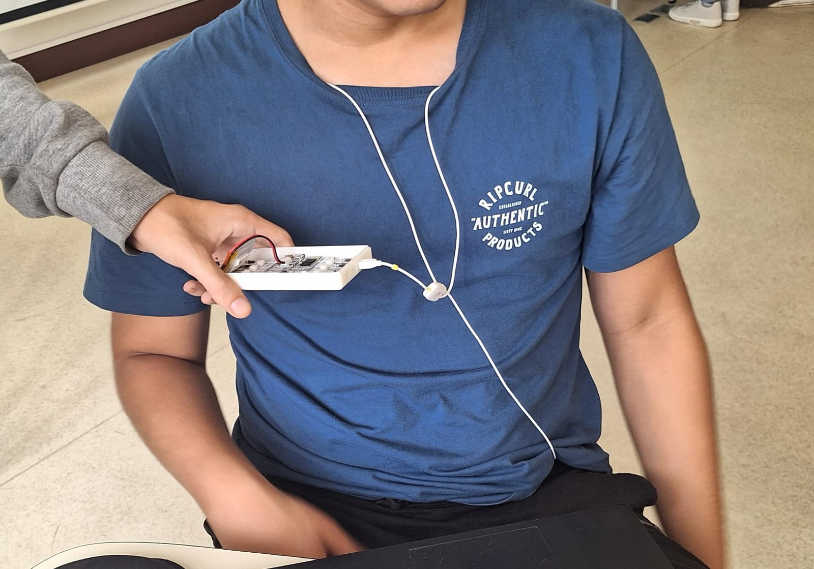
Figura 3. Colocación de electrodos para la derivación I (forma 1)

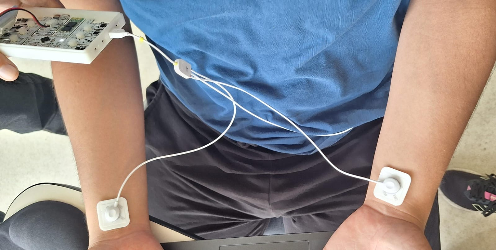
Figura 4. Colocación de electrodos para la derivación I (forma 2)

## Procedimiento

Se realizaron 2 mediciones de ECG en diferentes partes del cuerpo y se utilizó el dispositivo ProSim 4 Vital Signs Simulator para simular una secuencia de paro cardiaco

### Prueba con ProSim 4 Vital Signs Simulator

Con la ayuda de el dispositivo ProSim 4, se simuló una parada cardiaca. Esta consiste en una autosecuencia de 2 minutos y 30 segundos con 6 etapas:
1. ECG de 80 lpm (30 s)
2. Contracciones ventriculares prematuras (CVP) del ventrículo izquierdo (30 s)
3. Taquicardia ventricular de 160 lpm (30 s)
4. Fibrilación ventricular severa (30 s)
5. Asistolia (15 s)
6. Parada del corazón (muerte)

Por cuestiones de tiempo en clase, solo se tomó registro en el simulador OpenSignals (r)evolution a partir de la fase 2 a la 6. A continuación se muestran las gráficas obtenidas en cada una de estas fases.


| Fase | Señal obtenida |
|:--------------:|:--------------:|
| Figura 5. Contracciones ventriculares prematuras (CVP) del ventrículo izquierdo   | 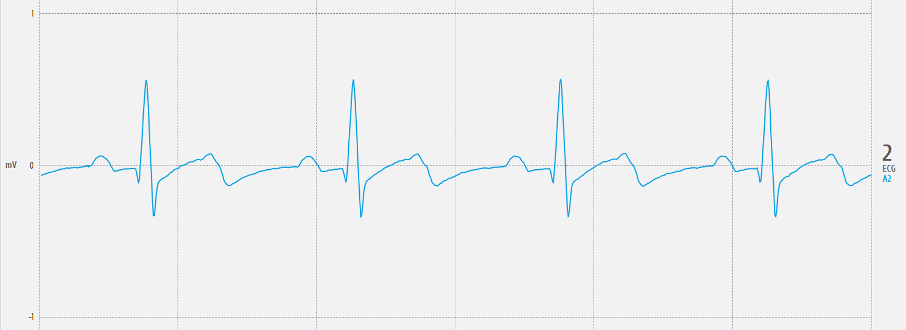 |
| Figura 6. Taquicardia ventricular de 160 lpm   | 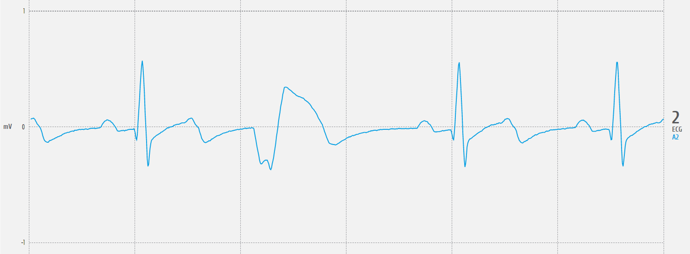   |
| Figura 7. Fibrilación ventricular severa| 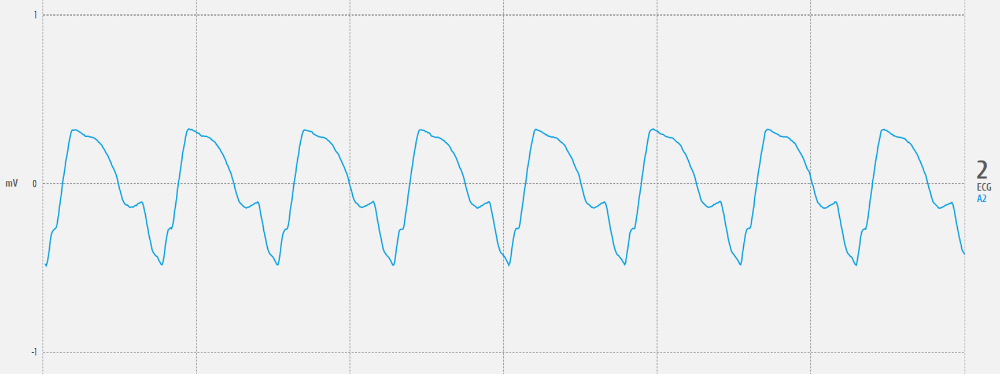|
| Figura 8. Asistolia | 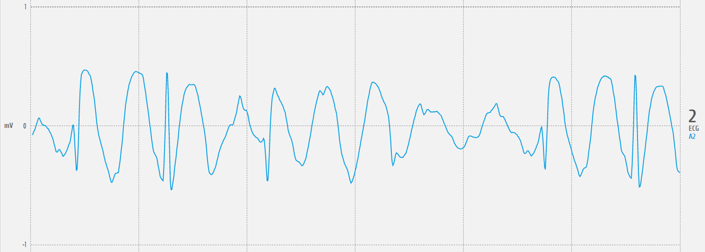|
| Figura 9. Parada del corazón (muerte)|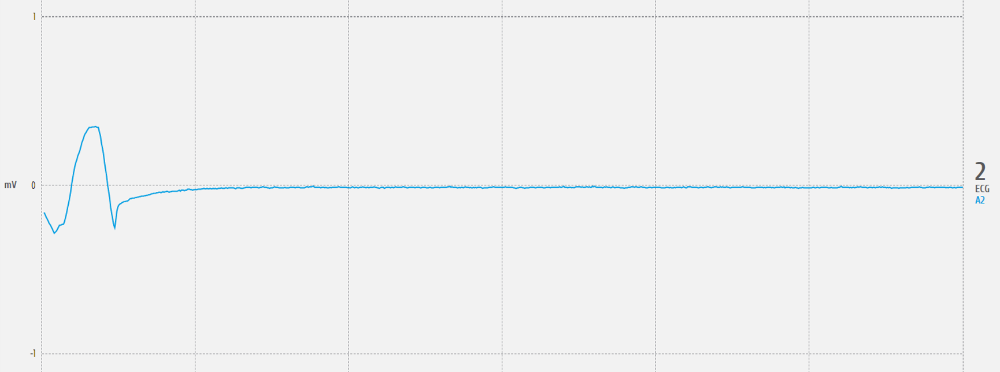 |


### Prueba ECG 

Para la prueba de electrocardiograma se realizó en 4 estados:
1. En estado de reposo con respiración normal (figura 10 y 11)
2. Hiperventilación (figura 12)
3. Después de la realización de ejercicio moderado (figura 13)
4. Luego de respiraciones largas (inhalación por 10 segundos, retención por 10 segundos y exhalación) (figura 14)


***Nota**: El estado de hiperventilación se mantuvo durante el proceso de medición. La actividad física consistió en trotar durante 5 minutos, y correr a velocidad máxima durante 2 minutos*

Para el estado de reposo se realizó con ambas formas de colocación de electrodos como se observa en la figura 10 y 11. Sin embargo, se observa que se obtiene una mejor señal con la colocación de electrodos en la forma 1 (clavículas y cresta iliaca), pues se obtiene mucho ruido en al colocar los electrodos de la forma 2 (muñecas y cresta iliaca). 

| Figura 10. Forma 1 en reposo | Figura 11. Forma 2 en reposo |
|:--------------:|:--------------:|
| 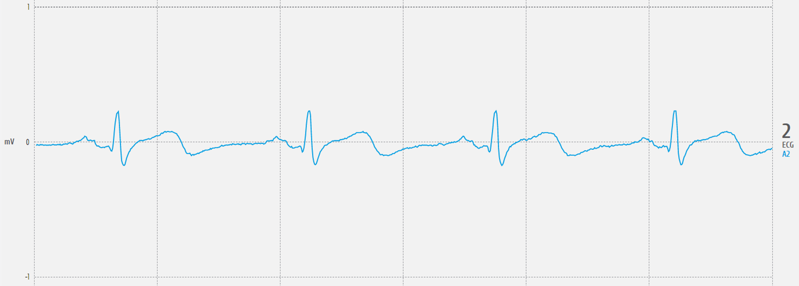    | 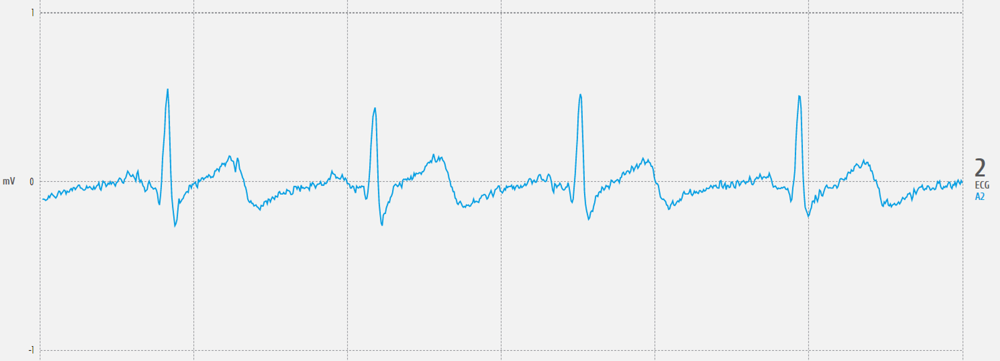    |

Por este motivo, todas las señales obtenidas a continuación se realizarán con los electrodos colocados en la forma 1. 

| Estado | Señal obtenida |
|:--------------:|:--------------:|
| Figura 12. Hiperventilación   | 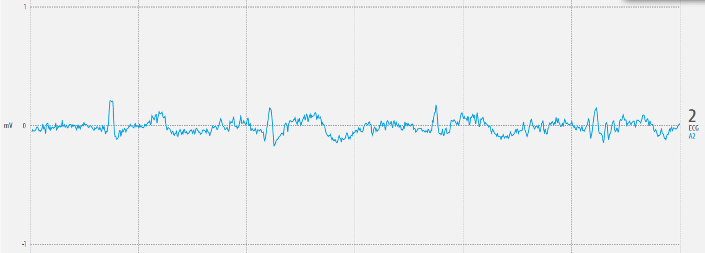   |
| Figura 13. Después de ejercicio| 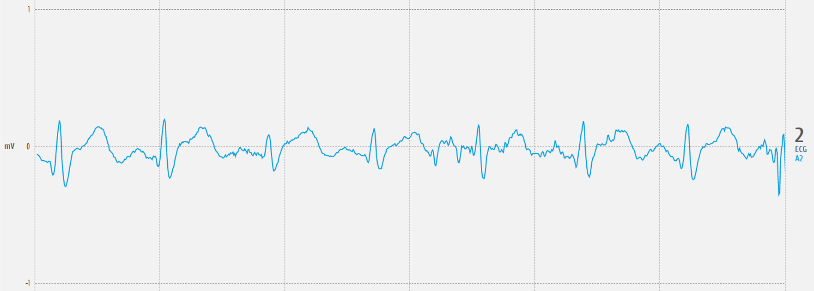|
| Figura 14. Respiraciones largas | 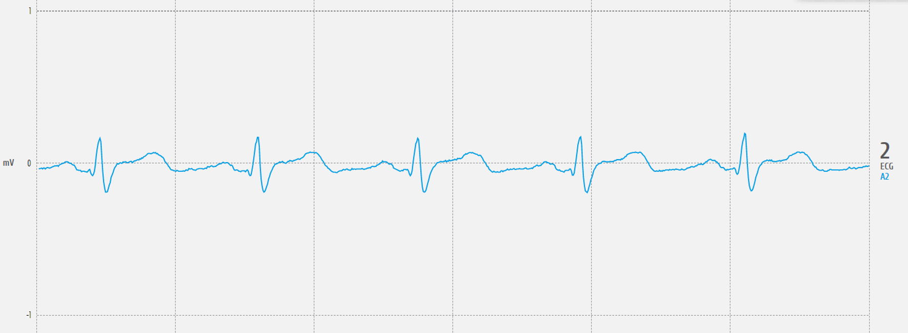|

A su vez, por medio de Python, se logró reproducir las señales obtenidas en el programa Open Signal. Las gráficas obtenidas se muestran a continuación:

| Estado | Señal obtenida |
|:--------------:|:--------------:|
| Figura 15. Reposo | 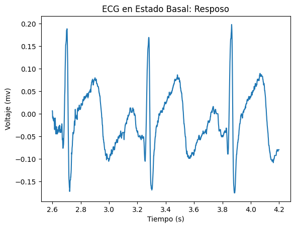|
| Figura 16. Hiperventilación   |    |
| Figura 17. Después de ejercicio| 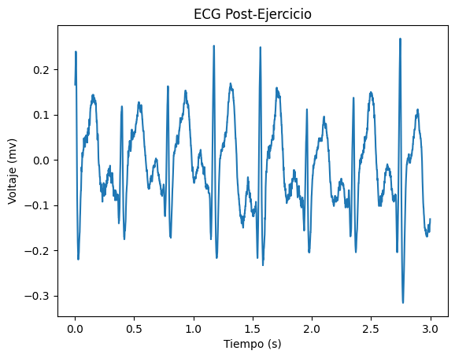|
| Figura 18. Respiraciones largas | |

***NOTA**: El ploteo de las señales se realizó en intervalos distintos, para una mejor apreciación de las señales.*

### Observaciones

Durante el desarrollo de la prueba se notaron aspectos que impactaron de manera significativa en la obtención de las señales de ECG. Uno de estos aspectos fue el uso de accesorios metálicos tales como piercing, anillos, relojes u otros, lo que no permitió obtener una señal clara de ECG como se observa en la figura 15. Además, se observó que mientras se realizaba la toma de la señal de ECG y se acercaba un dispositivo electrónico como laptop o celular a la persona que realizaba la prueba, la señal también se distorsionaba de manera significativa.

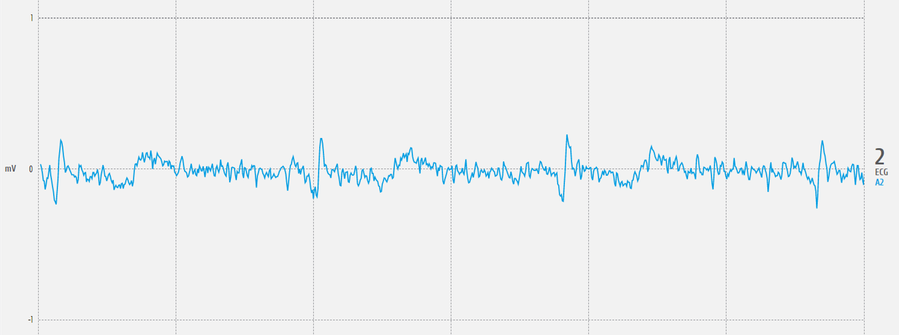
Figura 15. Señal de ECG con accesorios


## Explicación/ Discusión de resultados

### Estado de Reposo y Post-Ejercicio

De las imágenes mostradas anteriormente, se puede observar un periodo duración del segmento PQRS de 0.2 segundos aproximadamente en el estado de reposo, valor que pertenece al rango del periodo regular de dichas ondas en conjunto para derivaciones periféricas (0.20 a 0.24 segundos) [4]. 

Por otro lado, se observan artefactos eléctricos en las zonas de las ondas P, Q y T. Es importante resaltar que el procedimiento se llevó a cabo en un aula de clase, en la proximidad de dispositivos celulares y computadoras, con alta capacidad de transmisión de señales electromagnéticas para su sistema de comunicación. Según estudios como [5, 6], se sugiere que la presencia de señales electromagnéticas en el entorno de medición genera interferencias notorias en las gráficas de ECG, sean por parte de dispositivos móviles o por la red de área local inalámbrica (WLAN).

Luego de haber realizado las actividades de ejercicio, se esperaría que la señal eléctrica del corazón sufra una amplificación y un aumento de frecuencia, debido al incremento del gasto cardíaco durante dicho periodo, lo que supondría ontracciones mas fuertes y rápidas [7].. Asímismo, en el artículo [8], que estudia los cambios en las señales ECG inducidos por la actividad física en niños sanos, se obtiene que la amplitud de las ondas P, S y T se vieron amplificadas significativamente luego del ejercicio; además de que el periodo de duración de toda la onda en conjunto disminuye. Dichos fenómenos también se pueden presenciar en las gráficas de la señal adquirida. Se observa que, en reposo, el ritmo cardiaco registrado corresponde a 3 latidos por 1.6 segundos aproximadamente (1.875 Hz); mientras que, después del ejercicio, se producen 8 latidos por 3 segundos aproximadamente (2.667 Hz). Además, del artículo expuesto anteriormente, existe un estudio similar [9], cuyos resultados, respecto a alteración de la amplitud de la onda cardíaca y el periodo de cada onda y de la onda total, coinciden en que la actividad física influye en las características morfológicas de la señal ECG. 

se observa una mayor magnitud de potencial eléctrico en la señal de ECG.  

### Estado de Respiración e Hiperventilación


##  Ploteo de Python

Para el ploteo de las señales se utilizaron funciones (Archivo: Funciones.py) para realizar el ploteo de la señal (Archivo: Ploteo.py)

``` python

import pandas as pd
import matplotlib.pyplot as plt

def get_values(path):
  df = pd.read_csv(path, sep='\t', skiprows=3)  # saltar las dos primeras filas (encabezado)
  novena_columna = df.iloc[:, 6].values
  n = [i/1000 for i in range(0, len(novena_columna))]
  signal = [(float(valor)/(2**10)-1/2)*3.3/1009*1000 for valor in novena_columna]
  return n, signal

def plot_values(n, y, label):
  plt.plot(n[1:3000], y[1:3000])

  # Etiquetas y título
  plt.xlabel('Tiempo (s)')
  plt.ylabel('Voltaje (mv)')
  plt.title(label)

  # Mostrar el gráfico
  plt.show()

def plot_Customvalues(n, y, label, ini, fin):
  plt.plot(n[ini:fin], y[ini:fin])

  # Etiquetas y título
  plt.xlabel('Tiempo (s)')
  plt.ylabel('Voltaje (mv)')
  plt.title(label)

  # Mostrar el gráfico
  plt.show()

```

( Archivo Ploteo.py) 

``` python

from Funciones import *

"""## RESPIRACIÓN"""

path = "/content/drive/MyDrive/PUCP/7mo ciclo/Instruducción a Señales Biomédicas/Laboratorios/ECG/RESPIRACION.txt"
[n, y] = get_values(path)
label = "ECG durante respiración"
plot_values(n, y, label)

"""## POST-EJERCICIO"""

path = "/content/drive/MyDrive/PUCP/7mo ciclo/Instruducción a Señales Biomédicas/Laboratorios/ECG/POS EJERCICIO.txt"
[n, y] = get_values(path)
label = "ECG Post-Ejercicio"
plot_values(n, y, label)

"""## HIPERVENTILACIÓN"""

path = "/content/drive/MyDrive/PUCP/7mo ciclo/Instruducción a Señales Biomédicas/Laboratorios/ECG/HIPER.txt"
[n, y] = get_values(path)
label = "ECG Durante Hiperventilación"
plot_values(n, y, label)

"""## ESTADO BASAL: REPOSO"""

path = "/content/drive/MyDrive/PUCP/7mo ciclo/Instruducción a Señales Biomédicas/Laboratorios/ECG/J1.txt"
[n, y] = get_values(path)
label = "ECG en Estado Basal: Resposo"
inicio = 2600
fin = 4200
plot_Customvalues(n, y, label, inicio, fin)

path = "/content/drive/MyDrive/PUCP/7mo ciclo/Instruducción a Señales Biomédicas/Laboratorios/ECG/fase 2.txt"
[n, y] = get_values(path)
label = "ECG Fase 2: Simulación"
plot_values(n, y, label)

path = "/content/drive/MyDrive/PUCP/7mo ciclo/Instruducción a Señales Biomédicas/Laboratorios/ECG/fase 3.txt"
[n, y] = get_values(path)
label = "ECG Fase 3: Simulación"
plot_Customvalues(n, y, label, 20000, 23000)

path = "/content/drive/MyDrive/PUCP/7mo ciclo/Instruducción a Señales Biomédicas/Laboratorios/ECG/fase 4 5 y 6.txt"
[n, y] = get_values(path)
label = "ECG Fase 4: Simulación"
plot_Customvalues(n, y, label, 500, 3000)

path = "/content/drive/MyDrive/PUCP/7mo ciclo/Instruducción a Señales Biomédicas/Laboratorios/ECG/fase 4 5 y 6.txt"
[n, y] = get_values(path)
label = "ECG Fase 5: Simulación"
plot_Customvalues(n, y, label, 14000, 16000)

path = "/content/drive/MyDrive/PUCP/7mo ciclo/Instruducción a Señales Biomédicas/Laboratorios/ECG/fase 4 5 y 6.txt"
[n, y] = get_values(path)
label = "ECG Fase 6: Simulación"
plot_Customvalues(n, y, label, 41500, 45000)

```


## Referencias

1. Kundu M, Nasipuri M, Kumar Basu D. Knowledge-based ECG interpretation: a critical review. Pattern Recognit [Internet]. Marzo de 2000 [consultado el 19 de abril de 2024];33(3):351-73. Disponible en: https://doi.org/10.1016/s0031-3203(99)00065-5

2. Breen CJ, Kelly GP, Kernohan WG. ECG interpretation skill acquisition: A review of learning, teaching and assessment. J Electrocardiol [Internet]. Abril de 2019 [consultado el 19 de abril de 2024]. Disponible en: https://doi.org/10.1016/j.jelectrocard.2019.03.010

3. www.elsevier.com [Internet]. Interpretación del ECG: Guí­a Esencial para Profesionales Médicos; 12 de junio de 2023 [consultado el 19 de abril de 2024]. Disponible en: https://www.elsevier.com/es-es/connect/electrocardiograma-de-12-derivaciones-derivaciones-y-ejes

4. https://www.my-ekg.com/generalidades-ekg/ondas-electrocardiograma.html

5. https://pubmed.ncbi.nlm.nih.gov/19824066/

6. https://www.ncbi.nlm.nih.gov/pmc/articles/PMC3629245

7. https://us.humankinetics.com/blogs/excerpt/normal-ecg-responses-during-and-postexercise

8. https://journals.lww.com/aopc/fulltext/2021/14040/exercise_induced_electrocardiographic_changes.1.aspx

9. https://www.sciencedirect.com/science/article/abs/pii/S0022073605802808