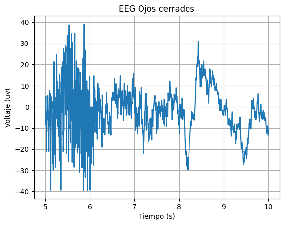
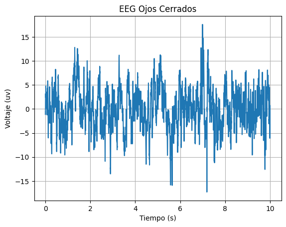
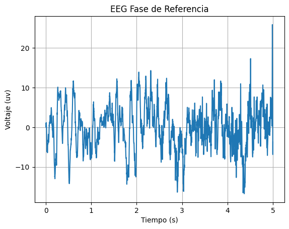
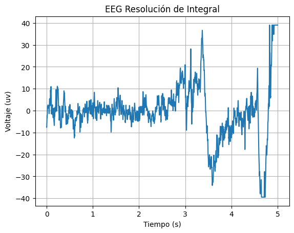

# Lab 5 - EEG con BiTalino y Ultracortex Mark IV

## Tabla de contenidos
- [Objetivos](#objetivos)
- [Materiales](#materiales)
- [Marco teórico](#Marco-teórico)
- [Conexión utilizada](#Conexión-utilizada)
- [Procedimiento](#Procedimiento)
- [Prueba EEG](#Prueba-EEG)
- [Explicación/ Discusión de resultados](#Explicación/-Discusión-de-resultados)
- [Ploteo de Python](#Ploteo-de-Python)
- [Referencias](#referencias)
  
##  Objetivos

- Adquirir señales biomédicas de EEG.
- Hacer una correcta configuración de BiTalino y el Ultracortex Mark IV.
- Extraer la información de las señales EEG del software OpenSignals (r)evolution y OpenBCI.

## Materiales
| Material | Cantidad |
|:--------------:|:--------------:|
| Kit BiTalino    | 1    |
| Ultracortex Mark IV | 1    |
| Laptop    | 1    |
| Electrodos    | 3    |
| Programa *Open Signal (r)evolution* | N.A |
| Programa *OpenBCI* | N.A |
| Programa *Python* | N.A | 

## Marco Teórico

<div style="text-align: justify;">

El electroencefalograma (EEG) es un procedimiento utilizado para evaluar la actividad eléctrica del cerebro a partir de la colocación de electrodos en el cuero cabelludo del paciente [1]. Dicha actividad eléctrica es producida por el potencial eléctrico que generan las corrientes ionicas que transcurren entre el cerebro y las neuronas, el cual es registrado en el orden de los micro voltios [1]. Por ende, a través de esta técnica se registra la suma de la actividad eléctrica sincrónica de muchísimas neuronas en el cerebro [1]. 

El posicionamiento de electrodos se puede realizar de acuerdo a distintos sistemas de referencia. Entre estos se encuentra el sistema internacional 10-20 el cual nos brinda una técnica estandarizada para el posicionamiento a partir de puntos anátomicos de referencia craneales externos cuyas distancias relativas (en porcentajes) son útiles para identificar las regiones del cerebro [2]. 

Por otro lado, existen cinco importantes tipos de onda en el EEG (alpha, beta, theta, delta y gamma) las cuales representan diferentes estados de actividad en el cerebro [3]. El análisis de estas, especificamente su presencia o ausencia en ciertos estados del paciente, es utilizado para el diagnóstico de enfermedades como epilepsia e insomnio [3]. 

En dicho análisis es importante también considerar la edad y el estado mental del paciente ya que existen diferencias significativas en la presencia o ausencia de las ondas entre niños y adultos [1]. Asimismo, es importante considerar que la señal del EEG sin procesar puede estar contaminada por interferencia ambiental así como otras señales no cerebrales como potenciales de movimiento facial o ocular [1]. Por último, dispositivos eléctricos como dispositivos biomédicos adicionales con lo que interactue el paciente también pueden alterar dicha señal [1]. Es por las razones expuestas que dicha señal suele ser filtrada para su posterior interpretación [1].

Para la práctica se utilizó 1 kit BiTalino y 1 Ultracortex Mark IV para la realización de EEG según el sistema internacional 10-20. Además, se utilizó el software OpenSignals (r)evolution y OpenBCI para la adquisición de la señal y los datos para un posterior análisis.

## Conexión utilizada


Para la obtención de EEG se utilizó la guía 3 de "BITalino (r)evolution Lab Guide: EXPERIMENTAL GUIDES TO MEET & LEARN YOUR BIOSIGNALS". Se utilizó la conexión en el puerto A4 en el BiTalino y se realizó la colocación de los electrodos de acuerdo a la configuración del sistema internacional 10-20.

* Colocación del electrodo positivo en la posición FP1 (cercano a la línea media del lado izquierdo de la cabeza) y electrodo negativo en la posición FP2 (cercano a la la linea media del lado derecho de la cabeza). Por último, el electrodo de referencia se coloca en una posición neutral como el hueso detrás de la oreja izquierda. Observar figura 1.

<div style="text-align: center;">


Figura 1. Colocación de electrodos. En la izquierda la colocación de electrodos positivo y negativo. A la derecha la colocación del electrodo de referencia.


Figura 2. Colocación electrodos
</div>


## Procedimiento

Se utilizó BiTalino para la adquisión de señales de la actividad cerebral al realizar distintos procesos cognitivos. Se tuvo las siguientes consideraciones para la realización del EEG:
- El sujeto de prueba debió suprimir cualquier activación muscular mientras se realiza la adquisición: movimientos en área facial (movimientos oculares y parpadeo), movimientos del cuello y la mandíbula (apretar/masticar).
- Eliminación de artefactos de interferencia o distracciones. Se buscó que el sujeto mire a un punto fijo al tener los ojos abiertos.
- No se utilizaron artefactos metálicos por parte del sujeto de prueba como lentes, aretes, piercings u otros, para no interferir con la adquisión de las señales.

### Prueba EEG 

Para la prueba de electroencefalograma se realizaron 4 pasos secuenciales. 

1. Registro de una línea base de señal (respiración normal, sin movimientos oculares, ojos cerrados) - 30 segundos
<div style="text-align: center;">


Figura 3. Fase base inicial
</div>

2. Registro de cinco ciclos de "ojos abiertos - ojos cerrados" - 5 segundos por fase en un ciclo
<div style="text-align: center;">


Figura 4. Ojos cerrados a la izquierda, ojos abiertos a la derecha.
</div>

3. Registro de una nueva fase de referencia - 30 segundos 

<div style="text-align: center;">


Figura 5. Segunda fase base
</div>

4. Registro realizando ejercicios mentales de acuerdo a  [https://link.springer.com/article/10.3758/s13415-019-00703-5/tables/1]

<div style="text-align: center;">


Figura 6. Ejercicios mentales simples y complejos
</div>

***Nota**: Para el registro realizando ejercicios mentales se leerá al usuario tres ejercicios simples y tres ejercicios complejos en voz alta y se le pedirá mantener la mirada en un punto específico y no hablar.

## BITalino

A continuación, se muestran las señales obtenidas en cada una de las fases anteriormnete descritas. 

| Estado | Señal obtenida |
|:--------------:|:--------------:|
| Figura 7. Primera fase de referencia |   |
| Figura 8. Fase 2 - Ciclo de "ojos cerrados " | |
| Figura 9. Fase 2 - Ciclo de "ojos abiertos" | |
| Figura 10. Segunda fase de referencia | |
| Figura 11. Ejercicios mentales simples | |
| Figura 12. Ejercicios mentales complejo | |


A su vez, por medio de Python, se logró reproducir las señales obtenidas en el programa Open Signal. Las gráficas obtenidas se muestran a continuación:

| Estado | Señal obtenida |
|:--------------:|:--------------:|
| Figura 7. Primera fase de referencia | |
| Figura 8. Fase 2 - Ciclo de "ojos cerrados " | |
| Figura 9. Fase 2 - Ciclo de "ojos abiertos por 5 segundos" | |
| Figura 10. Segunda fase de referencia | |
| Figura 11. Ejercicios mentales simples | |
| Figura 12. Ejercicios mentales complejo | |
| Figura 13. Ejercicios Extra: Resolución de Integral | |

***NOTA**: El ploteo de las señales se realizó en intervalos distintos, para una mejor apreciación de las señales.*

### Observaciones

Durante el desarrollo de la prueba se notaron aspectos que impactaron de manera significativa en la obtención de las señales de EEG. Se observó que mientras se realizaba la toma de la señal de EEG, la proximidad a un dispositivo electrónico como laptop o celular distorsionaba la señal de manera significativa. 

De mismo modo, se tiene que recalcar que, por breves momentos, se prodicía el habla por parte de la persona que realizó la prueba, lo que podría significar una actividad cerebral adicional. 

## Explicación/ Discusión de resultados

### BITalino Primera y segunda fase de referencia
Teóricamente, durante el reposo, las ondas alfa en el rango de frecuencia de 8.5 a 13 Hz mantienen una predominancia respecto de las demas, y mantienen una amplitud de entre 20 y 200 microvoltios [4, 5]; pues, estas ondas están vinculadas con un estado de relajación y una reducción de la actividad mental. La amplitud de estas ondas durante el reposo tiende a ser mayor, lo cual indica una mayor sincronización de la actividad neuronal. Cuando los sujetos mantienen los ojos cerrados, se intensificaría la actividad de las ondas alfa, ya que el cierre de los ojos limita la entrada de estímulos visuales, promoviendo una mayor relajación [4]. Sin embargo, de los gráficos mostrados anteriormente (Figura 7 y 10), se observa que la amplitud de los picos de la señal en fase de referencia mantienen una amplitud menor a 20 microvoltios en la mayoría del tiempo, que podría deberse a que el sujeto de prueba no mantuvo un estado de enfoque y relajación tan intenso, lo que se traduciría en mayor presencia de ondas de alta frecuencia y menor presencia de ondas de baja frecuencia [6].

### BITalino Ciclos de "Ojos abiertos - ojos cerrados"
En la figura 9, podemos observar el EEG durante el período de ojos abiertos, el cual debería mostrarse como una señal caracterizada por ondas de baja amplitud y frecuencia, debido a que estas ondas reflejan la actividad cortical relacionada con la recepción de estímulos visuales y la atención dirigida hacia el entorno externo [7]. Sin embargo, lo que se obtuvo en cambio fue una señal con una alta amplitud, la cual llega hasta los 1.5 mV. Esto es probablemente debido a alguna interferencia electromagnética que esté afectando la medición.  
Por otro lado, durante el periodo de ojos cerrados que se muestra en la figura 8, el EEG exhibe una disminución en la actividad cerebral, con ondas de menor amplitud y frecuencia en comparación con el periodo de ojos abiertos. En este caso, la actividad cerebral se centra más en estados de relajación y descanso, con menos estimulación visual externa. En la figura 8, se observan patrones de ondas más regulares y menos variabilidad, indicando un estado de tranquilidad y menor actividad cognitiva dirigida hacia el entorno [4]. Sin embargo, durante este estado, el cerebro debería exhibir patrones de ondas con mayor amplitud debido a que una mayor sincronización neuronal [7], lo cual fue contrario a lo obtenido.  


### BITalino Ejercicios mentales fáciles
El EEG al resolver ejercicios de bajo nivel de dificultad se observa que el voltaje de amplitud es mayor al de la fase de reposo con ojos cerrados y posee una mayor frecuencia que esta señal, pero, a su vez, posee una menor frecuencia que la señal obtenida al realizar ejercicios matemáticos complejos. Debido a las características mencionadas y en base a las investigaciones en [7], se puede decir que la señal es predominante en ondas beta. Las ondas beta tienen una frecuencia entre 13 Hz a 30 Hz y una amplitud de voltaje menor a 20 uV [8], las cuales se asocian a estados de vigilia, atención, estado de alerta, resolución de problemas o ansiedad [7]. A diferencia de las ondas alfa que se presentan en estados de tranquilidad y relajación, las ondas beta indican un estado mental activo y enfocado [9]. Ante ello, la realización de ejercicios sencillos refiere a una presencia de ondas beta, pues se requiere un estado enfocado y concentración leve para la obtención de una respuesta; al no requerirse un arduo proceso cognitivo, se descarta la posibilidad de clasificar la señal con predominancia en ondas gamma (frecuencia mayor a 30 Hz), pues estas se asocian a un procesamiento cognitivo avanzado y la fusión de información sensorial [7]. No obstante, en la señal (figura 11) se pueden observar picos con amplitud mayores a 20 uV, lo cual se puede dar debido a que se dio la respuesta en ese momento (hablar) o se realizó algún tipo de movimientos faciales, lo cual genera interferencia en la obtención de las señales de EEG.

### BITalino Ejercicios mentales complejos
En situaciones de alta actividad cerebral, se presentan las ondas gamma, que sugieren mayormente la presencia de esfuerzo de atención y memoria a largo plazo y corto plazo [10, 11], y poseen una frecuencia de oscilación mayor a 30 Hz generalmente y una amplitud menor [11 - 13]. Esto puede verse reflejado en la actividad neuronal registrada durante las pruebas de mayor difcultad, las cuales requerían de la memorización de datos y cálculos matemáticos, pues la señal mantiene un comportamiento de baja intensidad y alta frecuencia (Figura 12). De mismo modo, ante un problema de un nivel matemático mayor (resolución de la integral), la actividad cerebral aumentó en términos de actividad analítica. Ello se ve reflejado en el patron de ondas gamma mostrado en la Figura 13. 


##  Ploteo de Python

Para el ploteo de las señales se utilizaron funciones (Archivo: Funciones.py) para realizar el ploteo de la señal (Archivo: Ploteo.py)

``` python
def get_values(path):
  df = pd.read_csv(path, sep='\t', skiprows=3)  # saltar las dos primeras filas (encabezado)
  novena_columna = df.iloc[:, 8].values
  n = [i/1000 for i in range(0, len(novena_columna))]
  signal = [(float(valor)/(2**10)-1/2)*3.3/1009*1000*1000 for valor in novena_columna]
  return n, signal

```
``` python
def plot_values(n, y, label, ini, fin):
  plt.plot(n[ini:fin], y[ini:fin])

  # Etiquetas y título
  plt.xlabel('Tiempo (s)')
  plt.ylabel('Voltaje (uv)')
  plt.title(label)

  # Mostrar el gráfico
  plt.show()
```
``` python
path = "url"
[n, y] = get_values(path)
label = "Título"
plot_values(n, y, label, valor_inicial, valor_final)
```

## Referencias

1. Kaur J, Kaur A. A review on analysis of EEG signals. En: 2015 International Conference on Advances in Computer Engineering and Applications (ICACEA) [Internet]; 19-20 de marzo de 2015; Ghaziabad, India. [lugar desconocido]: IEEE; 2015 [consultado el 27 de abril de 2024]. Disponible en: https://doi.org/10.1109/icacea.2015.7164844

2. Jurcak V, Tsuzuki D, Dan I. 10/20, 10/10, and 10/5 systems revisited: Their validity as relative head-surface-based positioning systems. NeuroImage [Internet]. Febrero de 2007 [consultado el 27 de abril de 2024];34(4):1600-11. Disponible en: https://doi.org/10.1016/j.neuroimage.2006.09.024

3. Herrmann CS, Strüber D, Helfrich RF, Engel AK. EEG oscillations: From correlation to causality. Int J Psychophysiol [Internet]. Mayo de 2016 [consultado el 27 de abril de 2024];103:12-21. Disponible en: https://doi.org/10.1016/j.ijpsycho.2015.02.003

4. A. A. Torres-García, C. A. Reyes-García, L. Villaseñor-Pineda, y J. M. Ramírez-Cortés, “Análisis de señales electroencefalográficas para la clasificación de habla imaginada”, Rev. mex. ing. bioméd., vol. 34, núm. 1, pp. 23–39, 2013.[Consultado: 28-abr-2024]

5. M. V. Miralles, “Ondas cerebrales y su significado”, clinicaalevia.com, 13-may-2019. [En línea]. Disponible en: https://www.clinicaalevia.com/ondas-cerebrales-y-su-significado/. [Consultado: 28-abr-2024].

6. P. R. R. Aguilar, “Análisis de espectrogramas de señales EEG”, Buap.mx. [En línea]. Disponible en: https://repositorioinstitucional.buap.mx/server/api/core/bitstreams/92e27f78-4f9d-4d2e-9d69-9f90cd87c0b1/content. [Consultado: 28-abr-2024].

7. A. Chaddad, Y. Wu, R. Kateb, y A. Bouridane, “Electroencephalography signal processing: A comprehensive review and analysis of methods and techniques”, Sensors (Basel), vol. 23, núm. 14, p. 6434, 2023.

8. P. General, “Fisiología de la actividad eléctrica del cerebro”, Unam.mx. [En línea]. Disponible en: https://fisiologia.facmed.unam.mx/wp-content/uploads/2019/09/UTI-pr%C3%A1ctica-7-a.-Electroencefalograma.pdf. [Consultado: 28-abr-2024].

9. “¿Qué es onda beta? Diccionario médico. Clínica U. Navarra”, https://www.cun.es. [En línea]. Disponible en: https://www.cun.es/diccionario-medico/terminos/onda-beta-o-b. [Consultado: 28-abr-2024].
    
10. O. Jensen, J. Kaiser, y J.-P. Lachaux, “Human gamma-frequency oscillations associated with attention and memory”, Trends Neurosci., vol. 30, núm. 7, pp. 317–324, 2007.

11.  C. S. Herrmann, M. H. J. Munk, y A. K. Engel, “Cognitive functions of gamma-band activity: memory match and utilization”, Trends Cogn. Sci., vol. 8, núm. 8, pp. 347–355, 2004.

12. C. Braboszcz, B. R. Cahn, J. Levy, M. Fernandez, y A. Delorme, “Increased gamma brainwave amplitude compared to control in three different meditation traditions”, PLoS One, vol. 12, núm. 1, p. e0170647, 2017.
    
14.  A. S. Malik y H. U. Amin, “Designing EEG Experiments for Studying the Brain - Chapter 1”, Sciencedirect.com, 2017. [En línea]. Disponible en: https://www.sciencedirect.com/science/article/abs/pii/B9780128111406000011. [Consultado: 28-abr-2024].   
