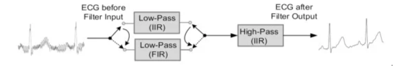
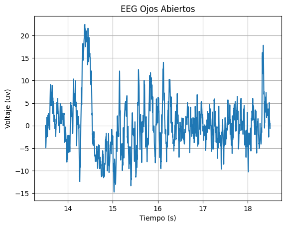
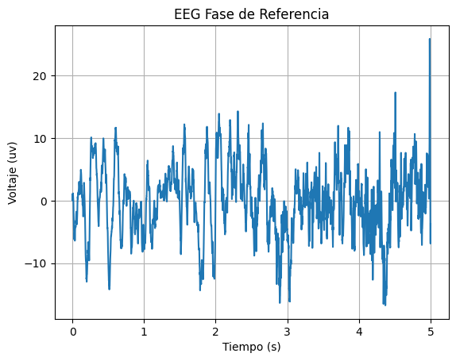

# Lab 5 - Filtros digitales

## Tabla de contenidos
- [Objetivos](#objetivos)
- [Materiales](#materiales)
- [Introducción](#introduccion)
- [Metolodogía] (#metolodogia)
- [Resultados](#resultados)
- [Discusión de resultados](#Explicación/-Discusión-de-resultados)
- [Referencias](#referencias)
  
##  Objetivos
- Comprender los fundamentos de filtros digitales, especialmente los IRR y FIR
- Aplicar filtros IRR y FIR a señales de EMG, ECG y EEG.
- Analizar las señales tras aplicar los filtros

## Materiales
| Material | Cantidad |
|:--------------:|:--------------:|

| Programa *Python* | N.A | 

## Introducción

<div style="text-align: justify;">

Filtros Digitales 

Filtros IRR y Filtros FIR

Para la práctica se utilizó el programa Python para aplicar los filtros digitales mencionados, graficar las señales y analizarlas.


## Metolodogía

Se utilizó el siguiente código como filtro IRR para las señales EMG, ECG y EEG. En este caso el filtro es Butterworth.

Se utilizó el siguiente código como filtro FIR para las señales EMG, ECG y EEG.

### Diseño del Filtro EMG

Para procesar la señal de electromiografía, se recurre a un filtro IIR de tipo Butterworth debido a su uso recurrente en procesamiento de dichas señales [A, B]. Específicamente, el filtro contará con características idénticas así como el implementado por Mello R. G. T, et al en [B], que además mostró resultados óptimos. Los componentes del filtro general son un filtro pasa altas (orden 2, fc = 10 Hz), filtro pasa bajas (orden 8, fc = 400 Hz) y seis filtros rechaza banda (orden 2, 60 Hz y armónicos hasta 360 Hz).  

[A] C. J. De Luca, L. Donald Gilmore, M. Kuznetsov, y S. H. Roy, “Filtering the surface EMG signal: Movement artifact and baseline noise contamination”, J. Biomech., vol. 43, núm. 8, pp. 1573–1579, 2010. Disponible en: https://www.bu.edu/nmrc/files/2010/06/103.pdf. Consultado [03-05-2024]

[B] R. G. T. Mello, L. F. Oliveira, y J. Nadal, “Digital Butterworth filter for subtracting noise from low magnitude surface electromyogram”, Comput. Methods Programs Biomed., vol. 87, núm. 1, pp. 28–35, 2007. Disponible en: https://doi.org/10.1016/j.cmpb.2007.04.004. Consultado [03-05-2024]


### Diseño del Filtro ECG

Para procesar la señal obtenida ECG, tal como fue realizado en [C], se implementarán dos filtros (IIR y FIR). En este caso, se utilizó un filtro FIR pasa bajas (orden #, fc = #) y un filtro pasa altas (orden 5, fc = 0.1 Hz), tal como se muestra en la figura 1. Cabe recalcar que el estudio mencionado no se especifica la frecuencia de corte pasa bajas pero menciona que busca suprimir las bandas de la red eléctrica de potencia (60 Hz); por ello, se diseña el filtro con las especificaciones expuestas para cumplir con dicho objetivo. 


Figura 1. Filtro diseñado por [C]

[C] N.-T. Bui y G.-S. Byun, “The comparison features of ECG signal with different sampling frequencies and filter methods for real-time measurement”, Symmetry (Basel), vol. 13, núm. 8, p. 1461, 2021.


### Diseño del Filtro EEG


## Resultados

***NOTA**: El ploteo de las señales se realizó en intervalos distintos, para una mejor apreciación de las señales.*

#EMG

Los resultados analizados en la siguiente tabla se obtuvieron al realizar el EMG del bíceps. 
Los electrodos fueron colocados como se observa en la figura 1. Los electrodos positivo y negativo será colocados en el músculo de interés, en este caso el bíceps mientras que el electrodo de referencia será colocado en una zona neutra como la muñeca.
Se tomó registro de la señal en el usuario en estado de reposo o silencio eléctrico y realizando la contracción muscular.

| Posicionamiento de los electrodos |
|:--------------:|
|  |
| Figura 1 |


| Campo | Señal Cruda | Filtro IRR | Filtro FIR |
|:--------------:|:--------------:|:--------------:|:--------------:|
| Figura 2. Señal completa| | | |
| Figura 3. Reposo | | | |
| Figura 4. Contracción muscular | | | |

#ECG

Los resultados analizados en la siguiente tabla se obtuvieron al realizar el ECG. 
Los electrodos fueron colocados como se observa en la figura 2. El electrodo positivo se posicionó en la clavícula izquierda, electrodo negativo en la clavícula derecha y electrodo de referencia en la cresta iliaca. 
Se tomó registro de la señal en el usuario en estado de reposo, hiperventilación, después de hacer ejercicio y al realizar respiraciones largas.

| Posicionamiento de los electrodos |
|:--------------:|
|  |
| Figura 5 |

| Campo | Señal Cruda | Filtro IRR | Filtro FIR |
|:--------------:|:--------------:|:--------------:|:--------------:|
| Figura 6. Estado Basal | |  |  |
| Figura 7. Después de ejercicio| | | |
| Figura 8. Respiraciones largas | | | |

#EEG

Los resultados analizados en la siguiente tabla se obtuvieron al realizar el EEG. 
Los electrodos fueron colocados como se observa en la figura 3 de acuerdo a la configuración del sistema internacional 10-20.
Se tomó registro de la señal en el usuario en una primera y segunda fase de referencia, en ciclos de ojos cerrados y abierto y realizando ejercicios mentales simples y complejos.

| Posicionamiento de los electrodos |
|:--------------:|
|  |
| Figura X |

| Campo| Señal Cruda | Filtro IRR | Filtro FIR |
|:--------------:|:--------------:|:--------------:|:--------------:|
| Figura X. Primera fase de referencia |  |  |  |
| Figura X. Fase 2 - Ciclo de "ojos cerrados " |  | | |
| Figura X. Fase 2 - Ciclo de "ojos abiertos" |  | | |
| Figura X. Segunda fase de referencia |  |  | |
| Figura X. Ejercicios mentales simples |  |  | |
| Figura X. Ejercicios mentales complejo |  |  | |


## Código en Python

``` python
import pandas as pd
import matplotlib.pyplot as plt
import numpy as np
from scipy import signal

def get_values(path, col):
  df = pd.read_csv(path, sep='\t', skiprows=3)  # saltar las dos primeras filas (encabezado)
  novena_columna = df.iloc[:, col].values
  n = [i/1000 for i in range(0, len(novena_columna))]
  signal = [(float(valor)/(2**10)-1/2)*3.3/1009*1000 for valor in novena_columna]
  return n, signal

def get_valuesEEG(path, col):
  df = pd.read_csv(path, sep='\t', skiprows=3)  # saltar las dos primeras filas (encabezado)
  novena_columna = df.iloc[:, col].values
  n = [i/1000 for i in range(0, len(novena_columna))]
  signal = [(float(valor)/(2**10)-1/2)*3.3/41782*1000 for valor in novena_columna]
  return n, signal

def plot_values(n, y, label, ini, fin):
  plt.plot(n[ini:fin], y[ini:fin])
  plt.xlabel('Tiempo (s)')
  plt.ylabel('Voltaje (mv)')
  plt.title(label)
  plt.grid(True)
  plt.show()

def FreqAnalysis (signal):
  fs = 1000
  fft_result = np.fft.fft(signal)
  freqs = np.fft.fftfreq(len(signal), 1/fs)
  plt.figure(figsize=(10, 5))
  plt.plot(freqs, np.abs(fft_result))
  plt.xlim(-50, 50)
  plt.title('Magnitud de la Transformada Rápida de Fourier (FFT)')
  plt.xlabel('Frecuencia (Hz)')
  plt.ylabel('Magnitud')
  plt.grid(True)
  plt.show()

```
### Importación de Señales

``` python

# Señales EMG

path = "/content/drive/MyDrive/PUCP/7mo ciclo/Instruducción a Señales Biomédicas/Laboratorios/EMG/BICEPS.txt"
[n, EMGsignal] = get_values(path, 5)
label = "EMG de los bíceps"


# Señales ECG

path = "/content/drive/MyDrive/PUCP/7mo ciclo/Instruducción a Señales Biomédicas/Laboratorios/ECG/J1.txt"
[n, ECGsignal] = get_values(path, 6)
label = "ECG Estado Basal"
plot_values(n, ECGsignal, label, 2600, 4200)

path = "/content/drive/MyDrive/PUCP/7mo ciclo/Instruducción a Señales Biomédicas/Laboratorios/ECG/POS EJERCICIO.txt"
[n, ECGsignal] = get_values(path, 6)
label = "ECG Estado Post Ejercicio"
plot_values(n, ECGsignal, label,  2600, 4200)

path = "/content/drive/MyDrive/PUCP/7mo ciclo/Instruducción a Señales Biomédicas/Laboratorios/ECG/RESPIRACION.txt"
[n, ECGsignal] = get_values(path, 6)
label = "ECG Durante respiración"
plot_values(n, ECGsignal, label,  2600, 4200)

# Señales EEG

path = "/content/drive/MyDrive/PUCP/7mo ciclo/Instruducción a Señales Biomédicas/Laboratorios/EEG/dificil.txt"
[n, EEGsignal] = get_valuesEEG(path, 8)
label = "EEG Durante Ejercicio Difíciles"


```

### Filtrados para las Señales EMG

``` python
b,a = signal.butter(2, 10, 'highpass', fs=1000, output='ba')
filteredEMG =signal.filtfilt(b,a, EMGsignal)
b,a = signal.butter(8, 400, 'lowpass', fs=1000, output='ba')
filteredEMG =signal.filtfilt(b,a, filteredEMG)
b,a = signal.butter(2, [40, 80], 'stop', fs=1000, output='ba')
filteredEMG =signal.filtfilt(b,a, filteredEMG)
b,a = signal.butter(2, [100, 140], 'stop', fs=1000, output='ba')
filteredEMG =signal.filtfilt(b,a, filteredEMG)
b,a = signal.butter(2, [160, 200], 'stop', fs=1000, output='ba')
filteredEMG =signal.filtfilt(b,a, filteredEMG)
b,a = signal.butter(2, [220, 260], 'stop', fs=1000, output='ba')
filteredEMG =signal.filtfilt(b,a, filteredEMG)
b,a = signal.butter(2, [280, 320], 'stop', fs=1000, output='ba')
filteredEMG =signal.filtfilt(b,a, filteredEMG)
b,a = signal.butter(2, [340, 380], 'stop', fs=1000, output='ba')
filteredEMG =signal.filtfilt(b,a, filteredEMG)

plt.figure(figsize=(10,4))
plt.subplot(121)
n = [i/1000 for i in range(0,len(EMGsignal))]
plt.plot(n, EMGsignal)
plt.ylabel("Amplitud (mv)")
plt.xlabel("Tiempo (s)")
plt.title("EMG sin filtro")
plt.grid(True)
plt.margins(0, 0.05)

plt.subplot(122)
plt.plot(n, filteredEMG)
plt.ylabel("Amplitud (mv)")
plt.xlabel("Tiempo (s)")
plt.title("EMG filtrado")
plt.grid(True)
plt.margins(0, 0.05)
plt.tight_layout()
plt.show()

plt.figure()
n = [i/1000 for i in range(0,len(EMGsignal))]
plt.plot(n[0:20000], EMGsignal[0:20000])
plt.ylabel("Amplitud (mv)")
plt.xlabel("Tiempo (s)")
plt.title("EMG sin filtro (EN REPOSO)")
plt.grid(True)
plt.ylim([-2, 2])
plt.margins(0, 0.05)

plt.figure()
plt.plot(n[0:20000], filteredEMG[0:20000])
plt.ylabel("Amplitud (mv)")
plt.xlabel("Tiempo (s)")
plt.title("EMG filtrado (EN REPOSO)")
plt.ylim([-2, 2])
plt.grid(True)
plt.margins(0, 0.05)
plt.tight_layout()
plt.show()

plt.figure()
n = [i/1000 for i in range(0,len(EMGsignal))]
plt.plot(n[40000:68000], EMGsignal[40000:68000])
plt.ylabel("Amplitud (mv)")
plt.xlabel("Tiempo (s)")
plt.title("EMG sin filtro (EN EXITACIÓN)")
plt.ylim([-1.2, 1.2])
plt.grid(True)
plt.margins(0, 0.05)

plt.figure()
plt.plot(n[40000:68000], filteredEMG[40000:68000])
plt.ylabel("Amplitud (mv)")
plt.xlabel("Tiempo (s)")
plt.title("EMG filtrado (EN EXITACIÓN)")
plt.ylim([-1.2, 1.2])
plt.margins(0, 0.05)
plt.grid(True)
plt.tight_layout()
plt.show()

```
 
### Filtrado para las señales ECG

``` python
b,a = signal.butter(2, 10, 'highpass', fs=1000, output='ba')
filteredEMG =signal.filtfilt(b,a, EMGsignal)
b,a = signal.butter(8, 400, 'lowpass', fs=1000, output='ba')
filteredEMG =signal.filtfilt(b,a, filteredEMG)
b,a = signal.butter(2, [40, 80], 'stop', fs=1000, output='ba')
filteredEMG =signal.filtfilt(b,a, filteredEMG)
b,a = signal.butter(2, [100, 140], 'stop', fs=1000, output='ba')
filteredEMG =signal.filtfilt(b,a, filteredEMG)
b,a = signal.butter(2, [160, 200], 'stop', fs=1000, output='ba')
filteredEMG =signal.filtfilt(b,a, filteredEMG)
b,a = signal.butter(2, [220, 260], 'stop', fs=1000, output='ba')
filteredEMG =signal.filtfilt(b,a, filteredEMG)
b,a = signal.butter(2, [280, 320], 'stop', fs=1000, output='ba')
filteredEMG =signal.filtfilt(b,a, filteredEMG)
b,a = signal.butter(2, [340, 380], 'stop', fs=1000, output='ba')
filteredEMG =signal.filtfilt(b,a, filteredEMG)

plt.figure(figsize=(10,4))
plt.subplot(121)
n = [i/1000 for i in range(0,len(EMGsignal))]
plt.plot(n, EMGsignal)
plt.ylabel("Amplitud (mv)")
plt.xlabel("Tiempo (s)")
plt.title("EMG sin filtro")
plt.margins(0, 0.05)

plt.subplot(122)
plt.plot(n, filteredEMG)
plt.ylabel("Amplitud (mv)")
plt.xlabel("Tiempo (s)")
plt.title("EMG filtrado")
plt.margins(0, 0.05)
plt.tight_layout()
plt.show()


```
### Filtrado para las señales EEG

``` python
b,a = signal.butter(2, 10, 'highpass', fs=1000, output='ba')
filteredEMG =signal.filtfilt(b,a, EMGsignal)
b,a = signal.butter(8, 400, 'lowpass', fs=1000, output='ba')
filteredEMG =signal.filtfilt(b,a, filteredEMG)
b,a = signal.butter(2, [40, 80], 'stop', fs=1000, output='ba')
filteredEMG =signal.filtfilt(b,a, filteredEMG)
b,a = signal.butter(2, [100, 140], 'stop', fs=1000, output='ba')
filteredEMG =signal.filtfilt(b,a, filteredEMG)
b,a = signal.butter(2, [160, 200], 'stop', fs=1000, output='ba')
filteredEMG =signal.filtfilt(b,a, filteredEMG)
b,a = signal.butter(2, [220, 260], 'stop', fs=1000, output='ba')
filteredEMG =signal.filtfilt(b,a, filteredEMG)
b,a = signal.butter(2, [280, 320], 'stop', fs=1000, output='ba')
filteredEMG =signal.filtfilt(b,a, filteredEMG)
b,a = signal.butter(2, [340, 380], 'stop', fs=1000, output='ba')
filteredEMG =signal.filtfilt(b,a, filteredEMG)

plt.figure(figsize=(10,4))
plt.subplot(121)
n = [i/1000 for i in range(0,len(EMGsignal))]
plt.plot(n, EMGsignal)
plt.ylabel("Amplitud (mv)")
plt.xlabel("Tiempo (s)")
plt.title("EMG sin filtro")
plt.margins(0, 0.05)

plt.subplot(122)
plt.plot(n, filteredEMG)
plt.ylabel("Amplitud (mv)")
plt.xlabel("Tiempo (s)")
plt.title("EMG filtrado")
plt.margins(0, 0.05)
plt.tight_layout()
plt.show()


```

## Discusión de resultados


### Observaciones


## Explicación/ Discusión de resultados


## Referencias

1. 

</div>
