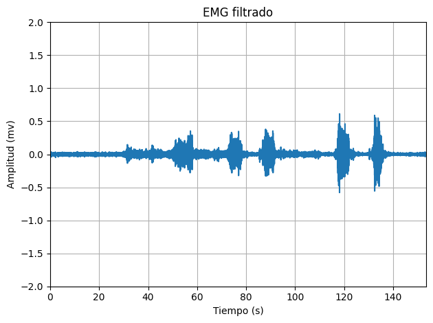
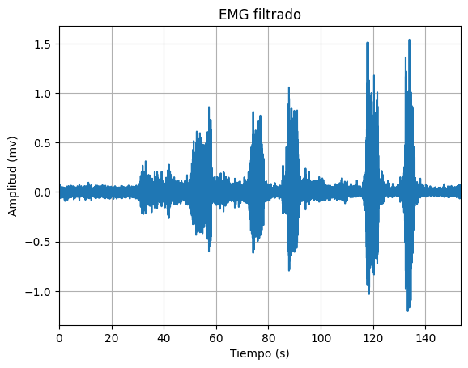
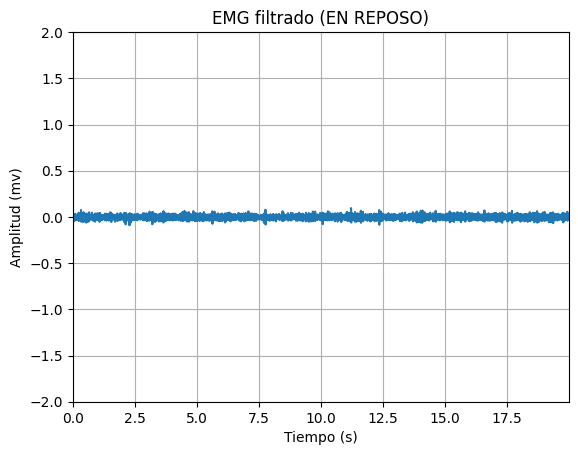
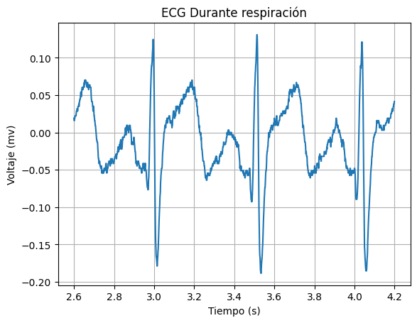
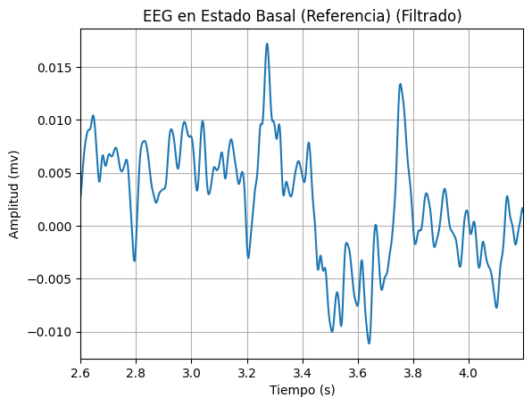
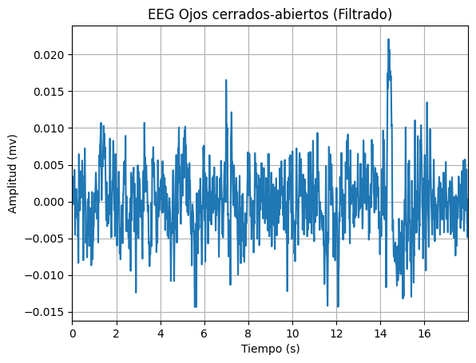
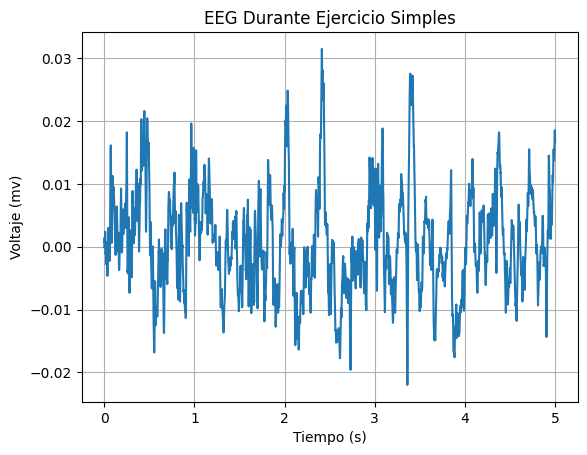

# Lab 6 - Filtros digitales

## Tabla de contenidos
- [Objetivos](#objetivos)
- [Materiales](#materiales)
- [Introducción](#introduccion)
- [Metolodogía](#metodología)
- [Resultados](#resultados)
- [Discusión de resultados](#Explicación/-Discusión-de-resultados)
- [Referencias](#referencias)
  
##  Objetivos
- Comprender los fundamentos de filtros digitales, especialmente los IRR y FIR
- Aplicar filtros IRR y FIR a señales de EMG, ECG y EEG.
- Analizar las señales tras aplicar los filtros.

## Materiales
| Material | Cantidad |
|:--------------:|:--------------:|
| Programa *Python* | N.A | 

## Introducción

<div style="text-align: justify;">

__Filtros digitales__

En general, las técnicas de filtrado digital son más flexibles que las analógicas ya que se implementan en software en vez de hardware y pueden modificarse según sea necesario de manera más sencilla sobretodo en aplicaciones donde los parámetros del filtro son modificados continuamente [1]. Esto se debe a que no hay dependencias de las tolerancias de los componentes electrónicos como si lo hay en los filtros analógicos lo que hace que el ajuste de componentes que se suele hacer en estos se vuelva obsoleto [1]. Por ende, el comportamiento de los algoritmos implementados con los filtros digitales es predecible [1]. Asimismo, las frecuencias extremadamente bajas pueden ser procesadas sin los problemas que ocurren en los sistemas analógicos [1]. 

Se han reportado varios métodos para la eliminación en tiempo real de la interferencia a partir de la corriente eléctrica suministrada por la red eléctrica así como interferencia por cambios en el nivel de referencia de una señal utilizando filtrado digital en las señales eléctricas como las evaluadas en el electromiograma (EMG), electrocardiograma (ECG) y encefalograma (EEG) [2]. La implementación de filtros digitales para dicha eliminación de ruido en línea también se ve promovida por la llegada de los primeros microprocesadores económicos [2]. 

Dentro de los diferentes filtros utilizados en procesamiento de señales están los filtros IIR (de respuesta infinita al impulso) y FIR (de respuesta finita al impulso) [1]. Las diferentes expresiones matemáticas para las funciones de transferencia de los filtros FIR e IIR también resultan en métodos de diseño muy diferentes para ambos tipos de filtros [1]. Mientras que en el caso del primero se aproxima una respuesta de frecuencia dada mediante una función de transferencia en el plano complejo con polos y ceros el filtro FIR simplemente se caracteriza por ceros y un polinomio de z [1].


__Filtros IRR__

El método más conocido y frecuentemente utilizado para diseñar filtros digitales IIR (de respuesta infinita al impuesto), los cuales depende de entradas pasadas, es la transformación bilineal de los filtros analógicos clásicos, como los Butterworth [3]. Esta técnica tiene la ventaja de contar con fórmulas establecidas para dichos filtros a partir de la identificación de polos y ceros [3]. No obstante, los filtros IIR diseñados de esta manera tienen tanto el numerador como el denominador con igual grado, lo que limita su flexibilidad. En ocasiones, resulta conveniente poder diseñar filtros con más ceros que polos para lograr un equilibrio mejorado entre rendimiento y complejidad de implementación [3]. 

Específicamente el filtro pasabajos de Butterworth es utilizado para suavizar muchos tipos de datos biomecánicos, de movimiento porque son óptimamente planos en su banda de paso, tienen caídas relativamente altas y una respuesta rápida en el dominio del tiempo [4]. Sin embargo, una de sus limitaciones es que debido a que está subamortiguado sobrepasa o subestima los datos durante transiciones rápidas [4].


__Filtros FIR__

La complejidad de los filtros FIR puede ser significativa en aplicaciones comunes de filtrado, ya que requieren numerosas operaciones de multiplicación y suma para reproducir completamente la respuesta al impulso en el dominio temporal sin necesitar entradas pasadas [1]. Esta complejidad se debe a la ausencia de técnicas de diseño en el dominio del tiempo continuo para los filtros FIR, a diferencia de los filtros IIR [1]. 

Es por esta razón que cada diseño de filtro debe seguir un proceso completo de diseño matemático, comenzando por la elección de un método de aproximación mediante algoritmos iterativos o analíticos [1]. El objetivo principal es lograr una aproximación lo más cercana posible a una respuesta de frecuencia determinada utilizando un conjunto limitado de coeficientes de filtro FIR [1].


Para la práctica se utilizó el programa Python para aplicar los filtros digitales mencionados, graficar las señales y analizarlas.


## Metodología


### Diseño del Filtro EMG

Para procesar la señal de electromiografía, se recurre a un filtro IIR de tipo Butterworth debido a su uso recurrente en procesamiento de dichas señales [5, 6]. Específicamente, el filtro contará con características idénticas así como el implementado por Mello R. G. T, et al en [6], que además mostró resultados óptimos. Los componentes del filtro general son un filtro pasa altas (orden 2, fc = 10 Hz), filtro pasa bajas (orden 8, fc = 400 Hz) y seis filtros rechaza banda (orden 2, 60 Hz y armónicos hasta 360 Hz).  Por otro lado, basándonos en la investigación de Drake y Callaghan [7], el filtro FIR adecuado para reducir el ruido y la contaminación generada por la actividad eléctrica cardiaca en las señales de EMG debe ser de pasa alta con una ventana tipo Hamming y  una frecuencia de corte  de 30 Hz. 

### Diseño del Filtro ECG

Para el filtro de señales ECG, estudios [8,9] comparan el uso de filtros IIR como Butterworth o Chebyshev I y I; sin embargo, muestran que el filtro más adecuado para este tipo de señales es el Butterworth de orden 8. De manera específica, el estudio [8] muestra que un filtro Butterworth pasa bajas de orden 8 con una frecuencia de corte de 60 Hz muestra un Ratio Señal a Ruido (SNR por sus siglas en ingles) en decibelios 11.84, donde un alto valor de SNR indica que la señal no tenderá a perderse en el ruido. En comparación a otros filtros Butterworth implementados en el mismo estudio [8] pero con menor orden y distinta frecuencia de corte, este filtro resulta ser el que mejor ante el ruido. Por ello, se tomará como referencia este filtro Butterworth pasa bajas de orden 8 y fc= 60 Hz para el filtro IIR de las señales.

### Diseño del Filtro EEG

En la adquisición de señales de EEG, estas resultan acompañadas de ruido o interferencia de la actividad muscular. En el desarrollo del laboratorio de EEG, los movimientos musculares presentes durante la adquisición de la señal fueron los movimientos faciales, movimientos oculares, hablar, abrir y cerrar los ojos. Ante ello, el estudio [10], propone el uso de un filtro tipo Butterworth pasa baja de orden 8 y frecuencia de corte de 35 Hz para la eliminación de contaminación o ruido producida por los movimientos musculares. 

## Resultados

***NOTA**: El ploteo de las señales se realizó en intervalos distintos, para una mejor apreciación de las señales. Asimismo, la frecuencia de muestreo fue de 1000 Hz.*

### EMG

Los resultados analizados en la siguiente tabla se obtuvieron al realizar el EMG del bíceps. 
Los electrodos fueron colocados como se observa en la figura 1. Los electrodos positivo y negativo será colocados en el músculo de interés, en este caso el bíceps mientras que el electrodo de referencia será colocado en una zona neutra como la muñeca.
Se tomó registro de la señal en el usuario en estado de reposo o silencio eléctrico y realizando la contracción muscular.

| Posicionamiento de los electrodos |
|:--------------:|
|  |
| Figura 1 |


| Campo | Señal Cruda | Filtro IRR | Filtro FIR |
|:--------------:|:--------------:|:--------------:|:--------------:|
| Figura 2. Señal completa| |||
| Figura 3. Reposo | | | |
| Figura 4. Contracción muscular | | | |

### ECG

Los resultados analizados en la siguiente tabla se obtuvieron al realizar el ECG. 
Los electrodos fueron colocados como se observa en la figura 2. El electrodo positivo se posicionó en la clavícula izquierda, electrodo negativo en la clavícula derecha y electrodo de referencia en la cresta iliaca. 
Se tomó registro de la señal en el usuario en estado de reposo, hiperventilación, después de hacer ejercicio y al realizar respiraciones largas.

| Posicionamiento de los electrodos |
|:--------------:|
|  |
| Figura 5 |

| Campo | Señal Cruda | Filtro IRR | Filtro FIR |
|:--------------:|:--------------:|:--------------:|:--------------:|
| Figura 6. Estado Basal | |  |  |
| Figura 7. Después de ejercicio| | |  |
| Figura 8. Respiraciones largas | | | |

### EEG

Los resultados analizados en la siguiente tabla se obtuvieron al realizar el EEG. 
Los electrodos fueron colocados como se observa en la figura 3 de acuerdo a la configuración del sistema internacional 10-20.
Se tomó registro de la señal en el usuario en una primera y segunda fase de referencia, en ciclos de ojos cerrados y abierto y realizando ejercicios mentales simples y complejos.

| Posicionamiento de los electrodos |
|:--------------:|
|  |
| Figura X |

| Campo| Señal Cruda | Filtro IRR | Filtro FIR |
|:--------------:|:--------------:|:--------------:|:--------------:|
| Figura X. Primera fase de referencia | |  |  |
| Figura X. Fase 2 - Ciclo de "ojos cerrados-abiertos" | |||
| Figura X. Ejercicios mentales simples | | | |
| Figura X. Ejercicios mentales complejo ||  ||


## Código en Python

``` python
import pandas as pd
import matplotlib.pyplot as plt
import numpy as np
from scipy import signal

def get_values(path, col):
  df = pd.read_csv(path, sep='\t', skiprows=3)  # saltar las dos primeras filas (encabezado)
  novena_columna = df.iloc[:, col].values
  n = [i/1000 for i in range(0, len(novena_columna))]
  signal = [(float(valor)/(2**10)-1/2)*3.3/1009*1000 for valor in novena_columna]
  return n, signal

def get_valuesEEG(path, col):
  df = pd.read_csv(path, sep='\t', skiprows=3)  # saltar las dos primeras filas (encabezado)
  novena_columna = df.iloc[:, col].values
  n = [i/1000 for i in range(0, len(novena_columna))]
  signal = [(float(valor)/(2**10)-1/2)*3.3/41782*1000 for valor in novena_columna]
  return n, signal

def plot_values(n, y, label, ini, fin):
  plt.plot(n[ini:fin], y[ini:fin])
  plt.xlabel('Tiempo (s)')
  plt.ylabel('Voltaje (mv)')
  plt.title(label)
  plt.grid(True)
  plt.show()

def FreqAnalysis (signal):
  fs = 1000
  fft_result = np.fft.fft(signal)
  freqs = np.fft.fftfreq(len(signal), 1/fs)
  plt.figure(figsize=(10, 5))
  plt.plot(freqs, np.abs(fft_result))
  plt.xlim(-50, 50)
  plt.title('Magnitud de la Transformada Rápida de Fourier (FFT)')
  plt.xlabel('Frecuencia (Hz)')
  plt.ylabel('Magnitud')
  plt.grid(True)
  plt.show()

```
### Importación de Señales

``` python

# Señales EMG

path = "/content/drive/MyDrive/PUCP/7mo ciclo/Instruducción a Señales Biomédicas/Laboratorios/EMG/BICEPS.txt"
[n, EMGsignal] = get_values(path, 5)
label = "EMG de los bíceps"


# Señales ECG

path = "/content/drive/MyDrive/PUCP/7mo ciclo/Instruducción a Señales Biomédicas/Laboratorios/ECG/J1.txt"
[n, ECGsignal1] = get_values(path, 6)
label = "ECG Estado Basal"


path = "/content/drive/MyDrive/PUCP/7mo ciclo/Instruducción a Señales Biomédicas/Laboratorios/ECG/POS EJERCICIO.txt"
[n, ECGsignal2] = get_values(path, 6)
label = "ECG Estado Post Ejercicio"


path = "/content/drive/MyDrive/PUCP/7mo ciclo/Instruducción a Señales Biomédicas/Laboratorios/ECG/RESPIRACION.txt"
[n, ECGsignal3] = get_values(path, 6)
label = "ECG Durante respiración"


# Señales EEG

path = "/content/drive/MyDrive/PUCP/7mo ciclo/Instruducción a Señales Biomédicas/Laboratorios/EEG/dificil.txt"
[n, EEGsignal] = get_valuesEEG(path, 8)
label = "EEG Durante Ejercicio Difíciles"

# Señales ECG

path = "/content/drive/MyDrive/PUCP/7mo ciclo/Instruducción a Señales Biomédicas/Laboratorios/EEG/dificil.txt"
[n, EEGsignal1] = get_valuesEEG(path, 8)
label = "EEG Durante Ejercicio Difíciles"

path = "/content/drive/MyDrive/PUCP/7mo ciclo/Instruducción a Señales Biomédicas/Laboratorios/EEG/paso1.txt"
[n, EEGsignal3] = get_valuesEEG(path, 8)
label = "EEG Estado Basal (Referencia)"

path = "/content/drive/MyDrive/PUCP/7mo ciclo/Instruducción a Señales Biomédicas/Laboratorios/EEG/simples.txt"
[n, EEGsignal2] = get_valuesEEG(path, 8)
label = "EEG Durante Ejercicio Simples"
plot_values(n, EEGsignal2, label, 0, 5000)

path = "/content/drive/MyDrive/PUCP/7mo ciclo/Instruducción a Señales Biomédicas/Laboratorios/EEG/paso2.txt"
[n, EEGsignal3] = get_valuesEEG(path, 8)
label = "EEG Ojos cerrados-abiertos"

```

### Filtrados IIR para las Señales EMG

``` python
b,a = signal.butter(2, 10, 'highpass', fs=1000, output='ba')
filteredEMG =signal.filtfilt(b,a, EMGsignal)
b,a = signal.butter(8, 400, 'lowpass', fs=1000, output='ba')
filteredEMG =signal.filtfilt(b,a, filteredEMG)
b,a = signal.butter(2, [40, 80], 'stop', fs=1000, output='ba')
filteredEMG =signal.filtfilt(b,a, filteredEMG)
b,a = signal.butter(2, [100, 140], 'stop', fs=1000, output='ba')
filteredEMG =signal.filtfilt(b,a, filteredEMG)
b,a = signal.butter(2, [160, 200], 'stop', fs=1000, output='ba')
filteredEMG =signal.filtfilt(b,a, filteredEMG)
b,a = signal.butter(2, [220, 260], 'stop', fs=1000, output='ba')
filteredEMG =signal.filtfilt(b,a, filteredEMG)
b,a = signal.butter(2, [280, 320], 'stop', fs=1000, output='ba')
filteredEMG =signal.filtfilt(b,a, filteredEMG)
b,a = signal.butter(2, [340, 380], 'stop', fs=1000, output='ba')
filteredEMG =signal.filtfilt(b,a, filteredEMG)

plt.figure()
n = [i/1000 for i in range(0,len(EMGsignal))]
plt.plot(n, EMGsignal)
plt.ylabel("Amplitud (mv)")
plt.xlabel("Tiempo (s)")
plt.title("EMG sin filtro")
plt.grid(True)
plt.margins(0, 0.05)

plt.figure()
plt.plot(n, filteredEMG)
plt.ylabel("Amplitud (mv)")
plt.xlabel("Tiempo (s)")
plt.title("EMG filtrado")
plt.grid(True)
plt.margins(0, 0.05)
plt.tight_layout()
plt.show()

plt.figure()
n = [i/1000 for i in range(0,len(EMGsignal))]
plt.plot(n[0:20000], EMGsignal[0:20000])
plt.ylabel("Amplitud (mv)")
plt.xlabel("Tiempo (s)")
plt.title("EMG sin filtro (EN REPOSO)")
plt.grid(True)
plt.ylim([-2, 2])
plt.margins(0, 0.05)

plt.figure()
plt.plot(n[0:20000], filteredEMG[0:20000])
plt.ylabel("Amplitud (mv)")
plt.xlabel("Tiempo (s)")
plt.title("EMG filtrado (EN REPOSO)")
plt.ylim([-2, 2])
plt.grid(True)
plt.margins(0, 0.05)
plt.tight_layout()
plt.show()

plt.figure()
n = [i/1000 for i in range(0,len(EMGsignal))]
plt.plot(n[40000:68000], EMGsignal[40000:68000])
plt.ylabel("Amplitud (mv)")
plt.xlabel("Tiempo (s)")
plt.title("EMG sin filtro (EN EXITACIÓN)")
plt.ylim([-1.2, 1.2])
plt.grid(True)
plt.margins(0, 0.05)

plt.figure()
plt.plot(n[40000:68000], filteredEMG[40000:68000])
plt.ylabel("Amplitud (mv)")
plt.xlabel("Tiempo (s)")
plt.title("EMG filtrado (EN EXITACIÓN)")
plt.ylim([-1.2, 1.2])
plt.margins(0, 0.05)
plt.grid(True)
plt.tight_layout()
plt.show()

```

### Filtrado FIR para las señales EMG

``` python

t = [num / fs for num in n]; N=len(n)
M = 37;
Fc = 30
wc = 2*np.pi*Fc/fs
w = firwin(numtaps=M, cutoff=Fc, window='hamming', fs=1000, pass_zero=False)
w = np.round(w,3)
nm = np.arange(M)
W = np.fft.fft(w,N)
W = np.round(W[0:N//2],3)
y_filtrado = lfilter(w, np.array(1),EMGsignal)
plt.figure()
n = [i/1000 for i in range(0,len(EMGsignal))]
plt.plot(n[0: 20000], y_filtrado[0: 68000])
plt.ylabel("Amplitud (mv)")
plt.xlabel("Tiempo (s)")
plt.ylim([-2, 2])
plt.title("EMG filtrado (EN REPOSO)")
plt.grid(True)
plt.margins(0, 0.05)

fs=1000 #Frecuencia de muestreo
t = [num / fs for num in n]; N=len(n)
M = 37;
Fc = 30
wc = 2*np.pi*Fc/fs
w = firwin(numtaps=M, cutoff=Fc, window='hamming', fs=1000, pass_zero=False)
w = np.round(w,3)
nm = np.arange(M)
W = np.fft.fft(w,N)
W = np.round(W[0:N//2],3)
y_filtrado = lfilter(w, np.array(1),EMGsignal)
plt.figure()
n = [i/1000 for i in range(0,len(EMGsignal))]
plt.plot(n[40000: 68000], y_filtrado[40000: 68000])
plt.ylabel("Amplitud (mv)")
plt.xlabel("Tiempo (s)")
plt.ylim([-1.2, 1.2])
plt.title("EMG filtrado (EN EXITACIÓN)")
plt.grid(True)
plt.margins(0, 0.05)

```
 
### Filtrado IIR para las señales ECG 

``` python

b = [6.622623141047573e-07,5.2980985128380585e-06,1.8543344794933204e-05,3.7086689589866414e-05,4.635836198733302e-05,3.708668958986641e-05,1.8543344794933207e-05,5.2980985128380585e-06,6.622623141047573e-07]
a = [1.0,-6.068790722024154,16.298664203810503,-25.26779226940654,24.70705645741085,-15.590167548706336,6.195189257371583,-1.4166345584748548,0.14264471917136207]

filteredECG = signal.lfilter(b,a,ECGsignal1)

plt.figure()
n = [i/1000 for i in range(0,len(filteredECG))]
plt.plot(n[2600: 4200], filteredECG[2600: 4200])
plt.ylabel("Amplitud (mv)")
plt.xlabel("Tiempo (s)")
plt.title("ECG en Estado Basal (Filtrado)")
plt.grid(True)
plt.margins(0, 0.05)

filteredECG = signal.lfilter(b,a,ECGsignal2)

plt.figure()
n = [i/1000 for i in range(0,len(filteredECG))]
plt.plot(n[2600: 4200], filteredECG[2600: 4200])
plt.ylabel("Amplitud (mv)")
plt.xlabel("Tiempo (s)")
plt.title("ECG en Estado Post Ejercicio (Filtrado)")
plt.grid(True)
plt.margins(0, 0.05)

filteredECG = signal.lfilter(b,a,ECGsignal3)
plt.figure()
n = [i/1000 for i in range(0,len(filteredECG))]
plt.plot(n[2600: 4200], filteredECG[2600: 4200])
plt.ylabel("Amplitud (mv)")
plt.xlabel("Tiempo (s)")
plt.title("ECG en Estado de Respiración (Filtrado)")
plt.grid(True)
plt.margins(0, 0.05)
```

### Filtrado FIR para las señales ECG 

``` python

fs=1000 #Frecuencia de muestreo
t = [num / fs for num in n]; N=len(n)
M = 37
Fc = 50
wc = 2*np.pi*Fc/fs
# filtro fir
w = firwin(numtaps=M, cutoff=Fc, window='hamming', fs=1000)
w = np.round(w,3)
nm = np.arange(M)
W = np.fft.fft(w,N)
W = np.round(W[0:N//2],3)
y_filtrado = lfilter(w, np.array(1),ECGsignal2)
plt.figure()
n = [i/1000 for i in range(0,len(filteredECG))]
plt.plot(n[2600: 4200], y_filtrado[2600: 4200])
plt.ylabel("Amplitud (mv)")
plt.xlabel("Tiempo (s)")
plt.title("ECG en Estado Basal (Filtrado)")
plt.grid(True)
plt.margins(0, 0.05)

fs=1000 #Frecuencia de muestreo
t = [num / fs for num in n]; N=len(n)
M = 37
Fc = 50
wc = 2*np.pi*Fc/fs
# filtro fir
w = firwin(numtaps=M, cutoff=Fc, window='hamming', fs=1000)
w = np.round(w,3)
nm = np.arange(M)
W = np.fft.fft(w,N)
W = np.round(W[0:N//2],3)
y_filtrado = lfilter(w, np.array(1),ECGsignal2)
plt.figure()
n = [i/1000 for i in range(0,len(filteredECG))]
plt.plot(n[2600: 4200], y_filtrado[2600: 4200])
plt.ylabel("Amplitud (mv)")
plt.xlabel("Tiempo (s)")
plt.title("ECG en Estado Basal (Filtrado)")
plt.grid(True)
plt.margins(0, 0.05)

fs=1000 #Frecuencia de muestreo
t = [num / fs for num in n]; N=len(n)
M = 37
Fc = 50
wc = 2*np.pi*Fc/fs
# filtro fir
w = firwin(numtaps=M, cutoff=Fc, window='hamming', fs=1000)
w = np.round(w,3)
nm = np.arange(M)
W = np.fft.fft(w,N)
W = np.round(W[0:N//2],3)
y_filtrado = lfilter(w, np.array(1),ECGsignal3)
plt.figure()
n = [i/1000 for i in range(0,len(filteredECG))]
plt.plot(n[2600: 4200], y_filtrado[2600: 4200])
plt.ylabel("Amplitud (mv)")
plt.xlabel("Tiempo (s)")
plt.title("ECG en Estado Basal (Filtrado)")
plt.grid(True)
plt.margins(0, 0.05)

```

### Filtrado IIR para las señales EEG

``` python
b,a = signal.butter(8, 35, 'lowpass', fs=1000, output='ba')
filteredEEG =signal.filtfilt(b,a, EEGsignal2)
plt.figure()
n = [i/1000 for i in range(0,len(filteredEEG))]
plt.plot(n[5000:10000], filteredEEG[5000:10000])
plt.ylabel("Amplitud (mv)")
plt.xlabel("Tiempo (s)")
plt.title("EEG en Estado Basal (Referencia) (Filtrado)")
plt.grid(True)
plt.margins(0, 0.05)

b,a = signal.butter(8, 35, 'lowpass', fs=1000, output='ba')
filteredEEG =signal.filtfilt(b,a, EEGsignal2)
plt.figure()
n = [i/1000 for i in range(0,len(filteredEEG))]
plt.plot(n[0:5000], filteredEEG[0:5000])
plt.ylabel("Amplitud (mv)")
plt.xlabel("Tiempo (s)")
plt.title("EEG en Durante Ejericios Simples (Filtrado)")
plt.grid(True)
plt.margins(0, 0.05)

b,a = signal.butter(8, 35, 'lowpass', fs=1000, output='ba')
filteredEEG =signal.filtfilt(b,a, EEGsignal1)
plt.figure()
n = [i/1000 for i in range(0,len(filteredEEG))]
plt.plot(n[6000:12000], filteredEEG[6000:12000])
plt.ylabel("Amplitud (mv)")
plt.xlabel("Tiempo (s)")
plt.title("EEG en Durante Ejericios Difíciles (Filtrado)")
plt.grid(True)
plt.margins(0, 0.05)

b,a = signal.butter(8, 35, 'lowpass', fs=1000, output='ba')
filteredEEG =signal.filtfilt(b,a, EEGsignal2)
plt.figure()
n = [i/1000 for i in range(0,len(filteredEEG))]
plt.plot(n[0:18000], filteredEEG[0:18000])
plt.ylabel("Amplitud (mv)")
plt.xlabel("Tiempo (s)")
plt.title("EEG Ojos cerrados-abiertos (Filtrado)")
plt.grid(True)
plt.margins(0, 0.05)
```

### Filtrado FIR para las señales EEG

``` python

fs=1000 #Frecuencia de muestreo
t = [num / fs for num in n]; N=len(n)
M = 37;
Fc = 50
wc = 2*np.pi*Fc/fs
w = firwin(numtaps=M, cutoff=[8,12], window='blackman', fs=1000,pass_zero=False)
w = np.round(w,3)
nm = np.arange(M)
W = np.fft.fft(w,N)
W = np.round(W[0:N//2],3)
y_filtrado = lfilter(w, np.array(1),EEGsignal3)

plt.figure()
n = [i/1000 for i in range(0,len(y_filtrado))]
plt.plot(n[2600: 4200], y_filtrado[2600: 4200])
plt.ylabel("Amplitud (mv)")
plt.xlabel("Tiempo (s)")
plt.title("EEG en Estado Basal (Referencia) (Filtrado)")
plt.grid(True)
plt.margins(0, 0.05)

fs=1000 #Frecuencia de muestreo
t = [num / fs for num in n]; N=len(n)
M = 37;
Fc = 50
wc = 2*np.pi*Fc/fs
w = firwin(numtaps=M, cutoff=[30,40], window='blackman', fs=1000, pass_zero=False)
w = np.round(w,3)
nm = np.arange(M)
W = np.fft.fft(w,N)
W = np.round(W[0:N//2],3)
y_filtrado = lfilter(w, np.array(1),EEGsignal2)

plt.figure()
n = [i/1000 for i in range(0,len(y_filtrado))]
plt.plot(n[2600: 4200], y_filtrado[2600: 4200])
plt.ylabel("Amplitud (mv)")
plt.xlabel("Tiempo (s)")
plt.title("EEG en Durante Ejericios Simples (Filtrado)")
plt.grid(True)
plt.margins(0, 0.05)

fs=1000 #Frecuencia de muestreo
t = [num / fs for num in n]; N=len(n)
M = 37;
Fc = 50
wc = 2*np.pi*Fc/fs
w = firwin(numtaps=M, cutoff=[30,40], window='blackman', fs=1000, pass_zero=False)
w = np.round(w,3)
nm = np.arange(M)
W = np.fft.fft(w,N)
W = np.round(W[0:N//2],3)
y_filtrado = lfilter(w, np.array(1),EEGsignal1)

plt.figure()
n = [i/1000 for i in range(0,len(y_filtrado))]
plt.plot(n[2600: 4200], y_filtrado[2600: 4200])
plt.ylabel("Amplitud (mv)")
plt.xlabel("Tiempo (s)")
plt.title("EEG en Durante Ejericios Difíciles (Filtrado)")
plt.grid(True)
plt.margins(0, 0.05)

fs=1000 #Frecuencia de muestreo
t = [num / fs for num in n]; N=len(n)
M = 37;
Fc = 50
wc = 2*np.pi*Fc/fs
w = firwin(numtaps=M, cutoff=[8,12], window='blackman', fs=1000,pass_zero=False)
w = np.round(w,3)
nm = np.arange(M)
W = np.fft.fft(w,N)
W = np.round(W[0:N//2],3)
y_filtrado = lfilter(w, np.array(1),EEGsignal4)

plt.figure()
n = [i/1000 for i in range(0,len(y_filtrado))]
plt.plot(n[2600: 4200], y_filtrado[2600: 4200])
plt.ylabel("Amplitud (mv)")
plt.xlabel("Tiempo (s)")
plt.title("EEG Ojos cerrados-abiertos (Filtrado)")
plt.grid(True)
plt.margins(0, 0.05)
```

## Discusión de resultados

### EMG

Debido a que la electromiografía de superficie es una técnica no invasiva es susceptible a una mayor cantidad de interferencias como la interferencia de la red eléctrica especialmente cuando la amplitud de la señal es baja [1, 6]. Esto es común debido a que la señal EMG en este tipo de técnicas presentan actividad mioeléctrica con una magnitud muy baja que pueden reducir la relación entre dicha señal y el ruido [6]. 

En primer lugar observamos la señal cruda la cual es ruidosa lo cual puede debido a los tipos de interferencia mencionados [1]. En comparación a esta primera gráfica los resultados de los filtros IIR y FIR aplicados a las señales de EMG tienen diferencias significativas ya que atenúan la señal y filtran dichas interferencias [1].

El filtro IIR Butterworth diseñado cuenta en primer lugar con un filtro pasa alto con una frecuencia de corte de 10 Hz para eliminar componentes de baja frecuencia no deseadas, seguido de un filtro pasa bajo con una frecuencia de corte de 400 Hz para eliminar componentes de alta frecuencia y por último seis filtros pasa banda [6]. La señal filtrada en comparación con la señal sin filtrar tiene una reducción significativa en el ruido de alta y baja frecuencia, así como la eliminación de bandas de interferencia específicas. Esto se puede comparar con un estudio de Mella, Oliviero y Nadal de 2007 en el que también se logró filtrar eficientemente una señal EMG [6].

Por otro lado, el filtro FIR diseño cuenta con un filtro pasa banda con una frecuencia central de 30 Hz para filtrar la señal EMG. La señal filtrada en comparación con la señal sin filtrar también muestra una reducción significativa en el ruido de alta y baja frecuencia. 

Por ende, al observar los resultados de ambos filtros aplicados a las señales de EMG se muestra una reducción del ruido en ambas condiciones, tanto en reposo como durante la excitación. Sin embargo, es importante destacar que el filtro FIR conserva en un mayor grado la forma de onda original de la señal EMG, sin introducir distorsiones significativas en comparación con los filtros IIR [6].


### ECG

Debido a que el ECG es una señal de baja frecuencia puede ser fácilmente influenciada por la corriente eléctrica suministrada por la red eléctrica así como interferencia por cambios en el nivel de referencia de una señal como la respiración del usuario u otros movimientos realizando durante la toma de datos  [1]. Por ende, el filtrado se utiliza para eliminar los componentes de frecuencia no deseados mientras se preserva la originalidad de la señal [9].

En primer lugar observamos la señal cruda la cual es ruidosa lo cual puede debido a los tipos de interferencia mencionados [1]. En comparación a esta primera gráfica los resultados de los filtros IIR y FIR aplicados a las señales de ECG tienen diferencias significativas ya que atenúan la señal y filtran dichas interferencias [1].

En el filtro IIR los coeficientes 'b' y 'a' del numerador y denominador de la función de transferencia se utilizan para aplicar el filtro a la señal de ECG [1]. La naturaleza de la señal de salida tras aplicar el filtro depende en gran medida del orden del filtro, en este caso 8, el cual a su vez depende de dichos coeficientes establecidos [9]. Este tipo de filtro reduce los recursos que se necesitan computacionalmente y debido a que es pasabaja es útil para eliminar el ruido de alta frecuencia en las señales de ECG con una transición de banda eficiente [9]. Sin embargo, debido a su respuesta de fase no lineal, puede introducir distorsión en la señal, especialmente durante las transiciones rápidas [1]. Por lo tanto, la respuesta en magnitud del filtro de Butterworth disminuye monótonamente a medida que aumenta la frecuencia [1]. En comparación a las gráficas de ECG tras aplicar el filtro IRR Butterworth de un estudio comparativo realizado por Basu y Mamut en 2020 en el que se evaluaban diferentes órdenes del filtro y frecuencias de corte incluyendo las utilizadas en el código propuesto, la señal se logró filtrar exitosamente disminuyendo los efectos distorsión mencionados debido a que se utilizó un orden de filtro alto [9]. En conclusión, el filtrado IIR proporciona una suavización más agresiva de la señal, pero puede producir cierta distorsión. 

Por otro lado, en el filtro FIR se utiliza una ventana de Hamming para diseñar el filtro. Este tipo de filtro tiene una respuesta de fase lineal, lo que significa que no introduce distorsión en la señal [1]. Sin embargo puede requerir más recursos computacionales y puede no ser tan eficiente como el filtrado IIR [1]. Esto se debe a que a pesar de que se utilice un orden de filtro mayor para asegurar su rendimiento esto también implica retrasos de fase en la señal de salida filtrada [11]. Dicho retraso de fase se puede observar en las gráficas y también se puede comparar con las publicadas en un artículo de Saxena, Jais y Kumar en 2019 [11].

Al observar los resultados de ambos filtros aplicados a las señales de ECG, es probable que el filtrado IIR proporcione una suavización más agresiva de la señal, pero puede introducir cierta distorsión a pesar de utilizar un orden alto para la función de transferencia [9]. Por otro lado, el filtrado FIR puede proporcionar una suavización más suave con menos distorsión, pero puede requerir más recursos computacionales para asegurar su eficiencia [11]. 


### EEG

Las señales de EEG son señales de muy baja frecuencia que pueden ser contaminadas por ruido de señales internas del cuerpo como señales de EMG ante la actividad muscular y EOG, o señales extrañas provenientes del ambiente o los mismos electrodos [10]. Se observa que los gráficos obtenidos sin filtrar poseen mucho ruido, el cual se debió a la contaminación de la señal por movimientos oculares o faciales como parpadear o hablar.

Por otro lado, a partir de [12], se puede observar que los filtros FIR pueden ser mas efectivos que los IIR al momento de purificar las señales. Esto se puede apreciar claramente en los _ploteos_ mostrados; en ellos se observa que las señal procesada por los filtros FIR posee menos picos locales y menos artefactos.


## Referencias

1. Schlichthärle D. Digital Filters: Basics and Design [Internet]. Berlin, Heidelberg: Springer-Verlag Berlin Heidelberg; 2011 [consultado el 4 de mayo de 2024]. Disponible en: https://link.springer.com/book/10.1007/978-3-662-04170-3 

2. Jagtap SK, Uplane MD. The impact of digital filtering to ECG analysis: Butterworth filter application. En: 2012 International Conference on Communication, Information & Computing Technology (ICCICT) [Internet]; 19-20 de octubre de 2012; Mumbai, India. [lugar desconocido]: IEEE; 2012 [consultado el 5 de mayo de 2024]. Disponible en: https://doi.org/10.1109/iccict.2012.6398145 

3. Selesnick IW, Burrus CS. Generalized digital Butterworth filter design. IEEE Trans Signal Process [Internet]. Junio de 1998 [consultado el 5 de mayo de 2024];46(6):1688-94. Disponible en: https://doi.org/10.1109/78.678493

4. Robertson DG, Dowling JJ. Design and responses of Butterworth and critically damped digital filters. J Electromyogr Kinesiol [Internet]. Diciembre de 2003 [consultado el 5 de mayo de 2024];13(6):569-73. Disponible en: https://doi.org/10.1016/s1050-6411(03)00080-4 

5. C. J. De Luca, L. Donald Gilmore, M. Kuznetsov, y S. H. Roy, “Filtering the surface EMG signal: Movement artifact and baseline noise contamination”, J. Biomech., vol. 43, núm. 8, pp. 1573–1579, 2010. Disponible en: https://www.bu.edu/nmrc/files/2010/06/103.pdf. Consultado [03-05-2024]

6. R. G. T. Mello, L. F. Oliveira, y J. Nadal, “Digital Butterworth filter for subtracting noise from low magnitude surface electromyogram”, Comput. Methods Programs Biomed., vol. 87, núm. 1, pp. 28–35, 2007. Disponible en: https://doi.org/10.1016/j.cmpb.2007.04.004. Consultado [03-05-2024]

7. J. D. M. Drake and J. P. Callaghan, “Elimination of electrocardiogram contamination from Electromyogram Signals: An evaluation of currently used removal techniques,” Journal of Electromyography and Kinesiology, vol. 16, no. 2, pp. 175–187, Apr. 2006. doi: 10.1016/j.jelekin.2005.07.003  

8. R. A. Rachman, I. D. G. H. Wisana, y P. C. Nugraha, “Development of a low-cost and effisient ECG devices with IIR digital filter design”, Indones.J.electronic.electromed.med.inf, vol. 3, núm. 1, pp. 21–28, 2021.

9. S. Basu y S. Mamud, “Comparative study on the effect of order and Cut off frequency of Butterworth Low Pass filter for removal of noise in ECG signal”, en 2020 IEEE 1st International Conference for Convergence in Engineering (ICCE), 2020, pp. 156–160.

10. P. V. Dutande, S. L. Nalbalwar, y S. V. Khobragade, “FPGA implementation of filters for removing muscle artefacts from EEG signals”, en 2018 Second International Conference on Intelligent Computing and Control Systems (ICICCS), 2018, pp. 728–732.

11. Saxena S, Jais R, Hota MK. Removal of Powerline Interference from ECG Signal using FIR, IIR, DWT and NLMS Adaptive Filter. En: 2019 International Conference on Communication and Signal Processing (ICCSP) [Internet]; 4-6 de abril de 2019; Chennai, India. [lugar desconocido]: IEEE; 2019 [consultado el 5 de mayo de 2024]. Disponible en: https://doi.org/10.1109/iccsp.2019.8698112 

12. Performance Analysis of IIR & FIR Windowing Techniques in Electroencephalography Signal Processing. VOL 8 ISSUE 10 AUGUST 2019 REGUL ISSUE [Internet]. 10 de agosto de 2019 [consultado el 5 de mayo de 2024];8(10):3568-78. Disponible en: https://doi.org/10.35940/ijitee.j9771.0881019 

</div>
