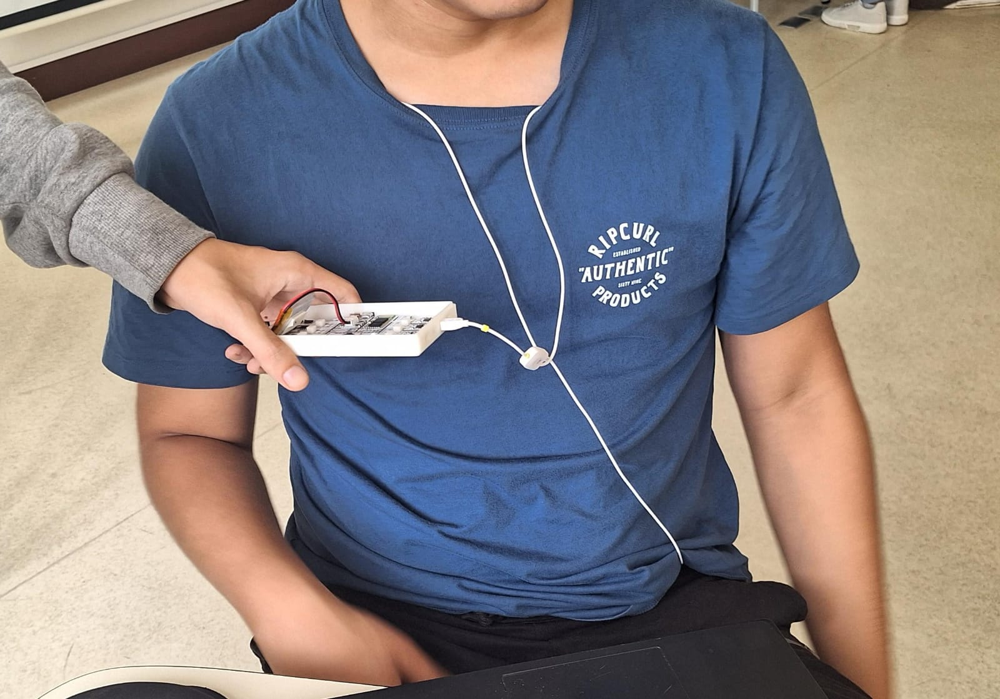

# Lab 5 - Filtros digitales

## Tabla de contenidos
- [Objetivos](#objetivos)
- [Materiales](#materiales)
- [Introducción](#introduccion)
- [Metolodogía] (#metolodogia)
- [Resultados](#resultados)
- [Discusión de resultados](#Explicación/-Discusión-de-resultados)
- [Referencias](#referencias)
  
##  Objetivos
- Comprender los fundamentos de filtros digitales, especialmente los IRR y FIR
- Aplicar filtros IRR y FIR a señales de EMG, ECG y EEG.
- Analizar las señales tras aplicar los filtros

## Materiales
| Material | Cantidad |
|:--------------:|:--------------:|

| Programa *Python* | N.A | 

## Introducción

Filtros Digitales 

Filtros IRR y Filtros FIR

Para la práctica se utilizó el programa Python para aplicar los filtros digitales mencionados, graficar las señales y analizarlas.

## Metolodogía

Se utilizó el siguiente código como filtro IRR para las señales EMG, ECG y EEG. En este caso el filtro es Butterworth.

Se utilizó el siguiente código como filtro FIR para las señales EMG, ECG y EEG.

## Resultados

***NOTA**: El ploteo de las señales se realizó en intervalos distintos, para una mejor apreciación de las señales.*

#EMG

Los resultados analizados en la siguiente tabla se obtuvieron al realizar el EMG del bíceps. 
Los electrodos fueron colocados como se observa en la figura 1. Los electrodos positivo y negativo será colocados en el músculo de interés, en este caso el bíceps mientras que el electrodo de referencia será colocado en una zona neutra como la muñeca.
Se tomó registro de la señal en el usuario en estado de reposo o silencio eléctrico y realizando la contracción muscular.

| Posicionamiento de los electrodos |
|:--------------:|:--------------:|
| Figura 1 |  |

| Campo | Señal Cruda | Filtro IRR | Filtro FIR |
|:--------------:|:--------------:|:--------------:|:--------------:|
| Figura X. Reposo | | | |
| Figura X. Contracción muscular | | | |

#ECG

Los resultados analizados en la siguiente tabla se obtuvieron al realizar el ECG. 
Los electrodos fueron colocados como se observa en la figura 2. El electrodo positivo se posicionó en la clavícula izquierda, electrodo negativo en la clavícula derecha y electrodo de referencia en la cresta iliaca. 
Se tomó registro de la señal en el usuario en estado de reposo, hiperventilación, después de hacer ejercicio y al realizar respiraciones largas.

| Posicionamiento de los electrodos |
|:--------------:|:--------------:|
| Figura 2 |  |

| Campo | Señal Cruda | Filtro IRR | Filtro FIR |
|:--------------:|:--------------:|
| Figura X. Reposo | |
| Figura X. Hiperventilación   |  |  |    |
| Figura X. Después de ejercicio| | | |
| Figura X. Respiraciones largas | | | |

#EEG

Los resultados analizados en la siguiente tabla se obtuvieron al realizar el EEG. 
Los electrodos fueron colocados como se observa en la figura 3 de acuerdo a la configuración del sistema internacional 10-20.
Se tomó registro de la señal en el usuario en una primera y segunda fase de referencia, en ciclos de ojos cerrados y abierto y realizando ejercicios mentales simples y complejos.

| Posicionamiento de los electrodos |
|:--------------:|:--------------:|
| Figura 3 |  |

| Campo| Señal Cruda | Filtro IRR | Filtro FIR |
|:--------------:|:--------------:|:--------------:|:--------------:|
| Figura X. Primera fase de referencia |  |  |  |
| Figura X. Fase 2 - Ciclo de "ojos cerrados " |  | | |
| Figura X. Fase 2 - Ciclo de "ojos abiertos" |  | | |
| Figura X. Segunda fase de referencia |  |  | |
| Figura X. Ejercicios mentales simples |  |  | |
| Figura X. Ejercicios mentales complejo |  |  | |

## Discusión de resultados

### Observaciones

## Explicación/ Discusión de resultados

## Referencias

1.

