# Lab 7 - Filtro wavelet

## Tabla de contenidos
- [Objetivos](#objetivos)
- [Materiales](#materiales)
- [Introducción](#introduccion)
- [Metolodogía](#metodología)
- [Resultados](#resultados)
- [Discusión de resultados](#Explicación/-Discusión-de-resultados)
- [Referencias](#referencias)
  
##  Objetivos
- Comprender los fundamentos del filtro wavelet.
- Aplicar el filtro wavelet a señales de EMG, ECG y EEG.
- Analizar las señales tras aplicar los filtros.

## Materiales
| Material | Cantidad |
|:--------------:|:--------------:|
| Programa *Python* | N.A | 

## Introducción

<p align="justify">
La transformada “wavelet” es una herramienta utilizada en el diseño de filtros para el análisis de señales e imágenes ya que permite filtrar el ruido de manera selectiva [1]. Esto se debe a que no describe una señal únicamente en el dominio de la frecuencia, sino también por la potencia (energía distribuida) en cada escala y posición [1]. Por ende, las diferentes técnicas desarrolladas a partir de esta transformada son representaciones multirresolución de señales e imágenes que las descomponen en diferentes niveles a detalle (como por ejemplo el tiempo, la frecuencia, entre otros) [1]. 
</p>

<p align="justify">
En comparación con la transformada de Fourier, en donde se utiliza una combinación ponderada de sinusoides que no puede capturar de manera adecuada los modos variables en el tiempo de las señales deseadas, la transformada “wavelet” permite observar a detalle características que cambian constantemente a lo largo del tiempo [2]. Es por el muestreo finito característico  que al utilizar la transformada de Fourier (dominio de la frecuencia) se da el efecto “ringing” de Gibbs el cual se visualiza en los bordes de la señal reconstruida como oscilaciones [3]. Por ende, reducir el ruido en una señal con filtros pasa baja en el dominio de Fourier (frecuencia) también involucra evaluar la reducción de la resolución espacial en la imagen a costa de la reducción de ruido ya que este usualmente tiene una mayor potencia en frecuencia altas [3]. Es por esta razón que las transformadas “wavelet” son de gran interés en el procesamiento y análisis de imágenes ya que concentra mucho más la potencia de la señal sin la dispersión en los bordes y no se pierde significativamente la calidad de la señal en comparación al ruido [3].
</p>

<p align="justify">
Cabe resaltar que las “wavelets” son familias de funciones generadas a partir de dilataciones (escala) y traslaciones de una onda (“wavelet”) base [1]. Las ondas base de dichas familias deben tener media cero y las más útiles tienen un soporte localizado tanto en los dominios espacial como de Fourier (frecuencia) [1]. Estas pueden ser de tipo ortogonal y no ortogonal [1]. 
</p>

<p align="justify">
Para la práctica se utilizó el programa Python para aplicar filtros wavelet, graficar las señales y analizarlas.
</p>

## Metodología


### Diseño del Filtro EMG

<p align="justify">
Para el filtrado de la señal EMG, se adoptan los parámetros utilizados por X.Ren et al. en [4]. Tipo de wavelet: Daubechies 5 , nivel de la wavelet: 9, threshold: hard. El objetivo de este estudio fue extraer y clasificar los potenciales de acción de diferentes unidades motoras. Como parte el procesamiento de las señales, se pretendió remover ruidos potencial a partir de filtrado con ondas wavelet, con las características mencionadas anteriormente. 
</p>

### Diseño del Filtro ECG

<p align="justify">
Para la implementación de la transformada Wavelet se utilizó como principal fuente de referencia el artículo “The Identification of ECG Signals Using WT-UKF and IPSO-SVM” [5] . El artículo propone un método de identificación de señales de ECG basado en una transformada wavelet de múltiples escalas junto con al algoritmo de filtro de Kalman (WT-UKF), con el propósito de eliminar el ruido presente y, a su vez, preservar las características locales de la señal de ECG. Además, con el fin de extraer puntos característicos del complejo QRS, utiliza la transformada wavelet spline diádica y la aplicación de procesamiento en ventanas para eliminar interferencias de los puntos máximos de ondas R y extraer características de las ondas P y T. 
</p>

<p align="justify">
Para el desarrollo de este laboratorio, solo se tomarán en cuenta los valores o parámetros mencionados por el artículo para la realización de la etapa de filtrado de la señal, mas no la detección de características específicas. Los parámetros utilizados se muestran a continuación:
</p>

| Tipo de Wavelet madre | Niveles/Escalas |
|:--------------:|:--------------:|
| Daubechies 8 (db8)| 8| 

Tabla 1. Parámetros de Wavelet para ECG [5]

- Por otro lado, se optó por usar un thresholding suave de 0.2. 


### Diseño del Filtro EEG

<p align="justify">
El diseño del filtro para las señales EEG fue basado principalmente en dos artículos. Primero, la investigación de Phadikar et al. [6] consiste en un método automático para eliminar señales indeseadas causados por parpadeos de ojos en señales de EEG corruptas. Este método utiliza la transformada discreta de wavelet (DWT) y un umbral optimizado mediante metaheurísticas. En este artículo, se menciona que la wavelet que se adecúa para el filtrado de EEG es la wavelet db8 con 6 niveles de descomposición. Luego, Wan et al. [7] habla de la propuesta de un método para discriminar estados de ira al conducir con diferente intensidad según las características espectrales del electroencefalograma (EEG). En este artículo se mencionan algunos valores de threshold para las ondas beta y theta según el nivel de ira. Por ello, se decidió usar un threshold de 0.3674.
</p>

## Resultados

***NOTA**: El ploteo de las señales se realizó en intervalos distintos, para una mejor apreciación de las señales. Asimismo, la frecuencia de muestreo fue de 1000 Hz.*

### EMG

Los resultados analizados en la siguiente tabla se obtuvieron al realizar el EMG del bíceps. 
Los electrodos fueron colocados como se observa en la figura 1. Los electrodos positivo y negativo será colocados en el músculo de interés, en este caso el bíceps mientras que el electrodo de referencia será colocado en una zona neutra como la muñeca.
Se tomó registro de la señal en el usuario en estado de reposo o silencio eléctrico y realizando la contracción muscular.

| Posicionamiento de los electrodos |
|:--------------:|
|  |
| Figura 1 |


| Campo | Señal Cruda | Filtro wavelet | 
|:--------------:|:--------------:|:--------------:|
| Figura 2. Señal completa| 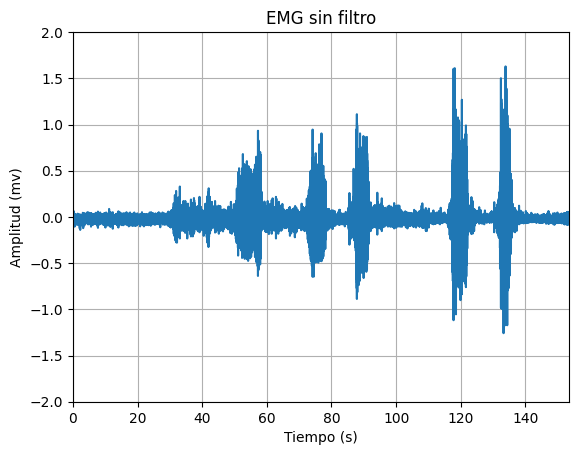|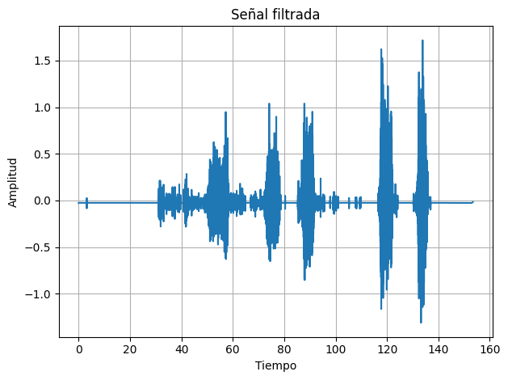|
| Figura 3. Reposo | 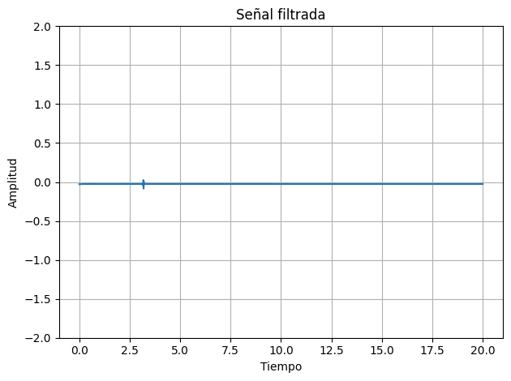|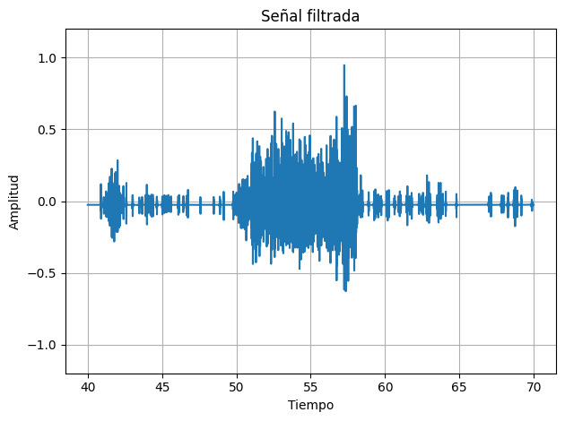| 
| Figura 4. Contracción muscular | 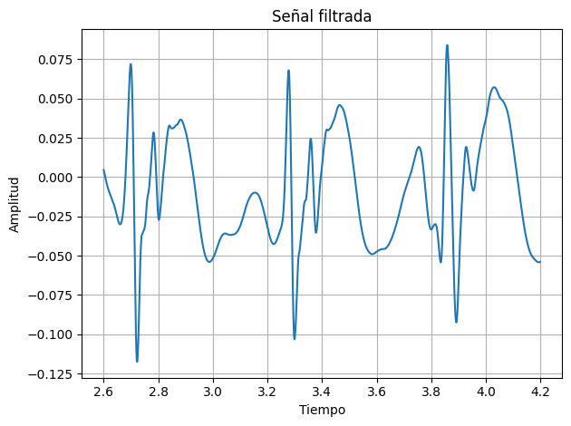| | 

### ECG

Los resultados analizados en la siguiente tabla se obtuvieron al realizar el ECG. 
Los electrodos fueron colocados como se observa en la figura 2. El electrodo positivo se posicionó en la clavícula izquierda, electrodo negativo en la clavícula derecha y electrodo de referencia en la cresta iliaca. 
Se tomó registro de la señal en el usuario en estado de reposo, hiperventilación, después de hacer ejercicio y al realizar respiraciones largas.

| Posicionamiento de los electrodos |
|:--------------:|
|  |
| Figura 5 |

| Campo | Señal Cruda | Filtro wavelet |
|:--------------:|:--------------:|:--------------:|
| Figura 6. Estado Basal | 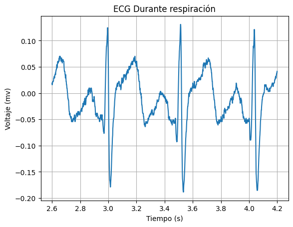| | 
| Figura 7. Después de ejercicio| 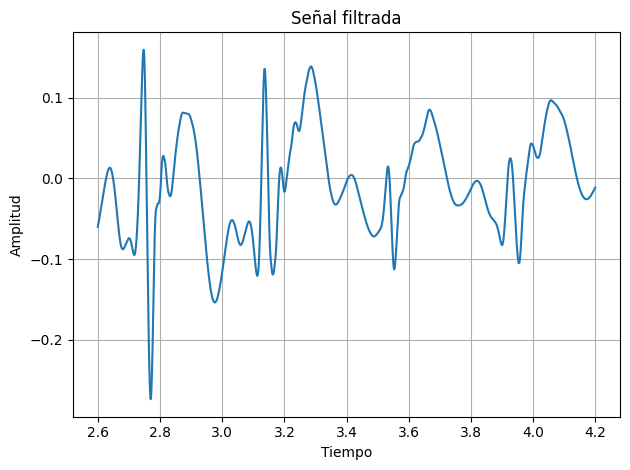| 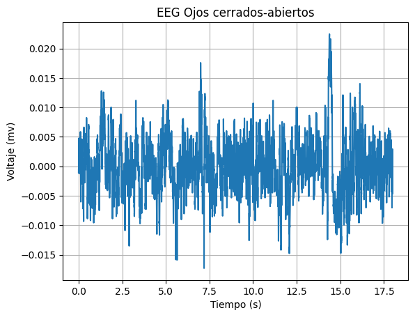| 
| Figura 8. Respiraciones largas | 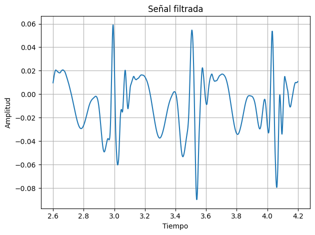| | 

### EEG

Los resultados analizados en la siguiente tabla se obtuvieron al realizar el EEG. 
Los electrodos fueron colocados como se observa en la figura 3 de acuerdo a la configuración del sistema internacional 10-20.
Se tomó registro de la señal en el usuario en una primera y segunda fase de referencia, en ciclos de ojos cerrados y abierto y realizando ejercicios mentales simples y complejos.

| Posicionamiento de los electrodos |
|:--------------:|
|  |
| Figura 9 |

| Campo| Señal Cruda | Filtro wavelet | 
|:--------------:|:--------------:|:--------------:|
| Figura 10. Primera fase de referencia |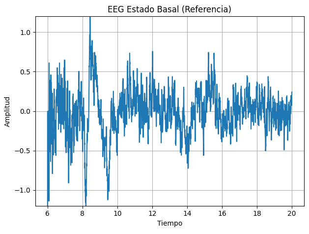 | 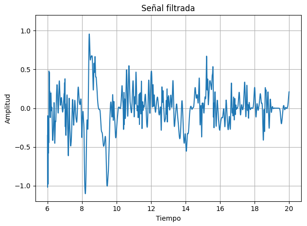 |
| Figura 11. Fase 2 - Ciclo de "ojos cerrados-abiertos" |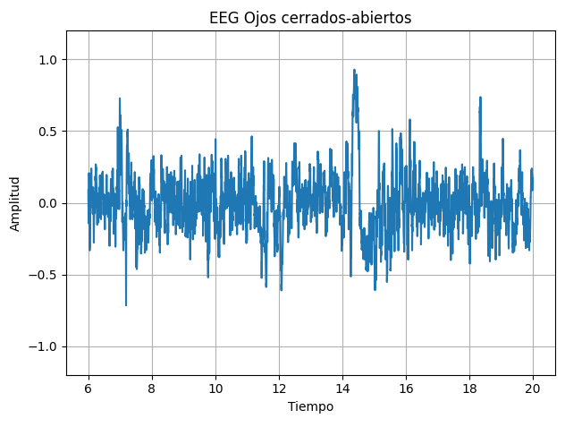 |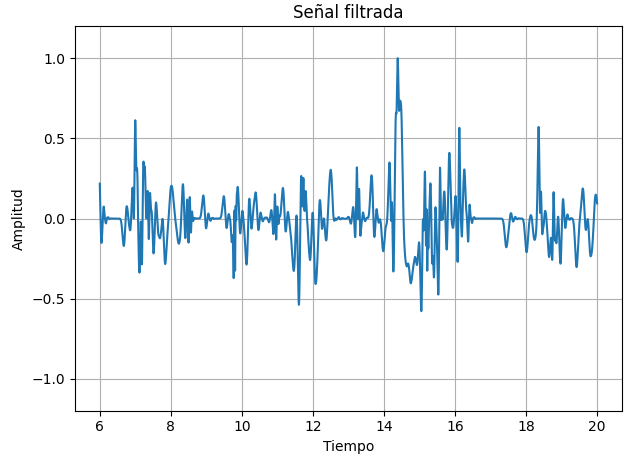|
| Figura 12. Ejercicios mentales simples | 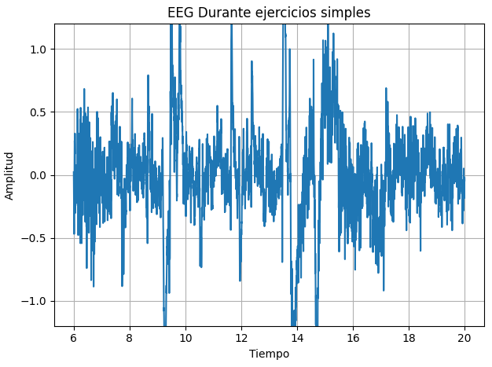| 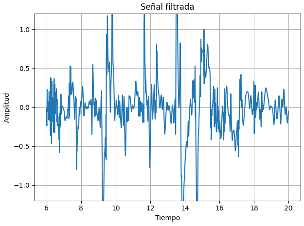|
| Figura 13. Ejercicios mentales complejo |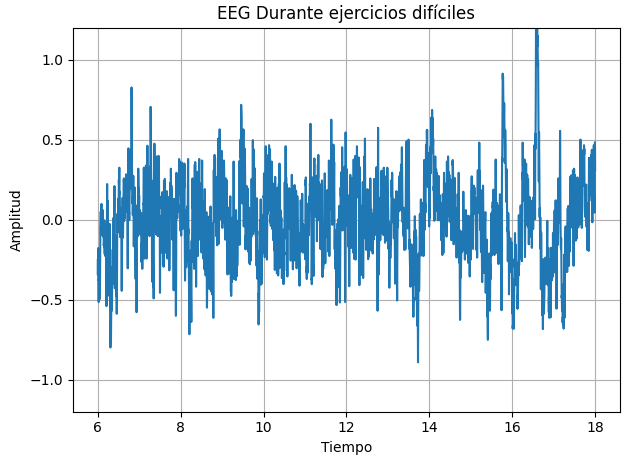| 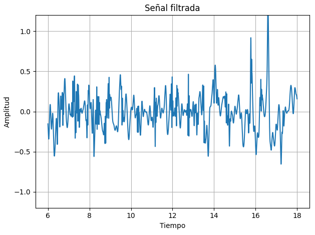 |


## Código en Python

``` python
import pandas as pd
import matplotlib.pyplot as plt
import numpy as np
from scipy import signal
from scipy.signal import lfilter, firwin
import pywt

def get_values(path, col):
  df = pd.read_csv(path, sep='\t', skiprows=3)  # saltar las dos primeras filas (encabezado)
  novena_columna = df.iloc[:, col].values
  n = [i/1000 for i in range(0, len(novena_columna))]
  signal = [(float(valor)/(2**10)-1/2)*3.3/1009*1000 for valor in novena_columna]
  return n, signal

def get_valuesEEG(path, col):
  df = pd.read_csv(path, sep='\t', skiprows=3)  # saltar las dos primeras filas (encabezado)
  novena_columna = df.iloc[:, col].values
  n = [i/1000 for i in range(0, len(novena_columna))]
  signal = [(float(valor)/(2**10)-1/2)*3.3/41782*1000 for valor in novena_columna]
  return n, signal

def plot_values(n, y, label, ini, fin):
  plt.plot(n[ini:fin], y[ini:fin])
  plt.xlabel('Tiempo (s)')
  plt.ylabel('Voltaje (mv)')
  plt.title(label)
  plt.grid(True)
  plt.show()

def FreqAnalysis (signal):
  fs = 1000
  fft_result = np.fft.fft(signal)
  freqs = np.fft.fftfreq(len(signal), 1/fs)

  # Graficar la magnitud de la FFT
  plt.figure(figsize=(10, 5))
  plt.plot(freqs, np.abs(fft_result))
  plt.xlim(-50, 50)
  plt.title('Magnitud de la Transformada Rápida de Fourier (FFT)')
  plt.xlabel('Frecuencia (Hz)')
  plt.ylabel('Magnitud')
  plt.grid(True)
  plt.show()
```
### Importación de Señales

# Señales EMG
 
``` python
path = "/content/drive/MyDrive/PUCP/7mo ciclo/Instruducción a Señales Biomédicas/Laboratorios/EMG/BICEPS.txt"
[n, EMGsignal] = get_values(path, 5)
label = "EMG de los bíceps"
plot_values(n, EMGsignal, label, 0, len(EMGsignal))
```

# Señales ECG

``` python
path = "/content/drive/MyDrive/PUCP/7mo ciclo/Instruducción a Señales Biomédicas/Laboratorios/ECG/J1.txt"
[n, ECGsignal1] = get_values(path, 6)
label = "ECG Estado Basal"
plot_values(n, ECGsignal1, label, 2600, 4200)

path = "/content/drive/MyDrive/PUCP/7mo ciclo/Instruducción a Señales Biomédicas/Laboratorios/ECG/POS EJERCICIO.txt"
[n, ECGsignal2] = get_values(path, 6)
label = "ECG Estado Post Ejercicio"
plot_values(n, ECGsignal2, label,  2600, 4200)

path = "/content/drive/MyDrive/PUCP/7mo ciclo/Instruducción a Señales Biomédicas/Laboratorios/ECG/RESPIRACION.txt"
[n, ECGsignal3] = get_values(path, 6)
label = "ECG Durante respiración"
plot_values(n, ECGsignal3, label,  2600, 4200)
```

# Señales EEG

``` python
path = "/content/drive/MyDrive/PUCP/7mo ciclo/Instruducción a Señales Biomédicas/Laboratorios/EEG/dificil.txt"
[n, EEGsignal1] = get_valuesEEG(path, 8)
label = "EEG Durante Ejercicio Difíciles"
plot_values(n, EEGsignal1, label, 6000, 12000)

path = "/content/drive/MyDrive/PUCP/7mo ciclo/Instruducción a Señales Biomédicas/Laboratorios/EEG/simples.txt"
[n, EEGsignal2] = get_valuesEEG(path, 8)
label = "EEG Durante Ejercicio Simples"
plot_values(n, EEGsignal2, label, 0, 5000)

path = "/content/drive/MyDrive/PUCP/7mo ciclo/Instruducción a Señales Biomédicas/Laboratorios/EEG/paso1.txt"
[n, EEGsignal3] = get_valuesEEG(path, 8)
label = "EEG Estado Basal (Referencia)"
plot_values(n, EEGsignal3, label, 5000, 10000)

path = "/content/drive/MyDrive/PUCP/7mo ciclo/Instruducción a Señales Biomédicas/Laboratorios/EEG/paso2.txt"
[n, EEGsignal4] = get_valuesEEG(path, 8)
label = "EEG Ojos cerrados-abiertos"
plot_values(n, EEGsignal4, label, 0, 18000)
```

### Filtrado wavelet para las Señales EMG

``` python 
# Aplicar la transformada wavelet
coeffs = pywt.wavedec(EMGsignal, 'db5', level=9)

# Filtrar los coeficientes
threshold = 0.2
filtered_coeffs = [pywt.threshold(coeff, threshold, mode='hard') for coeff in coeffs]

# Reconstruir la señal filtrada
filtered_signal = pywt.waverec(filtered_coeffs, 'db5')
plt.figure()
plt.plot(n[40000:70000], filtered_signal[40000:70000])
plt.title('Señal filtrada')
plt.xlabel('Tiempo')
plt.ylabel('Amplitud')
plt.ylim([-1.2, 1.2])
plt.grid(True)
plt.tight_layout()
plt.show()

```

### Filtrado wavelet para las señales ECG

``` python
# Aplicar la transformada wavelet
coeffs = pywt.wavedec(ECGsignal1, 'db8', level=8)

# Filtrar los coeficientes
threshold = 0.2
filtered_coeffs = [pywt.threshold(coeff, threshold, mode='soft') for coeff in coeffs]

# Reconstruir la señal filtrada
filtered_signal = pywt.waverec(filtered_coeffs, 'db8')
plt.figure()
plt.plot(n[2600:4200], filtered_signal[2600:4200])
plt.title('Señal filtrada')
plt.xlabel('Tiempo')
plt.ylabel('Amplitud')
plt.grid(True)
plt.tight_layout()
plt.show()
```

### Filtrado wavelet para las señales EEG

``` python
## Aplicar la transformada wavelet
coeffs = pywt.wavedec(EEG_signal, 'db8', level=6)

# Filtrar los coeficientes
threshold = 0.3674
filtered_coeffs = [pywt.threshold(coeff, threshold, mode='hard') for coeff in coeffs]

# Reconstruir la señal filtrada
filtered_signal = pywt.waverec(filtered_coeffs, 'db8')
plt.figure()
plt.plot(n[6000:18000], filtered_signal[6000:18000])
plt.title('Señal filtrada')
plt.xlabel('Tiempo')
plt.ylabel('Amplitud')
plt.ylim([-1.2, 1.2])
plt.grid(True)
plt.tight_layout()
plt.show()
```
 

## Discusión de resultados

### EMG

<p align="justify">
El filtro implementado utiliza la transformada “wavelet” para descomponer la señal EMG en coeficientes (en este caso, utilizando la wavelet 'db5' y 9 niveles de descomposición), los cuales son posteriormente filtrados mediante umbralización [8]. En este caso, se aplicó un umbral de 0.2 para eliminar componentes no deseados de la señal. Las figuras 2-4 muestran la señal original en comparación con la EMG filtrada, en la cual se destaca una reducción significativa de ruido en comparación con la señal original. Se observa que la forma de onda de la señal filtrada se encuentra suavizada por lo que se sugiere que se ha reducido el ruido y la calidad de la señal ha mejorado.
</p>

<p align="justify">
El proceso de filtrado wavelet implementado en este estudio se alinea con la metodología propuesta en el siguiente artículo  [4]. En este se precisa que la eliminación efectiva del ruido en la señal EMG es esencial para mejorar la precisión en la detección de potenciales de acción de unidades motoras (MUAPs) [4]. Por ende, la transformada wavelet se emplea para filtrar la señal y estimar umbrales de forma eficiente, lo que contribuye a la detección de MUAPs mediante un filtrado de amplitud individual [4]. Cabe resaltar que el filtro utiliza la transformada wavelet discreta (DWT) porque esta permite descomponer la señal EMG en coeficientes a diferentes niveles de resolución lo que favorece la identificación y eliminación de componentes de baja amplitud asociados al ruido mediante umbralización [8]. Es así como posteriormente se reconstruye la señal filtrada a partir de los coeficientes modificados. [8].
</p>

<p align="justify">
Por lo tanto, la descomposición permite separar la señal en coeficientes que representan diferentes componentes de frecuencia y tiempo, lo que facilita la identificación y eliminación de interferencias no deseadas conversando la señal de interés [4]. Es por esta razón que al umbralizar estos coeficientes, se pueden eliminar los componentes de baja amplitud. [8].
</p>

### ECG

<p align="justify">
El filtro implementado utiliza la transformada “wavelet” para descomponer la señal ECG en coeficientes (en este caso, utilizando la wavelet 'db8' y 8 niveles de descomposición), los cuales son posteriormente filtrados mediante umbralización [5]. En este caso, se aplicó un umbral de 0.2 para eliminar componentes no deseados de la señal como aquellos de baja amplitud relacionados al ruido [9]. Las figuras 6-8 muestran la señal original en comparación con la señal ECG filtrada destacando una reducción significativa de ruido en comparación con la señal original. Adicionalmente, se preservan de forma clara las características de la señal deseada como las ondas P, QRS y T para su posterior análisis. Asimismo, observa que la forma de onda de la señal filtrada se encuentra suavizada con menor cantidad de fluctuaciones no relacionadas por lo que se sugiere que se ha reducido el ruido y la calidad de la señal ha mejorado. Cabe resaltar que las señales ECG son típicamente de baja frecuencia [5]
</p>

<p align="justify">
El proceso de filtrado wavelet implementado en este estudio se alinea con la metodología propuesta en el siguiente artículo [5]. Dado que la transformada wavelet es un método de análisis de localización en tiempo-frecuencia con una ventana de área fija y ventanas de tiempo y frecuencia variables, es adaptable a diferentes tipos de señales [5]. En este caso, la descomposición y reconstrucción a múltiples escalas se lleva a cabo utilizando el algoritmo de Mallat [5]. Tras la descomposición, las señales presentan diferentes resoluciones de tiempo y frecuencia en cada escala [5]. Las señales con alta resolución temporal contienen información más detallada y de alta frecuencia, mientras que las señales con baja resolución temporal contienen información global [5]. Finalmente, la señal filtrada se reconstruye a partir de los coeficientes de aproximación modificados (los cuales son asociados a componentes de bajas frecuencias) tras el procesamiento de umbral [9]. En general, las señales ECG reconstruidas son las señales resultantes del filtrado a múltiples escalas [5]. Cabe resaltar que el filtro wavelet implementado utiliza la transformada wavelet discreta (DWT) [9]. 
</p>

<p align="justify">
Por lo tanto, se puede concluir que el filtrado es eficaz porque aprovecha la capacidad de la transformada wavelet para analizar señales en múltiples escalas de tiempo y frecuencia, lo que permite la eliminación de ruido sin perder la calidad de la señal preservando las características esenciales de la señal ECG [5].
</p>

### EEG


## Referencias

1. Yansun Xu, Weaver JB, Healy DM, Jian Lu. Wavelet transform domain filters: a spatially selective noise filtration technique. IEEE Trans Image Process [Internet]. 1994 [consultado el 16 de mayo de 2024];3(6):747-58. Disponible en: https://doi.org/10.1109/83.336245

2. Erdol N, Basbug F. Wavelet transform based adaptive filters: analysis and new results. IEEE Trans Signal Process [Internet]. 1996 [consultado el 15 de mayo de 2024];44(9):2163-71. Disponible en: https://doi.org/10.1109/78.536674

3. Weaver JB, Xu Y, Healy DM, Cromwell LD. Filtering noise from images with wavelet transforms. Magn Reson Med [Internet]. Octubre de 1991 [consultado el 15 de mayo de 2024];21(2):288-95. Disponible en: https://doi.org/10.1002/mrm.1910210213

4. X. Ren, X. Hu, Z. Wang, y Z. Yan, “MUAP extraction and classification based on wavelet transform and ICA for EMG decomposition”, Med. Biol. Eng. Comput., vol. 44, núm. 5, pp. 371–382, 2006.

5. N. Li et al., “The identification of ECG signals using WT-UKF and IPSO-SVM”, Sensors (Basel), vol. 22, núm. 5, p. 1962, 2022. doi: 10.3390/s22051962

6. S. Phadikar, N. Sinha, and R. Ghosh, “Automatic eyeblink artifact removal from EEG signal using wavelet transform with heuristically optimized threshold,” IEEE Journal of Biomedical and Health Informatics, vol. 25, no. 2, pp. 475–484, Feb. 2021. doi:10.1109/jbhi.2020.2995235
   
7. P. Wan, C. Wu, Y. Lin, and X. Ma, “Optimal threshold determination for discriminating driving anger intensity based on EEG wavelet features and ROC curve analysis,” Information, vol. 7, no. 3, p. 52, Aug. 2016. doi:10.3390/info7030052 

8. Boyer M, Bouyer L, Roy JS, Campeau-Lecours A. Reducing Noise, Artifacts and Interference in Single-Channel EMG Signals: A Review. Sensors [Internet]. 8 de marzo de 2023 [consultado el 18 de mayo de 2024];23(6):2927. Disponible en: https://doi.org/10.3390/s23062927

9. Seena V, Yomas J. A review on feature extraction and denoising of ECG signal using wavelet transform. En: 2014 2nd International Conference on Devices, Circuits and Systems (ICDCS) [Internet]; 6-8 de marzo de 2014; Combiatore, India. [lugar desconocido]: IEEE; 2014 [consultado el 18 de mayo de 2024]. Disponible en: https://doi.org/10.1109/icdcsyst.2014.6926190

</div>
