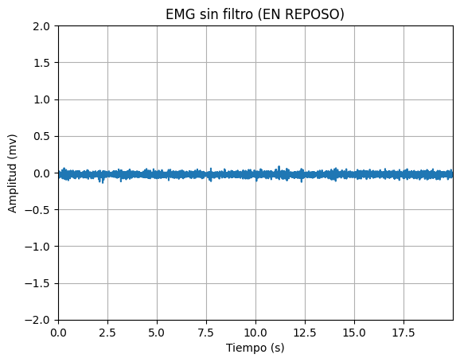
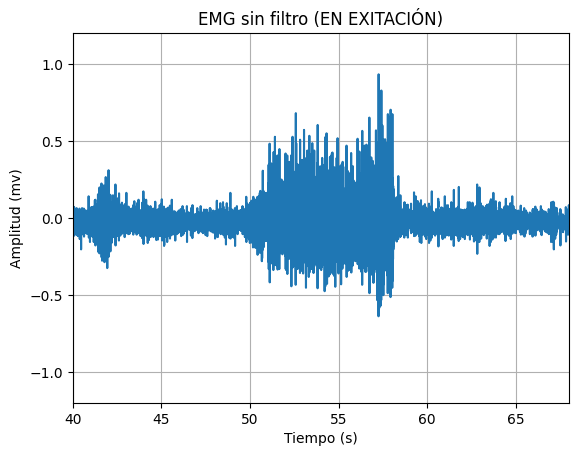

# Lab 7 - Filtro wavelet

## Tabla de contenidos
- [Objetivos](#objetivos)
- [Materiales](#materiales)
- [Introducción](#introduccion)
- [Metolodogía](#metodología)
- [Resultados](#resultados)
- [Discusión de resultados](#Explicación/-Discusión-de-resultados)
- [Referencias](#referencias)
  
##  Objetivos
- Comprender los fundamentos del filtro wavelet.
- Aplicar el filtro wavelet a señales de EMG, ECG y EEG.
- Analizar las señales tras aplicar los filtros.

## Materiales
| Material | Cantidad |
|:--------------:|:--------------:|
| Programa *Python* | N.A | 

## Introducción

<div style="text-align: justify;">

__Filtro wavelet__


Para la práctica se utilizó el programa Python para aplicar el filtro wavelet, graficar las señales y analizarlas.


## Metodología


### Diseño del Filtro EMG


### Diseño del Filtro ECG


### Diseño del Filtro EEG


## Resultados

***NOTA**: El ploteo de las señales se realizó en intervalos distintos, para una mejor apreciación de las señales. Asimismo, la frecuencia de muestreo fue de 1000 Hz.*

### EMG

Los resultados analizados en la siguiente tabla se obtuvieron al realizar el EMG del bíceps. 
Los electrodos fueron colocados como se observa en la figura 1. Los electrodos positivo y negativo será colocados en el músculo de interés, en este caso el bíceps mientras que el electrodo de referencia será colocado en una zona neutra como la muñeca.
Se tomó registro de la señal en el usuario en estado de reposo o silencio eléctrico y realizando la contracción muscular.

| Posicionamiento de los electrodos |
|:--------------:|
|  |
| Figura 1 |


| Campo | Señal Cruda | Filtro wavelet | 
|:--------------:|:--------------:|:--------------:|
| Figura 2. Señal completa| ||
| Figura 3. Reposo | | | 
| Figura 4. Contracción muscular | | | 

### ECG

Los resultados analizados en la siguiente tabla se obtuvieron al realizar el ECG. 
Los electrodos fueron colocados como se observa en la figura 2. El electrodo positivo se posicionó en la clavícula izquierda, electrodo negativo en la clavícula derecha y electrodo de referencia en la cresta iliaca. 
Se tomó registro de la señal en el usuario en estado de reposo, hiperventilación, después de hacer ejercicio y al realizar respiraciones largas.

| Posicionamiento de los electrodos |
|:--------------:|
|  |
| Figura 5 |

| Campo | Señal Cruda | Filtro wavelet |
|:--------------:|:--------------:|:--------------:|
| Figura 6. Estado Basal | |  | 
| Figura 7. Después de ejercicio| | | 
| Figura 8. Respiraciones largas | | | 

### EEG

Los resultados analizados en la siguiente tabla se obtuvieron al realizar el EEG. 
Los electrodos fueron colocados como se observa en la figura 3 de acuerdo a la configuración del sistema internacional 10-20.
Se tomó registro de la señal en el usuario en una primera y segunda fase de referencia, en ciclos de ojos cerrados y abierto y realizando ejercicios mentales simples y complejos.

| Posicionamiento de los electrodos |
|:--------------:|
|  |
| Figura X |

| Campo| Señal Cruda | Filtro wavelet | 
|:--------------:|:--------------:|:--------------:|
| Figura X. Primera fase de referencia | |  |
| Figura X. Fase 2 - Ciclo de "ojos cerrados-abiertos" | ||
| Figura X. Ejercicios mentales simples | | |
| Figura X. Ejercicios mentales complejo ||  |


## Código en Python

``` python

```
### Importación de Señales

# Señales EMG
 
``` python
```

# Señales ECG

``` python
```

# Señales EEG

``` python
```

### Filtrado wavelet para las Señales EMG

``` python 

```

### Filtrado wavelet para las señales ECG

``` python

```

### Filtrado wavelet para las señales EEG

``` python

```
 

## Discusión de resultados

### EMG


### ECG


### EEG


## Referencias


</div>
