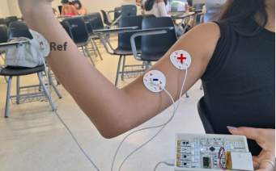

# Lab 7 - Filtro wavelet

## Tabla de contenidos
- [Objetivos](#objetivos)
- [Materiales](#materiales)
- [Introducción](#introduccion)
- [Metolodogía](#metodología)
- [Resultados](#resultados)
- [Discusión de resultados](#Explicación/-Discusión-de-resultados)
- [Referencias](#referencias)
  
##  Objetivos
- Comprender los fundamentos del filtro wavelet.
- Aplicar el filtro wavelet a señales de EMG, ECG y EEG.
- Analizar las señales tras aplicar los filtros.

## Materiales
| Material | Cantidad |
|:--------------:|:--------------:|
| Programa *Python* | N.A | 

## Introducción

<p align="justify">
La transformada “wavelet” es una herramienta utilizada en el diseño de filtros para el análisis de señales e imágenes ya que permite filtrar el ruido de manera selectiva [1]. Esto se debe a que no describe una señal únicamente en el dominio de la frecuencia, sino también por la potencia (energía distribuida) en cada escala y posición [1]. Por ende, las diferentes técnicas desarrolladas a partir de esta transformada son representaciones multirresolución de señales e imágenes que las descomponen en diferentes niveles a detalle (como por ejemplo el tiempo, la frecuencia, entre otros) [1]. 
</p>

<p align="justify">
En comparación con la transformada de Fourier, en donde se utiliza una combinación ponderada de sinusoides que no puede capturar de manera adecuada los modos variables en el tiempo de las señales deseadas, la transformada “wavelet” permite observar a detalle características que cambian constantemente a lo largo del tiempo [2]. Es por el muestreo finito característico  que al utilizar la transformada de Fourier (dominio de la frecuencia) se da el efecto “ringing” de Gibbs el cual se visualiza en los bordes de la señal reconstruida como oscilaciones [3]. Por ende, reducir el ruido en una señal con filtros pasa baja en el dominio de Fourier (frecuencia) también involucra evaluar la reducción de la resolución espacial en la imagen a costa de la reducción de ruido ya que este usualmente tiene una mayor potencia en frecuencia altas [3]. Es por esta razón que las transformadas “wavelet” son de gran interés en el procesamiento y análisis de imágenes ya que concentra mucho más la potencia de la señal sin la dispersión en los bordes y no se pierde significativamente la calidad de la señal en comparación al ruido [3].
</p>

<p align="justify">
Cabe resaltar que las “wavelets” son familias de funciones generadas a partir de dilataciones (escala) y traslaciones de una onda (“wavelet”) base [1]. Las ondas base de dichas familias deben tener media cero y las más útiles tienen un soporte localizado tanto en los dominios espacial como de Fourier (frecuencia) [1]. Estas pueden ser de tipo ortogonal y no ortogonal [1]. 
</p>

<p align="justify">
Para la práctica se utilizó el programa Python para aplicar filtros wavelet, graficar las señales y analizarlas.
</p>

## Metodología


### Diseño del Filtro EMG


### Diseño del Filtro ECG

<p align="justify">
Para la implementación de la transformada Wavelet se utilizó como principal fuente de referencia el artículo “The Identification of ECG Signals Using WT-UKF and IPSO-SVM” [5] . El artículo propone un método de identificación de señales de ECG basado en una transformada wavelet de múltiples escalas junto con al algoritmo de filtro de Kalman (WT-UKF), con el propósito de eliminar el ruido presente y, a su vez, preservar las características locales de la señal de ECG. Además, con el fin de extraer puntos característicos del complejo QRS, utiliza la transformada wavelet spline diádica y la aplicación de procesamiento en ventanas para eliminar interferencias de los puntos máximos de ondas R y extraer características de las ondas P y T. 
Para el desarrollo de este laboratorio, solo se tomarán en cuenta los valores o parámetros mencionados por el artículo para la realización de la etapa de filtrado de la señal, mas no la detección de características específicas. Los parámetros utilizados se muestran a continuación:
</p>

<p align="center">

| Tipo de Wavelet madre | Niveles/Escalas |
|:--------------:|:--------------:|
| Daubechies 8 (db8)| 8| 
Tabla X. Parámetros de Wavelet para ECG [5]
</p>
Por otro lado, se optó por usar un thresholding suave de 0.2. 


### Diseño del Filtro EEG


## Resultados

***NOTA**: El ploteo de las señales se realizó en intervalos distintos, para una mejor apreciación de las señales. Asimismo, la frecuencia de muestreo fue de 1000 Hz.*

### EMG

Los resultados analizados en la siguiente tabla se obtuvieron al realizar el EMG del bíceps. 
Los electrodos fueron colocados como se observa en la figura 1. Los electrodos positivo y negativo será colocados en el músculo de interés, en este caso el bíceps mientras que el electrodo de referencia será colocado en una zona neutra como la muñeca.
Se tomó registro de la señal en el usuario en estado de reposo o silencio eléctrico y realizando la contracción muscular.

| Posicionamiento de los electrodos |
|:--------------:|
|  |
| Figura 1 |


| Campo | Señal Cruda | Filtro wavelet | 
|:--------------:|:--------------:|:--------------:|
| Figura 2. Señal completa| ||
| Figura 3. Reposo | || 
| Figura 4. Contracción muscular | | | 

### ECG

Los resultados analizados en la siguiente tabla se obtuvieron al realizar el ECG. 
Los electrodos fueron colocados como se observa en la figura 2. El electrodo positivo se posicionó en la clavícula izquierda, electrodo negativo en la clavícula derecha y electrodo de referencia en la cresta iliaca. 
Se tomó registro de la señal en el usuario en estado de reposo, hiperventilación, después de hacer ejercicio y al realizar respiraciones largas.

| Posicionamiento de los electrodos |
|:--------------:|
|  |
| Figura 5 |

| Campo | Señal Cruda | Filtro wavelet |
|:--------------:|:--------------:|:--------------:|
| Figura 6. Estado Basal | | | 
| Figura 7. Después de ejercicio| | | 
| Figura 8. Respiraciones largas | | | 

### EEG

Los resultados analizados en la siguiente tabla se obtuvieron al realizar el EEG. 
Los electrodos fueron colocados como se observa en la figura 3 de acuerdo a la configuración del sistema internacional 10-20.
Se tomó registro de la señal en el usuario en una primera y segunda fase de referencia, en ciclos de ojos cerrados y abierto y realizando ejercicios mentales simples y complejos.

| Posicionamiento de los electrodos |
|:--------------:|
|  |
| Figura X |

| Campo| Señal Cruda | Filtro wavelet | 
|:--------------:|:--------------:|:--------------:|
| Figura X. Primera fase de referencia | |  |
| Figura X. Fase 2 - Ciclo de "ojos cerrados-abiertos" | ||
| Figura X. Ejercicios mentales simples | | |
| Figura X. Ejercicios mentales complejo ||  |


## Código en Python

``` python
import pandas as pd
import matplotlib.pyplot as plt
import numpy as np
from scipy import signal
from scipy.signal import lfilter, firwin
import pywt

def get_values(path, col):
  df = pd.read_csv(path, sep='\t', skiprows=3)  # saltar las dos primeras filas (encabezado)
  novena_columna = df.iloc[:, col].values
  n = [i/1000 for i in range(0, len(novena_columna))]
  signal = [(float(valor)/(2**10)-1/2)*3.3/1009*1000 for valor in novena_columna]
  return n, signal

def get_valuesEEG(path, col):
  df = pd.read_csv(path, sep='\t', skiprows=3)  # saltar las dos primeras filas (encabezado)
  novena_columna = df.iloc[:, col].values
  n = [i/1000 for i in range(0, len(novena_columna))]
  signal = [(float(valor)/(2**10)-1/2)*3.3/41782*1000 for valor in novena_columna]
  return n, signal

def plot_values(n, y, label, ini, fin):
  plt.plot(n[ini:fin], y[ini:fin])
  plt.xlabel('Tiempo (s)')
  plt.ylabel('Voltaje (mv)')
  plt.title(label)
  plt.grid(True)
  plt.show()

def FreqAnalysis (signal):
  fs = 1000
  fft_result = np.fft.fft(signal)
  freqs = np.fft.fftfreq(len(signal), 1/fs)

  # Graficar la magnitud de la FFT
  plt.figure(figsize=(10, 5))
  plt.plot(freqs, np.abs(fft_result))
  plt.xlim(-50, 50)
  plt.title('Magnitud de la Transformada Rápida de Fourier (FFT)')
  plt.xlabel('Frecuencia (Hz)')
  plt.ylabel('Magnitud')
  plt.grid(True)
  plt.show()
```
### Importación de Señales

# Señales EMG
 
``` python
path = "/content/drive/MyDrive/PUCP/7mo ciclo/Instruducción a Señales Biomédicas/Laboratorios/EMG/BICEPS.txt"
[n, EMGsignal] = get_values(path, 5)
label = "EMG de los bíceps"
plot_values(n, EMGsignal, label, 0, len(EMGsignal))
```

# Señales ECG

``` python
path = "/content/drive/MyDrive/PUCP/7mo ciclo/Instruducción a Señales Biomédicas/Laboratorios/ECG/J1.txt"
[n, ECGsignal1] = get_values(path, 6)
label = "ECG Estado Basal"
plot_values(n, ECGsignal1, label, 2600, 4200)

path = "/content/drive/MyDrive/PUCP/7mo ciclo/Instruducción a Señales Biomédicas/Laboratorios/ECG/POS EJERCICIO.txt"
[n, ECGsignal2] = get_values(path, 6)
label = "ECG Estado Post Ejercicio"
plot_values(n, ECGsignal2, label,  2600, 4200)

path = "/content/drive/MyDrive/PUCP/7mo ciclo/Instruducción a Señales Biomédicas/Laboratorios/ECG/RESPIRACION.txt"
[n, ECGsignal3] = get_values(path, 6)
label = "ECG Durante respiración"
plot_values(n, ECGsignal3, label,  2600, 4200)
```

# Señales EEG

``` python
path = "/content/drive/MyDrive/PUCP/7mo ciclo/Instruducción a Señales Biomédicas/Laboratorios/EEG/dificil.txt"
[n, EEGsignal1] = get_valuesEEG(path, 8)
label = "EEG Durante Ejercicio Difíciles"
plot_values(n, EEGsignal1, label, 6000, 12000)

path = "/content/drive/MyDrive/PUCP/7mo ciclo/Instruducción a Señales Biomédicas/Laboratorios/EEG/simples.txt"
[n, EEGsignal2] = get_valuesEEG(path, 8)
label = "EEG Durante Ejercicio Simples"
plot_values(n, EEGsignal2, label, 0, 5000)

path = "/content/drive/MyDrive/PUCP/7mo ciclo/Instruducción a Señales Biomédicas/Laboratorios/EEG/paso1.txt"
[n, EEGsignal3] = get_valuesEEG(path, 8)
label = "EEG Estado Basal (Referencia)"
plot_values(n, EEGsignal3, label, 5000, 10000)

path = "/content/drive/MyDrive/PUCP/7mo ciclo/Instruducción a Señales Biomédicas/Laboratorios/EEG/paso2.txt"
[n, EEGsignal4] = get_valuesEEG(path, 8)
label = "EEG Ojos cerrados-abiertos"
plot_values(n, EEGsignal4, label, 0, 18000)
```

### Filtrado wavelet para las Señales EMG

``` python 
# Aplicar la transformada wavelet
coeffs = pywt.wavedec(EMGsignal, 'db5', level=9)

# Filtrar los coeficientes
threshold = 0.2
filtered_coeffs = [pywt.threshold(coeff, threshold, mode='hard') for coeff in coeffs]

# Reconstruir la señal filtrada
filtered_signal = pywt.waverec(filtered_coeffs, 'db5')
plt.figure()
plt.plot(n[40000:70000], filtered_signal[40000:70000])
plt.title('Señal filtrada')
plt.xlabel('Tiempo')
plt.ylabel('Amplitud')
plt.ylim([-1.2, 1.2])
plt.grid(True)
plt.tight_layout()
plt.show()

```

### Filtrado wavelet para las señales ECG

``` python
# Aplicar la transformada wavelet
coeffs = pywt.wavedec(ECGsignal1, 'db8', level=8)

# Filtrar los coeficientes
threshold = 0.2
filtered_coeffs = [pywt.threshold(coeff, threshold, mode='soft') for coeff in coeffs]

# Reconstruir la señal filtrada
filtered_signal = pywt.waverec(filtered_coeffs, 'db8')
plt.figure()
plt.plot(n[2600:4200], filtered_signal[2600:4200])
plt.title('Señal filtrada')
plt.xlabel('Tiempo')
plt.ylabel('Amplitud')
plt.grid(True)
plt.tight_layout()
plt.show()
```

### Filtrado wavelet para las señales EEG

``` python

```
 

## Discusión de resultados

### EMG


### ECG


### EEG


## Referencias

1. Yansun Xu, Weaver JB, Healy DM, Jian Lu. Wavelet transform domain filters: a spatially selective noise filtration technique. IEEE Trans Image Process [Internet]. 1994 [consultado el 16 de mayo de 2024];3(6):747-58. Disponible en: https://doi.org/10.1109/83.336245

2. Erdol N, Basbug F. Wavelet transform based adaptive filters: analysis and new results. IEEE Trans Signal Process [Internet]. 1996 [consultado el 15 de mayo de 2024];44(9):2163-71. Disponible en: https://doi.org/10.1109/78.536674

3. Weaver JB, Xu Y, Healy DM, Cromwell LD. Filtering noise from images with wavelet transforms. Magn Reson Med [Internet]. Octubre de 1991 [consultado el 15 de mayo de 2024];21(2):288-95. Disponible en: https://doi.org/10.1002/mrm.1910210213

4.  ...

5.  N. Li et al., “The identification of ECG signals using WT-UKF and IPSO-SVM”, Sensors (Basel), vol. 22, núm. 5, p. 1962, 2022. doi: 10.3390/s22051962

</div>
