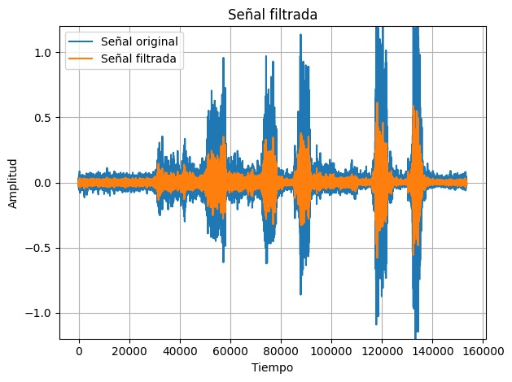
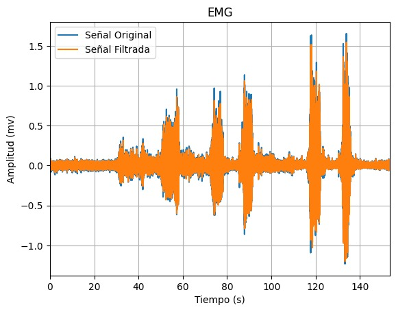
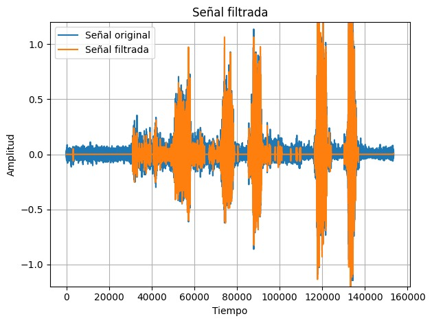

# Lab 8 - Procesamiento EMG

## Tabla de contenidos
- [Objetivos](#objetivos)
- [Materiales](#materiales)
- [Introducción](#introducción)
- [Metolodogía](#metodología)
- [Resultados](#resultados)
- [Discusión de resultados](#Discusión-de-resultados)
- [Referencias](#referencias)
  
##  Objetivos
- Comparar y seleccionar el filtro mas adecuado para la señal EMG
- Extraer y discutir las características de la señal EMG
- Comparar la señal procesada con una señal de referencia

## Materiales
| Material | Cantidad |
|:--------------:|:--------------:|
| Programa *Python* | N.A | 
| Programa *Open Signal (r)evolution* | N.A | 

## Introducción

<p align="justify">
La electromiografía de superficie (sEMG) es una técnica ampliamente utilizada en diversos campos como aplicaciones clínicas ya que nos arroja una señal eléctrica conocida como señal mioeléctrica generada a partir de los músculos esqueléticos lo que incluye información importante respecto a la contracción muscular [1]. Sin embargo, la calidad de esta señal puede verse alterada por diversos tipos de ruido como la interferencia y los artefactos lo que puede llevar a una interpretación errónea de esta [2]. Dentro de estos tenemos ruido inherente (de parte de otros equipos electrónicos), ruido ambiental, contaminación cruzada por parte de otros músculos activos cercanos al músculo esquelético de interés, entre otros [1]. Por ende, para obtener la señal EMG se debe tomar en cuenta las características adecuadas que se deben extraer de la señal tanto en el dominio del tiempo, de la frecuencia o del tiempo-frecuencia ya que de tomar un enfoque incorrecto también puede alterar la señal real [1]. En síntesis, la extracción de características en sEMG es el primer paso en el procesamiento de la señal y se utiliza para remover el ruido y obtener la señal real [1]. La extracción de características en el dominio del tiempo presenta el comportamiento de la señal en este y es utilizado en una amplia gama de aplicaciones como sistemas biológicos debido a que ofrece una reducción respecto a la complejidad relacionada a la extracción de características y facilidad de implementación [1]. Dentro de estas características se encuentran el valor de la media absoluta (MAV), la pendiente del valor de la media absoluta (MAVS), entre otros [1]. Cabe resaltar que esta señal es no estacionaria aunque al ser analizada en el dominio del tiempo se suele asumir que sí lo que conlleva ciertos problemas [1]. Una de las técnicas más utilizadas satisfactoriamente para el análisis de las señales no estacionarias como esta es la transformada de wavelet discreta en el dominio del tiempo aunque esta implica un vector de características de múltiples dimensiones lo que causa un aumento en los parámetros para la clasificación por lo que se debe reducir la dimensionalidad de dicho vector preservando la precisión de la clasificación de características [3]. 
</p>

<p align="justify">
Para la práctica se utilizó el programa Python para aplicar el filtro seleccionado, graficar la señal y extraer sus características. Asimismo, se utilizo el programa Open Signal (r)evolution para comparar dicha señal.
</p>

## Metodología


### Diseño del Filtro EMG

<p align="justify">
Las señales de EMG suelen ser adquiridas junto a ruido (ruido de base, ruido de interferencia, ruido de artefactos, etc.), el cual, dependiendo de su naturaleza, puede tener efecto tanto en el dominio del tiempo como la frecuencia [A]. El artículo “Reducing Noise, Artifacts and Interference in Single-Channel EMG Signals: A Review” [A] sugiere que, debido a la variedad de características de cada posible contaminante dentro de la señal, no es posible identificar un método único de filtrado que funcione bien para todos los tipos de contaminantes o ruidos. Dicho artículo menciona características de diversos filtros que son capaces de filtrar el ruido y reconstruir la señal, garantizando la conservación de la mayor cantidad posible de información contenida en la señal EMG; entre ellos menciona el filtro Wavelet y resalta la capacidad de adaptabilidad de sus parámetros basado en las características de la señal. 

Para la determinación del mejor filtro, se optó por comparar los filtros ya utilizados (IIR, FIR y Wavelet). Para ello, un parámetro a considerar será la relación señal/ruido (SNR) de las señales obtenidas luego de cada filtro respectivo. 

| Filtro IIR - Butterworth | Filtro FIR | Filtro Wavelet |
|:--------------:|:--------------:| :--------------:|
|  |  | |
| SNR = 2.3529 | SNR = -2.4112 | SNR = 8.7686 |

Luego de los cálculos respectivos, se observa que la señal con un SNR más alto es la señal obtenida tras el uso del filtro Wavelet, lo cual indica una mayor atenuación del ruido en comparación a los otros filtros.

El artículo “MUAP extraction and classification based on wavelet transform and ICA for EMG decomposition” [B], presenta el uso de un filtro wavelet frente a los filtros digitales comunes, debido a que sugiere que estos último pueden causar demoras en el dominio del tiempo (time-delay). Para el filtrado de la señal EMG, se adoptarán los parámetros utilizados por este artículo: 
- Tipo de wavelet: Daubechies 5 (db5)
- Nivel de la wavelet: 9
- Threshold: Hard.

[A] https://www.ncbi.nlm.nih.gov/pmc/articles/PMC10059683/
[B] https://link.springer.com/article/10.1007/s11517-006-0051-3 
</p>

### Segmentación

<p align="justify">


</p>

### Extracción de características

<p align="justify">


</p>


## Resultados

***NOTA**: El ploteo de las señales se realizó en intervalos distintos, para una mejor apreciación de las señales. Asimismo, la frecuencia de muestreo fue de 1000 Hz.*

### EMG

Los resultados analizados en la siguiente tabla se obtuvieron al realizar el EMG del bíceps. 
Los electrodos fueron colocados como se observa en la figura 1. Los electrodos positivo y negativo será colocados en el músculo de interés, en este caso el bíceps mientras que el electrodo de referencia será colocado en una zona neutra como la muñeca.
Se tomó registro de la señal en el usuario en estado de reposo o silencio eléctrico y realizando la contracción muscular.

| Posicionamiento de los electrodos |
|:--------------:|
|  |
| Figura 1 |


| Campo | Señal Cruda | Filtro wavelet | Señal Referencial | 
|:--------------:|:--------------:|:--------------:|:--------------:|
| Figura 2. Señal completa| |||
| Figura 3. Reposo | || |
| Figura 4. Contracción muscular | | | |


## Código en Python


### Librerías

``` python

import numpy as np
import pandas as pd
import matplotlib.pyplot as plt
import pywt
from scipy import signal
from scipy.signal import lfilter, firwin

```

### Funciones Generales

``` python

def get_values(path, col):
  df = pd.read_csv(path, sep='\t', skiprows=3)  # saltar las dos primeras filas (encabezado)
  novena_columna = df.iloc[:, col].values
  n = [i/1000 for i in range(0, len(novena_columna))]
  signal = [(float(valor)/(2**10)-1/2)*3.3/1009*1000 for valor in novena_columna]
  return n, signal


def plot_values(n, y, label, ini, fin):
  plt.plot(n[ini:fin], y[ini:fin])
  plt.xlabel('Tiempo (s)')
  plt.ylabel('Voltaje (mv)')
  plt.title(label)
  plt.grid(True)
  plt.show()


def FreqAnalysis_FFT (signal):
  global fs
  fs = 1000
  fft_result = np.fft.fft(signal)
  freqs = np.fft.fftfreq(len(signal), 1/fs)
  # Graficar la magnitud de la FFT
  plt.figure(figsize=(10, 5))
  plt.plot(freqs, np.abs(fft_result))
  plt.xlim(-600, 600)
  plt.title('Magnitud de la Transformada Rápida de Fourier (FFT)')
  plt.xlabel('Frecuencia (Hz)')
  plt.ylabel('Magnitud')
  plt.grid(True)
  plt.show()
  return fft_result

```

### Funciones para Filtros


```python

def WaveletFiltering(signal, ini, fin):
    coeffs = pywt.wavedec(signal, 'db5', level=9)
    # sigma = np.median(coeffs[-1])/0.6745
    # print(sigma)
    # thresh = sigma*np.sqrt(2*np.log10(len(signal)))
    # print(thresh)
    # Filtrar los coeficientes
    threshold = 0.2
    filtered_coeffs = [pywt.threshold(coeff, threshold, mode='hard') for coeff in coeffs]

    # Reconstruir la señal filtrada
    filtered_signal = pywt.waverec(filtered_coeffs, 'db5')
    plt.figure()
    plt.plot(signal[ini:fin], label='Señal original')
    plt.plot(filtered_signal[ini:fin], label='Señal filtrada')
    plt.title('Señal filtrada')
    plt.xlabel('Tiempo')
    plt.ylabel('Amplitud')
    plt.ylim([-1.2, 1.2])
    plt.legend()
    plt.grid(True)
    plt.tight_layout()
    plt.show()
    return filtered_signal

def IIR_Butter(EMGsignal, ini, fin):
  b,a = signal.butter(2, 10, 'highpass', fs=1000, output='ba')
  filteredEMG =signal.filtfilt(b,a, EMGsignal)
  b,a = signal.butter(8, 400, 'lowpass', fs=1000, output='ba')
  filteredEMG =signal.filtfilt(b,a, filteredEMG)
  b,a = signal.butter(2, [40, 80], 'stop', fs=1000, output='ba')
  filteredEMG =signal.filtfilt(b,a, filteredEMG)
  b,a = signal.butter(2, [100, 140], 'stop', fs=1000, output='ba')
  filteredEMG =signal.filtfilt(b,a, filteredEMG)
  b,a = signal.butter(2, [160, 200], 'stop', fs=1000, output='ba')
  filteredEMG =signal.filtfilt(b,a, filteredEMG)
  b,a = signal.butter(2, [220, 260], 'stop', fs=1000, output='ba')
  filteredEMG =signal.filtfilt(b,a, filteredEMG)
  b,a = signal.butter(2, [280, 320], 'stop', fs=1000, output='ba')
  filteredEMG =signal.filtfilt(b,a, filteredEMG)
  b,a = signal.butter(2, [340, 380], 'stop', fs=1000, output='ba')
  filteredEMG =signal.filtfilt(b,a, filteredEMG)
  plt.figure()
  plt.plot(EMGsignal[ini:fin], label='Señal original')
  plt.plot(filteredEMG[ini:fin], label='Señal filtrada')
  plt.title('Señal filtrada')
  plt.xlabel('Tiempo')
  plt.ylabel('Amplitud')
  plt.ylim([-1.2, 1.2])
  plt.legend()
  plt.grid(True)
  plt.tight_layout()
  plt.show()
  return filteredEMG

def FIR(EMGsignal, ini, fin):
  n = [i/1000 for i in range(0,len(EMGsignal))]
  t = [num / fs for num in n]; N=len(n)
  M = 37
  Fc = 30
  wc = 2*np.pi*Fc/fs
  w = firwin(numtaps=M, cutoff=Fc, window='hamming', fs=1000, pass_zero=False)
  w = np.round(w,3)
  nm = np.arange(M)
  W = np.fft.fft(w,N)
  W = np.round(W[0:N//2],3)
  y_filtrado = lfilter(w, np.array(1),EMGsignal)
  plt.figure()
  plt.plot(n[ini: fin], EMGsignal[ini: fin], label="Señal Original")
  plt.plot(n[ini: fin], y_filtrado[ini: fin], label="Señal Filtrada")
  plt.ylabel("Amplitud (mv)")
  plt.xlabel("Tiempo (s)")
  plt.title("EMG")
  plt.legend()
  plt.grid(True)
  plt.margins(0, 0.05)
  return y_filtrado

def SNR(signal, filtered_signal):
    power_signal = np.mean(np.square(signal))
    noise = signal - filtered_signal
    power_noise = np.mean(np.square(noise))
    snr = 10 * np.log10(power_signal / power_noise)
    return snr

```

### Funciones de Segmentación

```python

def split_signal(signal, N):
    num_segments = len(signal) // N  # Número de pedazos completos
    segments = [signal[i*N:(i+1)*N] for i in range(num_segments)]
    return segments

# Selección de segmentos de señal en etapas de reposo y exitación
# Tiempo de reposo 0 a 20 s
# Tiempo de exitación de 40 a 70 s

signalSet = split_signal(EMGsignal_NoDC, 200)
restSegments = signalSet[0:100]
excitementSegments = signalSet[200:350]

```

### Funciones de Características en Tiempo

``` python

def timeChar(segments):
  mavlist = []
  rmslist = []
  mavslist = []
  varlist = []
  iemglist = []
  wllist = []
  zclist = []
  ssclist = []
  for i in segments:
    mav = np.mean(np.abs(EMGsignal))
    rms = np.sqrt(np.mean(np.square(EMGsignal)))
    mavs = np.mean(np.abs(np.diff(EMGsignal)))
    var = np.var(EMGsignal)

    # Calcular el iEMG (integral de la EMG)
    iemg_value = np.sum(np.abs(EMGsignal_NoDC))
    # Calcular la longitud de la forma de onda (WL)
    wl_value = len(EMGsignal_NoDC)
    # Calcular los cruces por cero (ZC)
    zc_value = np.sum(np.diff(np.sign(EMGsignal_NoDC)) != 0)
    # Calcular los cambios en el signo de la pendiente (SSC)
    ssc_value = np.sum(np.diff(np.sign(np.diff(EMGsignal_NoDC))) != 0)
    mavlist.append(mav)
    rmslist.append(rms)
    mavslist.append(mavs)
    varlist.append(var)
    iemglist.append(iemg_value)
    wllist.append(wl_value)
    zclist.append(zc_value)
    ssclist.append(ssc_value)

    mav_mean = np.mean(mavlist)
    rms_mean = np.mean(rmslist)
    mavs_mean = np.mean(mavslist)
    var_mean = np.mean(varlist)
    iemg_mean = np.mean(iemglist)
    wl_mean = np.mean(wllist)
    zc_mean = np.mean(zclist)
    ssc_mean = np.mean(ssclist)

  print("Mean Absolute Value: ", mav_mean)
  print("Root Mean Square: ", rms_mean)
  print("Mean Absolute Value Slope: ", mavs_mean)
  print("Variance: ", var_mean);
  print("iEMG:", iemg_value)
  print("Waveform Length (WL):", wl_value)
  print("Zeros Crosses (ZC):", zc_value)
  print("Sign Signal Change (SSC):", ssc_value) 


def wavelength(signal):
  n = [i for i in range(0, len(signal))]
  t = n/1000
  peak_indices = np.where(np.diff(np.sign(np.diff(signal))) < 0)[0]
  # Calcular la longitud de onda como la distancia entre dos picos consecutivos
  if len(peak_indices) >= 2:
      wavelength = t[peak_indices[1]] - t[peak_indices[0]]
      print("Longitud de onda:", wavelength)
  else:
      print("No se encontraron suficientes picos para calcular la longitud de onda.")

timeChar(restSegments)
timeChar(excitementSegments)

```

### Funciones de Características en Frecuencia

```python

def Periodogram(signal):
  powSpectralDensity = abs(np.fft.fft(signal))**2
  freqs = np.fft.fftfreq(len(signal), 1/fs)
  plt.plot(freqs, powSpectralDensity)
  plt.title('Power Spectral Density')
  plt.xlabel('Frecuencia')
  plt.ylabel('Potencia')
  plt.legend()
  plt.grid(True)
  plt.show()
  return 

```

## Discusión de resultados

### EMG

<p align="justify">


</p>


## Referencias

1. Burhan N, Kasno MA, Ghazali R. Feature extraction of surface electromyography (sEMG) and signal processing technique in wavelet transform: A review. En: 2016 IEEE International Conference on Automatic Control and Intelligent Systems (I2CACIS) [Internet]; 22 de octubre de 2016; Selangor, Malaysia. [lugar desconocido]: IEEE; 2016 [consultado el 26 de mayo de 2024]. Disponible en: https://doi.org/10.1109/i2cacis.2016.7885304
2. Boyer M, Bouyer L, Roy JS, Campeau-Lecours A. Reducing Noise, Artifacts and Interference in Single-Channel EMG Signals: A Review. Sensors [Internet]. 8 de marzo de 2023 [consultado el 26 de mayo de 2024];23(6):2927. Disponible en: https://doi.org/10.3390/s23062927
3. Phinyomark A, Nuidod A, Phukpattaranont P, Limsakul C. Feature Extraction and Reduction of Wavelet Transform Coefficients for EMG Pattern Classification. Electron Electr Eng [Internet]. 11 de junio de 2012 [consultado el 26 de mayo de 2024];122(6). Disponible en: https://doi.org/10.5755/j01.eee.122.6.1816

</div>
