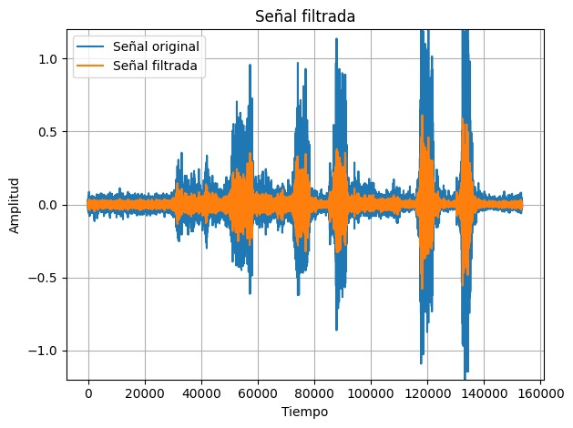
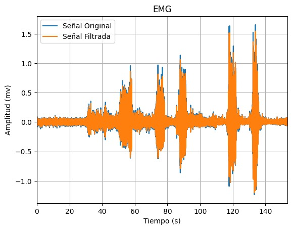
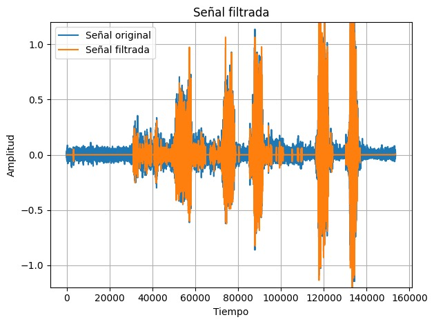

# Lab 8 - Procesamiento EMG

## Tabla de contenidos
- [Objetivos](#objetivos)
- [Materiales](#materiales)
- [Introducción](#introducción)
- [Metolodogía](#metodología)
- [Resultados](#resultados)
- [Discusión de resultados](#Discusión-de-resultados)
- [Referencias](#referencias)
  
##  Objetivos
- 
-
-

## Materiales
| Material | Cantidad |
|:--------------:|:--------------:|
| Programa *Python* | N.A | 
| Programa *Open Signal (r)evolution* | N.A | 

## Introducción

<p align="justify">
</p>


<p align="justify">
Para la práctica se utilizó el programa Python para aplicar el filtro seleccionado, graficar la señal y extraer sus características. Asimismo, se utilizo el programa Open Signal (r)evolution para comparar dicha señal.
</p>

## Metodología


### Diseño del Filtro EMG

<p align="justify">
Las señales de EMG suelen ser adquiridas junto a ruido (ruido de base, ruido de interferencia, ruido de artefactos, etc.), el cual, dependiendo de su naturaleza, puede tener efecto tanto en el dominio del tiempo como la frecuencia [A]. El artículo “Reducing Noise, Artifacts and Interference in Single-Channel EMG Signals: A Review” [A] sugiere que, debido a la variedad de características de cada posible contaminante dentro de la señal, no es posible identificar un método único de filtrado que funcione bien para todos los tipos de contaminantes o ruidos. Dicho artículo menciona características de diversos filtros que son capaces de filtrar el ruido y reconstruir la señal, garantizando la conservación de la mayor cantidad posible de información contenida en la señal EMG; entre ellos menciona el filtro Wavelet y resalta la capacidad de adaptabilidad de sus parámetros basado en las características de la señal. 

Para la determinación del mejor filtro, se optó por comparar los filtros ya utilizados (IIR, FIR y Wavelet). Para ello, un parámetro a considerar será la relación señal/ruido (SNR) de las señales obtenidas luego de cada filtro respectivo. 

| Filtro IIR - Butterworth | Filtro FIR | Filtro Wavelet |
|:--------------:|:--------------:| :--------------:|
|  |  | |
| SNR = 2.3529 | SNR = -2.4112 | SNR = 8.7686 |

Luego de los cálculos respectivos, se observa que la señal con un SNR más alto es la señal obtenida tras el uso del filtro Wavelet, lo cual indica una mayor atenuación del ruido en comparación a los otros filtros.

El artículo “MUAP extraction and classification based on wavelet transform and ICA for EMG decomposition” [B], presenta el uso de un filtro wavelet frente a los filtros digitales comunes, debido a que sugiere que estos último pueden causar demoras en el dominio del tiempo (time-delay). Para el filtrado de la señal EMG, se adoptarán los parámetros utilizados por este artículo: 
- Tipo de wavelet: Daubechies 5 (db5)
- Nivel de la wavelet: 9
- Threshold: Hard.

[A] https://www.ncbi.nlm.nih.gov/pmc/articles/PMC10059683/
[B] https://link.springer.com/article/10.1007/s11517-006-0051-3 
</p>

### Segmentación

<p align="justify">
</p>

### Extracción de características

<p align="justify">
</p>


## Resultados

***NOTA**: El ploteo de las señales se realizó en intervalos distintos, para una mejor apreciación de las señales. Asimismo, la frecuencia de muestreo fue de 1000 Hz.*

### EMG

Los resultados analizados en la siguiente tabla se obtuvieron al realizar el EMG del bíceps. 
Los electrodos fueron colocados como se observa en la figura 1. Los electrodos positivo y negativo será colocados en el músculo de interés, en este caso el bíceps mientras que el electrodo de referencia será colocado en una zona neutra como la muñeca.
Se tomó registro de la señal en el usuario en estado de reposo o silencio eléctrico y realizando la contracción muscular.

| Posicionamiento de los electrodos |
|:--------------:|
|  |
| Figura 1 |


| Campo | Señal Cruda | Filtro wavelet | Señal Referencial | 
|:--------------:|:--------------:|:--------------:|:--------------:|
| Figura 2. Señal completa| |||
| Figura 3. Reposo | || |
| Figura 4. Contracción muscular | | | |


## Código en Python

``` python

```


## Discusión de resultados

### EMG

<p align="justify">
</p>


## Referencias


</div>
