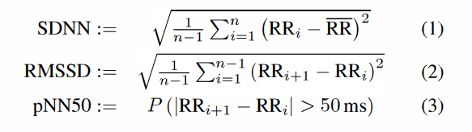
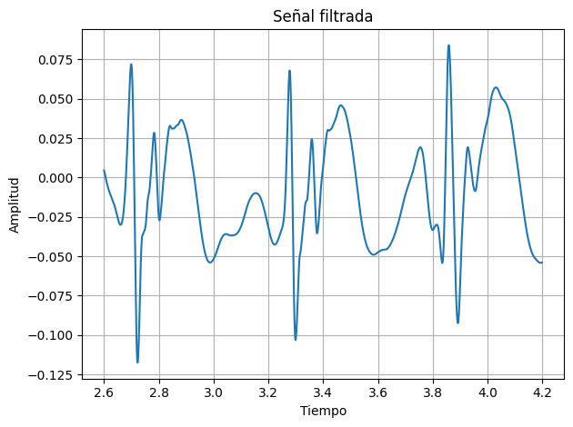
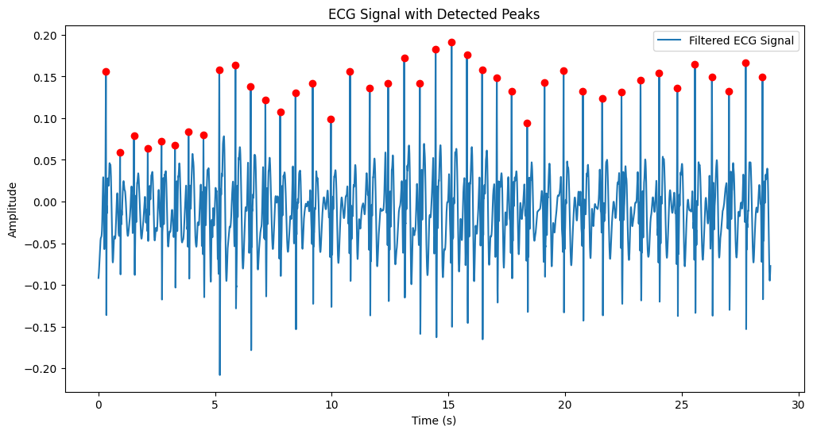
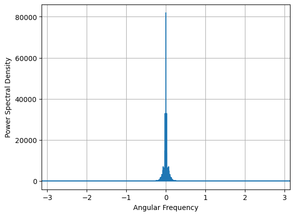

# Lab 9 - Procesamiento ECG

## Tabla de contenidos
- [Objetivos](#objetivos)
- [Materiales](#materiales)
- [Introducción](#introducción)
- [Metolodogía](#metodología)
- [Resultados](#resultados)
- [Discusión de resultados](#Discusión-de-resultados)
- [Referencias](#referencias)


##  Objetivos
- Aplicar el filtro mas adecuado para la señal ECG
- Extraer los intervalos de picos R-R y la variación en tiempo entre cada latido del corazón, conocida como HRV, de la señal ECG
- Discutir las características de la señal ECG

## Materiales
| Material | Cantidad |
|:--------------:|:--------------:|
| Programa *Python* | N.A | 

## Introducción

<p align="justify">
El electrocardiograma (ECG) es el registro de la actividad eléctrica del corazón [1]. Esta señal es susceptible a la presencia de diferentes tipos de ruidos como la deriva de línea base, los artefactos de movimiento, la interferencia de la línea de alimentación, el ruido de alta frecuencia, el ruido muscular, etc [1]. Por lo tanto, para una detección e interpretación precisa de las características, el primer paso en el análisis de la señal de ECG es eliminar estos ruidos y para esto se han utilizado diferentes métodos como el filtrado de Kalman, el filtrado no lineal, los métodos basados en la transformada wavelet, entre otros [1]. Sin embargo, la transformada wavelet posee la propiedad de múltiple resolución lo que la convierte en una de las herramientas más utilizadas en el procesamiento de señales [1].
</p>

<p align="justify">. 
En general, el análisis de esta señal es importante para diagnosticar a pacientes que sufren afecciones cardiacas [1]. Durante el análisis, se extraen diversas características como los intervalos R-R, la onda P, el complejo QRS, la onda T, entre otros [1]. La detección del pico R es la parte crucial del análisis de la señal de ECG, ya que otros componentes de la señal de ECG pueden detectarse respecto al punto de referencia del pico R [1]. Esto se debe a que el pico R corresponde a la posición más alta y aguda en la señal [2]. Asimismo, la detección del pico R es mucho más simple que la detección de picos/ondas P [1]. Adicionalmente, la detección de la onda R es crucial para medir la frecuencia cardíaca y detectar otras características  [1]. Específicamente el intervalo R-R representa la frecuencia cardiaca [3]. Dicho intervalo corresponde a la duración de dos puntos consecutivos de picos R lo que también se considera como la duración de un latido (un ciclo cardíaco) [1]. La frecuencia cardíaca es el número de latidos del corazón en un minuto [1]. Se considera que una frecuencia cardíaca entre 60 y 100 latidos por minuto es normal o ritmo sinusal normal (NSR) [1,3]. Sin embargo, una frecuencia cardíaca menor de 60 latidos por minuto se denomina bradicardia, y una mayor de 100 latidos por minuto se conoce como taquicardia [1,2]. Cabe resaltar que la detección exacta de los picos R siempre es un desafío debido a la naturaleza no estacionaria de estos picos [1]. 
</p>

<p align="justify">. 
Por otro lado, el ritmo de los latidos del corazón contiene información relacionada con muchos factores fisiológicos [4]. Se ha observado que el intervalo RR varía de un latido a otro; en algunos individuos, esta variación es mínima, mientras que en otros puede ser considerable [4]. Esto se conoce como Variabilidad de la Frecuencia Cardíaca (HRV) [4]. El análisis de la HRV se basa en una serie de mediciones del intervalo entre latidos del corazón utilizando un sistema de registro adecuado [4]. A pesar de todas las precauciones, los datos pueden presentar errores con valores de frecuencia cardíaca excesivamente altos o bajos [4]. Estas observaciones se consideran ectópicas y se eliminan de los datos antes del análisis, ya que provocan un exceso de componentes de alta frecuencia en el espectro de potencia de los datos de HRV [4]. Es una práctica común eliminar los valores ectópicos de los datos de HRV estableciendo un umbral específico, por ejemplo, del 10, 15 o 20 por ciento [4]. Generalmente, si un intervalo entre latidos difiere del anterior por esta cantidad, la lectura se elimina de la serie de datos o se reemplaza por un valor estadísticamente más probable calculado utilizando la media de lecturas anteriores o algún criterio similar [4]. Además, si la eliminación de ectopias no se realiza de manera adecuada, puede introducir errores adicionales [4].
</p>

## Metodología

### Diseño del Filtro ECG

<p align="justify">
Como parte del pre procesamiento de las señales de ECG, se usará la implementación del filtro Wavelet del laboratorio 7, el cual está toma de referencia el artículo “The Identification of ECG Signals Using WT-UKF and IPSO-SVM” [A], donde la transformada wavelet permite eliminar el ruido presente y, a su vez, preservar las características locales de la señal de ECG. Para el filtro el tipo de Wavelet madre a implementar es Daubechies 8 (db8) con 8 niveles de descomposición y un thresholding suave de 0.2.

[A] N. Li et al., “The identification of ECG signals using WT-UKF and IPSO-SVM”, Sensors (Basel), vol. 22, núm. 5, p. 1962, 2022. doi: 10.3390/s22051962
</p>

### Picos R

<p align="justify">
En modelos de Inteligencia Artificial, la extracción de características de las señales como el intervalo R-R demuestra ser determinante para la óptima segmentación de las señales ECG [X]. Por ejemplo, D. Li et al consideran el entrenamiento de una CNN en base a intervalos de señal ECG correspondientes a cada latido; para lo cual se requirió determinar las posiciones de los picos R, y definiendo un intervalo de 100 muestras anteriores y posteriores a cada pico. 

[X] D. Li, J. Zhang, Q. Zhang, y X. Wei, “Classification of ECG signals based on 1D convolution neural network”, en 2017 IEEE 19th International Conference on e-Health Networking, Applications and Services (Healthcom), 2017, pp. 1–6.
</p>


### HRV

<p align="justify">
El análisis del HRV puede realizarse en el dominio del tiempo o en el dominio de la frecuencia, siendo el análisis en el dominio del tiempo el método más sencillo para la extracción de características.
</p>

En el dominio del tiempo, se empleará el intervalo normal entre latidos (NN), el cual se define como el intervalo entre ondas R consecutivas en las señales de ECG [B]. Este se empelará para el cálculo de:
- La desviación estándar de los intervalos NN (SDNN)
- La raíz cuadrada de la media de las diferencias sucesivas de los intervalos NN (RMSSD)
- La proporción del número de intervalos NN adyacentes cuyas duraciones difieren más de 50 ms con respecto al número total de intervalos NN (pNN50).



Fig #. Medidas de HRV relacionados a la variabilidad de picos RR [Z]

<p align="justify">
De estos parámetros, el SDNN depende de la longitud de la señal de ECG y su significancia clínica es la medida del riesgo cardíaco [B]. Por su parte, el RMSSD puede relacionarse con la arritmia sinusal respiratoria y los cambios de frecuencia en el ritmo cardíaco en respuesta a la respiración [B]. Finalmente, el pNN50 se relaciona con la actividad del sistema nervioso parasimpático [B].
</p>

<p align="justify">
En el dominio de la frecuencia, realizar un análisis del Densidad Espectral de Potencia (PSD) puede ayudar a recopilar información sobre la dispersión de la varianza (potencia) en función de la frecuencia [C]. Del espectro, frecuencias entre 0 y 0.5 Hz se puede categorizar en cuatro bandas:

- Alta frecuencia (HF) (0.15-0.4 Hz)
- Banda de frecuencia baja (LF) (0.04-0.15 Hz)
- Banda de frecuencia muy baja (VLF) (0.003-0.04Hz)
- Banda de frecuencia ultra baja (ULF) (<0.003 Hz)

Donde VLF, HF y LF son características del espectro a corto plazo y ULF a largo plazo. La suma de las cuatro bandas espectrales LF, HF, ULF y VLF y la varianza es la potencia total de la variabilidad de los intervalos RR [C]. 
</p>

[B] S. Sieciński, P. S. Kostka, y E. J. Tkacz, “Heart rate variability analysis on electrocardiograms, seismocardiograms and gyrocardiograms on healthy volunteers”, Sensors (Basel), vol. 20, núm. 16, p. 4522, 2020.

[C] R. Tiwari, R. Kumar, S. Malik, T. Raj, y P. Kumar, “Analysis of heart rate variability and implication of different factors on heart rate variability”, Curr. Cardiol. Rev., vol. 17, núm. 5, 2021.

[Z] M. Vollmer, “A robust, simple and reliable measure of heart rate variability using relative RR intervals”, en 2015 Computing in Cardiology Conference (CinC), 2015, pp. 609–612.
</p>


## Resultados

### Identificación de Picos R

| Señal Filtrada | Identificación de Picos R |
|:----------------------------------:|:---------------:|
| | | 

***NOTA**: El ploteo de las señales se realizó en intervalos distintos, para una mejor apreciación de las señales. Asimismo, la frecuencia de muestreo fue de 1000 Hz.*

### Calculo de parámetros HRV

| Parámetros Calculados |
|:--------------:|
| Mean R-R: 0.7036 s |
| SDRR :  0.0801 s |
| RMSSSD : 0.0355 s |
| pRR50 : 15.00 %|

### Análisis en Frecuencia

| Power Spectral Density |
|:--------------:|
| |

## Código en Python


### Librerías

``` python
import pandas as pd
import matplotlib.pyplot as plt
import numpy as np
from scipy import signal
from scipy.signal import lfilter, firwin, find_peaks
import pywt
from pyhrv.hrv import hrv
import pyhrv
```

### Funciones Generales

``` python
def get_values(path, col):
  df = pd.read_csv(path, sep='\t', skiprows=3)  # saltar las dos primeras filas (encabezado)
  novena_columna = df.iloc[:, col].values
  n = [i/1000 for i in range(0, len(novena_columna))]
  signal = [(float(valor)/(2**10)-1/2)*3.3/1009*1000 for valor in novena_columna]
  return n, signal

def list_Df(n, signal):
  df = pd.DataFrame(list(zip(n, signal)), index=None, columns=["Time", "Signal"])
  df.to_csv('/content/drive/MyDrive/PUCP/7mo ciclo/Instruducción a Señales Biomédicas/Laboratorios/Tratamiento de ECG/ecg_signal.csv', sep=";")


```

### Funciones para Filtros


```python
def filter_Wavelet(EGGsignal1):
  coeffs = pywt.wavedec(ECGsignal1, 'db8', level=8)
  threshold = 0.2
  filtered_coeffs = [pywt.threshold(coeff, threshold, mode='soft') for coeff in coeffs]
  filtered_signal = pywt.waverec(filtered_coeffs, 'db8')
  return filtered_signal
```

```python

path = "/content/drive/MyDrive/PUCP/7mo ciclo/Instruducción a Señales Biomédicas/Laboratorios/ECG/J1.txt"
[n, ECGsignal1] = get_values(path, 6)
label = "ECG Estado Basal"
new_signal = filter_Wavelet(ECGsignal1)

fs =1000
peaks, properties = find_peaks(new_signal, height=0.05, distance=int(0.5 * fs))
t = [i/fs for i in range(0, len(new_signal))]

plt.figure(figsize=(12, 6))
plt.plot(t, new_signal, label='Filtered ECG Signal')
timeP =[]
peaksonly = []
for i in peaks:
  timeP.append(t[i])
  peaksonly.append(new_signal[i])
  plt.plot(t[i], new_signal[i], 'ro')
plt.title('ECG Signal with Detected Peaks')
plt.xlabel('Time (s)')
plt.ylabel('Amplitude')
plt.legend()
plt.show()


rr_intervals = np.diff(peaks) / fs 
rr_intervals = rr_intervals[rr_intervals > 0.3]
mean_rr = np.mean(rr_intervals)
std_rr = np.std(rr_intervals)
rmssd = np.sqrt(np.mean(np.diff(rr_intervals)**2))
nn50 = np.sum(np.abs(np.diff(rr_intervals)) > 0.05)
pnn50 = (nn50 / len(rr_intervals)) * 100
print(f"Mean RR: {mean_rr:.4f} s")
print(f"SDNN: {std_rr:.4f} s")
print(f"RMSSD: {rmssd:.4f} s")
print(f"pNN50: {pnn50:.2f} %")

```
