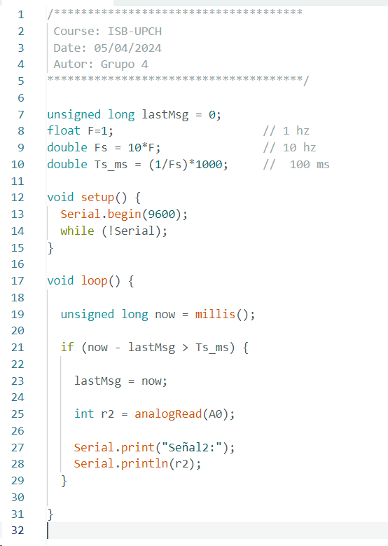
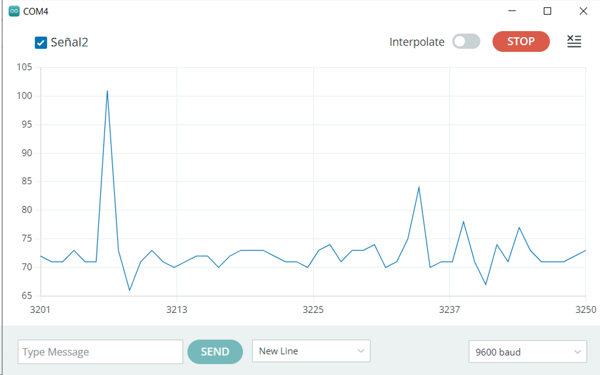
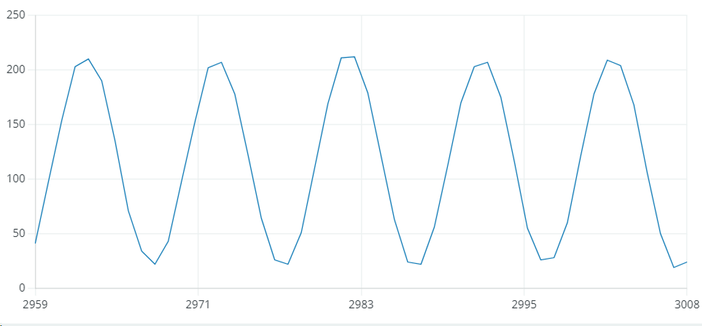
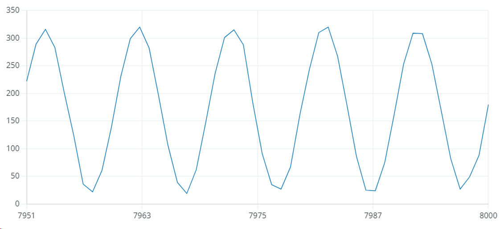
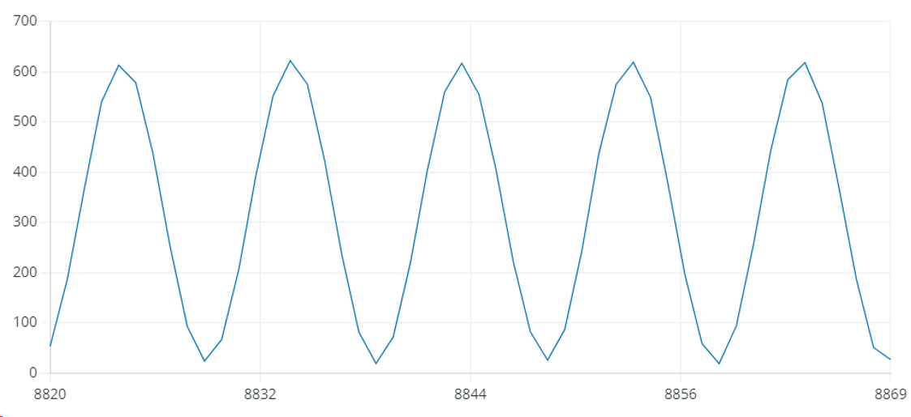

# Laboratorio 2 - Adquisición de Señales y graficación en Arduino

## Generación de señales y visualización en osciloscopio

### Señal 1
| Característica | Valor |
|--------------|--------------|
| Tipo de onda | Sinusoidal   | 
| Voltaje pico-pico | 320 mV  | 
| Amplitud | 160 mV |
| Frecuencia | 1 Hz |
| Periodo | 1 s |
| Offset | 0 V |

Figura 1. Señal 1 en generador de señales y osciloscopio

### Señal 2
| Característica | Valor |
|--------------|--------------|
| Tipo de onda | Sinusoidal   | 
| Voltaje pico-pico | 330 mV  | 
| Amplitud | 165 mV |
| Frecuencia | 1 kHz |
| Periodo | 1 ms |
| Offset | 0 V |

Figura 2. Señal 2 en generador de señales y osciloscopio

### Señal 3
| Característica | Valor |
|--------------|--------------|
| Tipo de onda | Sinusoidal   | 
| Voltaje pico-pico | 500 mV  | 
| Amplitud | 250 mV |
| Frecuencia | 1 kHz |
| Periodo | 1 ms |
| Offset | 250 mV |

Figura 3. Señal 3 en generador de señales y osciloscopio

## Uso del Arduino Nano 33 IoT

Para la implementación del circuito, se desea diseñar un filtro capacitivo para mejorar la calidad de la señal, y librarla del ruido. Para ello, se desea implementar un filtro capacitivo RC. A pesar de que no se contó con resistores externos, la presencia de una resistencia interna propia del Arduino Nano 33 IoT (en serie con el voltaje de entrada) permitiría completar el filtro. Este filtro RC no es el convencional (figura 4), más bien tiene la entrada y salida invertida; por lo que, la función de transferencia corresponde a los siguiente (figura 5): 

Figura 4. Filtro RC pasa bajas convecional. Obtenido de: https://solectroshop.com/es/blog/todo-lo-que-necesitas-saber-sobre-filtros-rc-n52

Figura 5. Desarrollo de la función de transferencia. Elaboración propia.

De ello, se puede observar que el filtro implementado corresponde a un filtro pasa altas. Por lo tanto, al conectar el capacitor, la señal (de baja frecuencia) será atenuada mientras que el ruido (alta frecuencia) será amplificado.

### Código implementado en Arduino IDE

Figura 6. Programación en Arduino. Elaboración propia.

### Gráficas obtenidas del Arduino IDE
- Ondas obtenidas utilizando el capacitor 

Inicialmente, se añade un condensador al circuito como componente de un sistema de filtrado, trabajando en conjunto con la resistencia interna del conversor analógico-digital (ADC) del Arduino para crear un filtro RC elemental. Sin embargo, la señal obtenida no tiene una forma o periodicidad definida, esto es debido a que corresponde al ruido que no está siendo atenuado por el filtro capacitivo. Por lo contrario, la sinusoide obtenida del generador es la que está siendo atenuada debido a que es de baja frecuencia y el filtro que estamos empleando es un pasa altas. Por esta razón, las gráficas obtenidas a continuación son de la señal sin utilizar el capacitor en el circuito.

Figura 7. Ondas obtenidas con capacitor

- Señal 1, obtenida al configurar 0.325 V y frecuencia 1Hz en generador de señales

Se utilizó una frecuencia de muestreo de 10 Hz. Como se mencionó, sin el capacitor, no se atenúa la señal sinusoidal del generador debido a que no ya está presente el filtro pasa altas. Por ello, podemos observar una representación similar a la onda sinusoidal generada. Asimismo, podemos observar que la amplitud es aproximadamente 200 V, tomando en cuenta que la sonda utilizada es de 10X podemos inferir que la señal se ha amplificado hasta 20 V.  

Figura 8. Señal 1 en Arduino

- Señal 2, obtenida con 0.5 V y frecuencia 1Hz en generador de señales

Se utilizó una frecuencia de muestreo de 10 Hz. Al igual que la anterior señal, la sinusoide no está siendo atenuada al no haber un filtro pasa altas. Por otro lado, a comparación de la primera señal, esta tiene una mayor amplitud llegando a un valor superior de 300 V, tomando en cuenta que la sonda es de 10X podemos inferir que la señal se ha amplificado hasta 30 V, esto se debe a que la señal de entrada es de 0.5 Vpp, mayor que la señal 1 de entrada. 

Figura 9. Señal 2 en Arduino

- Señal 3, obtenida con 1 V y frecuencia 1Hz en generador de señales

Se utilizó una frecuencia de muestreo de 10 Hz. En esta señal la sinusoide tampoco está siendo atenuada al no haber un filtro pasa altas. Igualmente, a comparación de la primera señal, esta tiene una mayor amplitud llegando a un valor superior de 600 V, tomando en cuenta que la sonda utilizada es de 10X podemos inferir que la señal se ha amplificado hasta 60 V. Se observa una mayor amplificación que con la primera y segunda señal, esto se debe a que la señal de entrada es de 1 Vpp, mayor a la señal 1 y 2 de entrada.

Figura 10. Señal 2 en Arduino