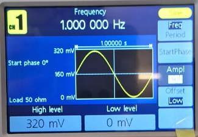
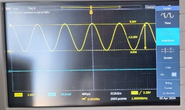
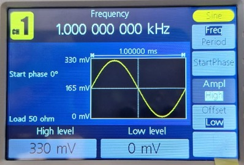
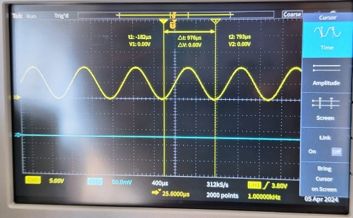
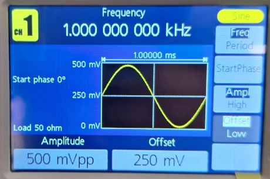
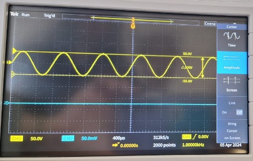
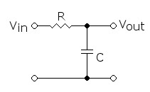
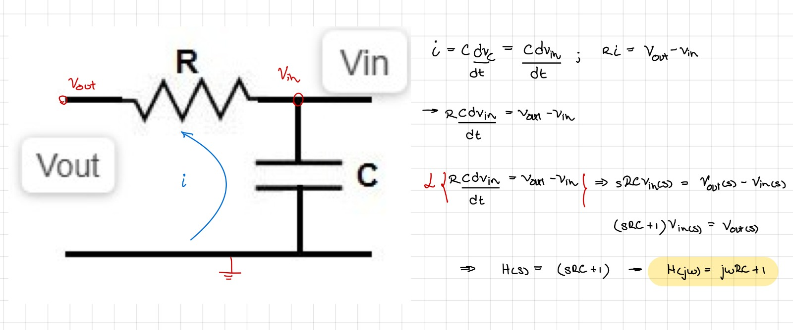

# Laboratorio 2 - Adquisición de Señales y graficación en Arduino

## Generación de señales y visualización en osciloscopio

### Señal 1
| Característica | Valor |
|--------------|--------------|
| Tipo de onda | Sinusoidal   | 
| Voltaje pico-pico | 320 mV  | 
| Amplitud | 160 mV |
| Frecuencia | 1 Hz |
| Periodo | 1 s |
| Offset | 0 V |

### Señal 2
| Característica | Valor |
|--------------|--------------|
| Tipo de onda | Sinusoidal   | 
| Voltaje pico-pico | 330 mV  | 
| Amplitud | 165 mV |
| Frecuencia | 1 kHz |
| Periodo | 1 ms |
| Offset | 0 V |

### Señal 3
| Característica | Valor |
|--------------|--------------|
| Tipo de onda | Sinusoidal   | 
| Voltaje pico-pico | 500 mV  | 
| Amplitud | 250 mV |
| Frecuencia | 1 kHz |
| Periodo | 1 ms |
| Offset | 250 mV |

## Uso del Arduino Nano 33 IoT

Para la implementación del circuito, se desea diseñar un filtro capacitivo para mejorar la calidad de la señal, y librarla del ruido. Para ello, se desea implementar un filtro capacitivo RC. A pesar de que no se contó con resistores externos, la presencia de una resistencia interna propia del Arduino Nano 33 IoT (en serie con el voltaje de entrada) permitiría completar el filtro. Este filtro RC no es el convencional (figura X), más bien tiene la entrada y salida invertida; por lo que, la función de transferencia corresponde a los siguiente: 

Figura X. Filtro RC pasa bajas convecional. Obtenido de: https://solectroshop.com/es/blog/todo-lo-que-necesitas-saber-sobre-filtros-rc-n52

Figura Y. Desarrollo de la función de transferencia. Elaboración propia.

De ello, se puede observar que el filtro implementado corresponde a un filtro pasa altas. Por lo tanto, al conectar el capacitor, la señal (de baja frecuencia) será atenuada mientras que el ruido (alta frecuencia) será amplificado.

